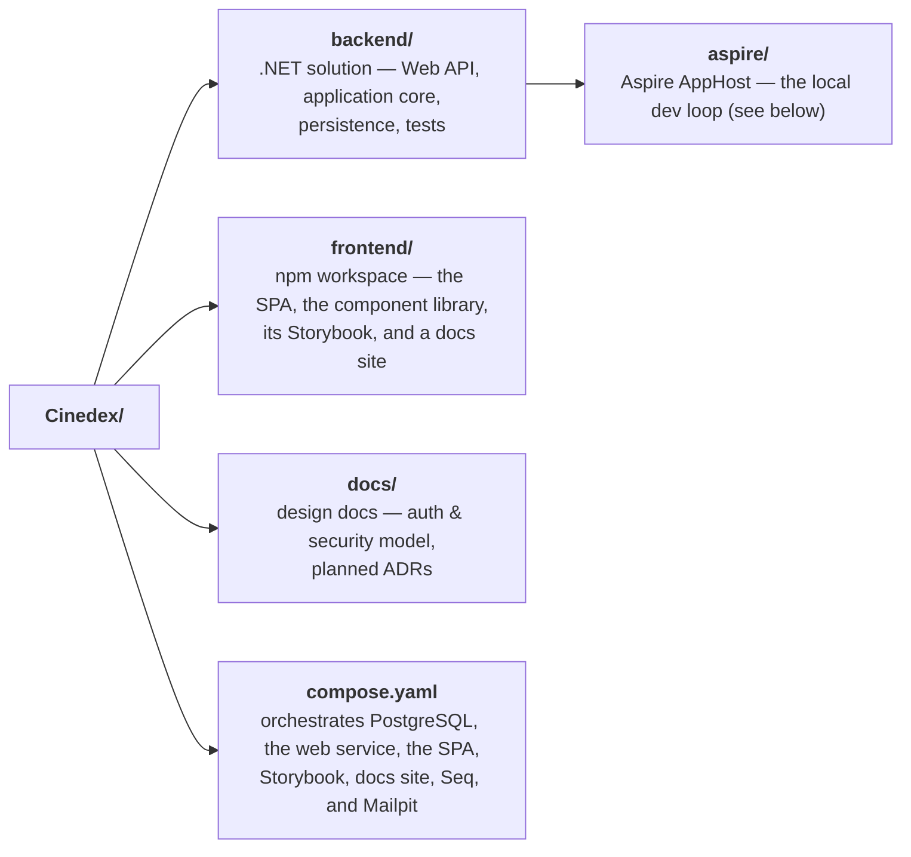

# Cinedex

[](https://github.com/felipedferreira/Cinedex/actions/workflows/continuous-integration.yml)

A full-stack portfolio application for cataloging movie titles and their genres — inspired by IMDB — with JWT-based authentication in front of a members-only catalog.

## 📁 Repository Layout



- **[Getting Started](docs/getting-started.md)** — new here? Clone-to-running-app in 5 minutes via Docker Compose
- **[Backend](backend/README.md)** — hexagonal (ports & adapters) .NET solution: architecture guide, build/test/migration instructions
- **[Frontend](frontend/README.md)** — npm workspace: the React + TypeScript + Vite SPA (`cinedex-app`), the design system and three component tiers (`@cinedex/theme`, `atoms`, `compounds`, `solution`), their Storybook (`@cinedex/storybook`), and a branded Docusaurus docs site (`@cinedex/docs-site`) that renders the changelog at `/changelog`
- **[Design docs](docs/README.md)** — why the system is shaped this way (auth & security model, planned ADRs)
- **[Changelog](CHANGELOG.md)** — version history and release notes

## 🚀 Quick Start

```bash
git clone https://github.com/felipedferreira/Cinedex.git
cd Cinedex
cp .env.example .env       # fill in the database, Seq, and Mailpit values
docker compose up --build
```

Then open **https://localhost:9000** (Caddy local-CA certificate — trust it or use `curl -k`).

There's one manual step before logs show up in Seq — full walkthrough, access points, and
troubleshooting in **[docs/getting-started.md](docs/getting-started.md)**.

### 🧪 Or: the Aspire dev loop

For day-to-day work the Aspire AppHost is faster — it runs the .NET services and both frontend dev
servers as local processes instead of rebuilding images, and it applies the database migrations for
you:

```bash
cd backend/aspire/Cinedex.AppHost
dotnet user-secrets set "Parameters:postgres-password" "<choose a password>"   # once
dotnet run
```

It needs Docker, Node/npm and that one secret, but no `.env`. The password is only applied when the
database volume is first created — to change it later, `docker volume rm cinedex-aspire-pgdata`
first. PostgreSQL and Mailpit come up as containers; the migrator, web service, scheduler worker and
both frontend dev servers run as processes, with their logs and traces on the Aspire dashboard (the
console prints a login URL). In JetBrains Rider, the equivalent **Aspire AppHost** entry is already
in the Run dropdown.

That covers the whole stack: the SPA at **https://localhost:9000** with its `/movies-svc` proxy
already pointed at the web service this host started, and Storybook at **http://localhost:9001**.

Each resource can be switched off individually, so you only start what the session needs. From
`backend/aspire/Cinedex.AppHost`, either `dotnet user-secrets set "<flag>" "false"` or copy
`appsettings.Development.json.example` to `appsettings.Development.json` (git-ignored). Both are
per-developer and neither touches a tracked file.

| Flag                                   | Off means                                                                     |
| -------------------------------------- | ----------------------------------------------------------------------------- |
| `Features:EnableDatabaseMigrationsSvc` | Nothing applies migrations — faster, but the schema must already be current    |
| `Features:EnableFrontendUiSvc`         | No SPA on 9000; the API is only reachable directly at `http://localhost:9002`  |
| `Features:EnableStorybookSvc`          | No Storybook on 9001                                                          |
| `Features:EnableMailpitSvc`            | Outgoing email has nowhere to land (logged, not fatal)                        |

Turn migrations back on for a run after pulling a new migration or against an empty database. The two
frontend flags are the ones that need Node and npm on `PATH`, so a machine without them turns both
off; Storybook waits on nothing and calls no API, so it is unaffected by the rest of the stack in
either direction. Full detail on every flag is in [`backend/CLAUDE.md`](backend/CLAUDE.md).

This complements Compose rather than replacing it — `docker compose up` is still the prod-like path,
with built images, the Caddy HTTPS edge, Seq, and both frontends served as static bundles. **Run one
or the other**: they collide on PostgreSQL's 5432 and the SPA's 9000, so the second to start fails to
bind. Their data volumes are separate, so neither can corrupt the other's database.

The difference for frontend work is that the AppHost runs the **dev servers**, with hot reload, while
Compose serves **built bundles** — both now on the same ports (9000 for the SPA, 9001 for Storybook),
since the two stacks are already mutually exclusive.
