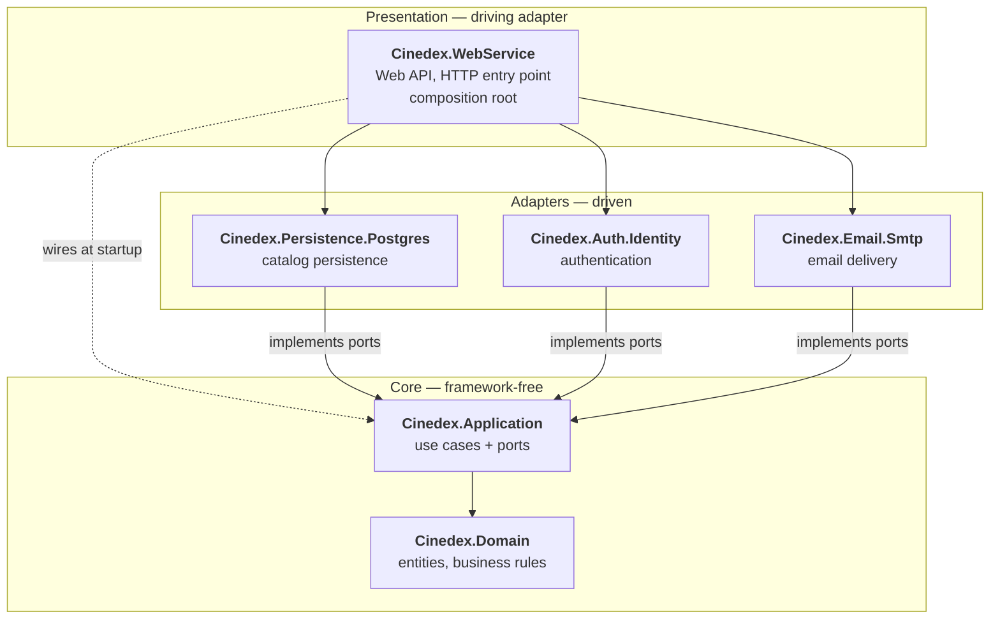
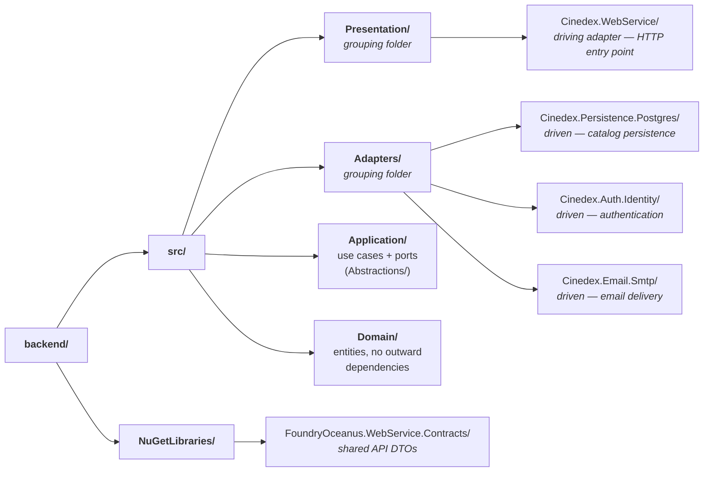

# Movies Backend

[](https://github.com/felipedferreira/Cinedex/actions/workflows/build-and-test.yml)

A hexagonal (ports & adapters) .NET solution for cataloging movie titles and their genres — inspired by IMDB. Built with a focus on separation of concerns, testability, and maintainability.

All `dotnet` commands below are run from this folder (`backend/`). Docker Compose commands run from the repository root, where [compose.yaml](../compose.yaml) lives.

> **Also published, in adapted form, on the docs site.** The architecture and catalog material below
> is the source for the Features section of `@cinedex/docs-site`
> ([`frontend/apps/docs-site/docs/features/`](../frontend/apps/docs-site/docs/features/)). That
> adaptation is curated prose, not a generated copy, so **nothing re-syncs it** — a change here
> silently leaves those pages stale. Update both, or note the divergence.

## 🏷️ Genres

Genres are their own entity (`Id`, `Name`, `Description`) stored in the `genres` table, and
movies link to genres through a many-to-many relationship backed by a `movie_genres`
junction table. A genre's navigation is one-directional — a movie knows its genres, but a
genre does not hold a back-reference to movies.

- **CRUD endpoints** under `/movies-svc/genres` (`GET`, `GET /{id}`, `POST`, `PUT /{id}`, `DELETE /{id}`).
- **Titles reference genres by id** — `CreateTitlesRequest`/`UpdateTitlesRequest` carry a `GenreIds` collection, and title responses include the linked genres.
- **Seeded data** — the database ships with 17 common genres (Action, Comedy, Drama, …) so movies can be tagged immediately.

See the [contracts README](NuGetLibraries/FoundryOceanus.WebService.Contracts/README.md) for the request/response DTOs.

## 🔐 Authentication

Authentication is built on **ASP.NET Core Identity**, confined to the
`Cinedex.Auth.Identity` adapter behind application-layer ports so the domain and
application layers stay framework-free. Login issues a short-lived JWT access token plus a rotating
refresh token; protected endpoints are guarded by JWT bearer middleware.

- **Endpoints** under `/movies-svc/auth` — `register`, `login`, `refresh`, `logout`,
  `password/forgot`, `password/reset`.
- **Tokens** — 15-minute default HS256 access token in the response body (configurable from 5 to
  15 minutes through `Jwt:AccessTokenMinutes`); 7-day default refresh token (configurable from 1 to
  7 days through `Jwt:RefreshTokenDays`) stored
  hashed, rotated on use, and delivered only as an `HttpOnly`/`Secure` cookie (never in the body).
- **Members-only catalog** — every Genre and Title endpoint (reads and writes) requires a bearer
  token; anonymous catalog requests get `401`.
- **Roles** — `User`, `Moderator`, and `Administrator` are seeded, registration assigns `User`,
  and the access token carries role claims. No endpoint restricts by role yet.
- **Schema** — all Identity tables live in a dedicated `auth` schema with its own migration history.

> ⚠️ `Jwt:SigningKey` in `appsettings.json` is a **dev-only placeholder**. Override it per
> environment via `Jwt__SigningKey` or User Secrets.

Full details, including known gaps (no role-restricted endpoints and no refresh-token reuse
detection), are in the
**[Auth & Security Model](../docs/auth-security-model.md)**.

## 🗄️ Database

This project uses **PostgreSQL** via **Entity Framework Core 10**.

### Prerequisites

You have two options to run PostgreSQL:

#### Option 1: Docker Compose (Recommended for development)
```bash
docker compose up            # from the repository root, where compose.yaml lives
```

This starts:
- **PostgreSQL 17 Alpine** on port `5432`
- **Database Migrator** as a one-shot container before the web service starts
- **Movies WebService** on Docker-network port `8080` only
- **Caddy HTTPS edge for the Cinedex UI and API** on `https://localhost:9000`
- Browser auth flows should use the HTTPS proxy URL so `Secure` refresh cookies are accepted and same-origin with the SPA.
- Data persistence via Docker volume

The database migrator applies pending migrations for both database contexts before the API starts.

#### Option 2: Local PostgreSQL
Ensure PostgreSQL is installed and running locally. The connection string is **not**
committed — for local runs (`Development` environment) it is supplied via
[.NET User Secrets](https://learn.microsoft.com/aspnet/core/security/app-secrets) so the
password stays out of git. Set it once from the web service project directory:
```bash
# from backend/src/Presentation/Cinedex.WebService
dotnet user-secrets set "ConnectionStrings:DefaultConnection" \
  "<YOUR_LOCAL_CONNECTION_STRING>"
```

Verify the secret was stored correctly (same directory):
```bash
# from backend/src/Presentation/Cinedex.WebService
dotnet user-secrets list
```

### Environment Configuration

Most environment variables are baked into `compose.yaml` automatically. **Secrets are the
exception** — the database connection string and the Seq/Mailpit credentials are read from a
git-ignored `.env` file at the repository root; `docker compose up` fails without it. Full
variable reference and first-run setup: **[docs/getting-started.md](../docs/getting-started.md)**.

For local development outside of Docker, the connection string is supplied via .NET User
Secrets instead (see [Option 2](#option-2-local-postgresql) above).

### Migrations

Docker Compose runs `Cinedex.DatabaseMigrator` after PostgreSQL becomes healthy. The migrator
applies pending migrations for both contexts and exits; `movies.webservice` starts only after the
migrator exits successfully. Local `dotnet run` of the web service still does not apply migrations.
See the [Database Migrator README](src/Presentation/Cinedex.DatabaseMigrator/README.md) for its
configuration, local execution, container lifecycle and pipeline usage.

When run directly, the migrator loads `application.json`, then
`application.{DOTNET_ENVIRONMENT}.json`. In `Development`, it also loads the same .NET User Secrets
store as the web service. Environment variables and command-line arguments override those sources.

The solution has **two `DbContext`s**, backed by two projects and two migration histories in the
same physical database:

| Context | Project | Schema | Covers |
|---------|---------|--------|--------|
| `FilmDbContext` | `src/Adapters/Cinedex.Persistence.Postgres` | `catalog` | Titles, genres |
| `AuthDbContext` | `src/Adapters/Cinedex.Auth.Identity` | `auth` | Identity users, refresh tokens |

Because more than one context is discoverable, **every `dotnet ef` command must pass `--context`**
or the tooling fails with "More than one DbContext was found". Run these from this folder
(`backend/`), with the WebService as the startup project:

```bash
# Add a migration to the catalog context
dotnet ef migrations add <MigrationName> \
  --context FilmDbContext \
  --project src/Adapters/Cinedex.Persistence.Postgres \
  --startup-project src/Presentation/Cinedex.WebService

# Add a migration to the auth context
dotnet ef migrations add <MigrationName> \
  --context AuthDbContext \
  --project src/Adapters/Cinedex.Auth.Identity \
  --startup-project src/Presentation/Cinedex.WebService
```

Applying them — a fresh database needs **both**:

```bash
dotnet ef database update \
  --context FilmDbContext \
  --project src/Adapters/Cinedex.Persistence.Postgres \
  --startup-project src/Presentation/Cinedex.WebService

dotnet ef database update \
  --context AuthDbContext \
  --project src/Adapters/Cinedex.Auth.Identity \
  --startup-project src/Presentation/Cinedex.WebService
```

By default these commands resolve `ConnectionStrings:DefaultConnection` from the startup
project's configuration (User Secrets in `Development`; see [Option 2](#option-2-local-postgresql)).
If that isn't set — or you want to target a specific database such as the Docker Postgres
container exposed on `localhost:5432` — pass the connection string explicitly with `--connection`:

```bash
dotnet ef database update \
  --context FilmDbContext \
  --project src/Adapters/Cinedex.Persistence.Postgres \
  --startup-project src/Presentation/Cinedex.WebService \
  --connection "<YOUR_CONNECTION_STRING>"
# e.g. "Host=127.0.0.1;Port=5432;Database=movies;Username=movies_rw;Password=<DB_PASSWORD>"
```

Each context keeps its own `__EFMigrationsHistory` table inside its own schema, so the two
histories never collide. See the [Auth & Security Model](../docs/auth-security-model.md#storage)
for why auth is isolated in its own schema.

> **Domain models** live in `Cinedex.Domain`. EF entity configurations use **Fluent API** in `Cinedex.Persistence.Postgres`, keeping the domain layer free of any EF dependencies.

---

## 📚 Documentation

- **[Architecture Guide](README.md)** (this file) - Project structure and design patterns
- **[Design docs](../docs/README.md)** - Why the system is shaped this way
  - [Auth & Security Model](../docs/auth-security-model.md) - JWT, refresh rotation, the `auth` schema
- **[Changelog](../CHANGELOG.md)** - Version history and release notes
- **[NuGetLibraries](NuGetLibraries/FoundryOceanus.WebService.Contracts/README.md)** - NuGet package documentation
  - FoundryOceanus.WebService.Contracts - API contracts and DTOs

## 🚀 Quick Start

```bash
# Build the solution
dotnet build

# Run tests
dotnet test

# Run the web service
dotnet run --project src/Presentation/Cinedex.WebService

# Generate coverage report
.\coverage.ps1 -Open
```

## 🐳 Docker Compose

The project uses a single `compose.yaml` containing PostgreSQL, the one-shot database migrator, the
web service, the frontend, a [Seq](https://datalust.co/seq) instance for logs and traces, and a
[Mailpit](https://mailpit.axllent.org/) dev mail sink.

**First time running the stack?** Start with **[docs/getting-started.md](../docs/getting-started.md)**
— `.env` setup, first-run Seq configuration, access points, a try-it-out walkthrough, and
troubleshooting all live there.

### Services

| Service | Image | Port | Purpose |
|---------|-------|------|---------|
| `postgres` | postgres:17-alpine | 5432 | PostgreSQL database with persistent storage |
| `movies.databasemigrator` | movies.databasemigrator | None | Applies pending database migrations and exits |
| `movies.webservice` | movies.webservice | 8080 internal | ASP.NET Core web API |
| `cinedex-app` | cinedex-app | 8080 internal | React SPA static bundle (Nginx) |
| `cinedex-edge` | caddy:2.11.4-alpine | 9000 HTTPS | Local TLS termination and same-origin routing for the SPA and API |
| `cinedex-storybook` | cinedex-storybook | 9001 HTTP | Storybook for the `@cinedex/*` component libraries — static bundle on Nginx, calls no backend |
| `seq` | datalust/seq | 5341 | Structured logs + distributed traces (OpenTelemetry/OTLP) |
| `mailpit` | axllent/mailpit:v1.30.0 | 8025 UI, 1025 SMTP | Dev mail sink — captures outgoing email in a web UI (see [Email](#-email-mailpit-dev-mail-sink)) |

Postgres and Seq data persist across restarts via the `postgres_data` and `seq_data` named
volumes; `docker compose down -v` removes both for a clean slate.

## 🩺 Health Checks

The web service exposes two health endpoints, following the standard liveness/readiness split.
Both live under the `/movies-svc` base path and return a minimal JSON body (`{ "status": ..., "checks": [...] }`)
along with an HTTP status code (`200` healthy, `503` unhealthy). The payload intentionally omits
exception detail so the endpoints don't leak internal information.

| Endpoint | Purpose | Dependencies checked |
|----------|---------|----------------------|
| `GET /movies-svc/health/live` | **Liveness** — confirms the process is up and serving requests. | None |
| `GET /movies-svc/health/ready` | **Readiness** — confirms the service can handle traffic. | PostgreSQL (checks tagged `ready`) |

```bash
# Liveness
curl -k -s https://localhost:9000/movies-svc/health/live
# {"status":"Healthy","checks":[]}

# Readiness (includes the Postgres connectivity check)
curl -k -s https://localhost:9000/movies-svc/health/ready
# {"status":"Healthy","checks":[{"name":"postgres","status":"Healthy"}]}
```

The public Compose path goes through the Caddy HTTPS edge; use `-k` with curl unless you have trusted
Caddy's local development CA.

## 📈 Observability (Seq)

The web service emits **structured logs** and **distributed traces** through OpenTelemetry,
exporting both over OTLP to the `seq` container. Inside the Compose network the app targets
`http://seq/ingest/otlp` (configured via the `OTEL_EXPORTER_OTLP_*` environment variables on
`movies.webservice`); from your machine the Seq UI is at **http://localhost:5341**.

Traces cover incoming HTTP requests (ASP.NET Core), outbound `HttpClient` calls, and PostgreSQL
queries (the `Npgsql` activity source). Every request's `CorrelationId` is attached to its log
events and to the trace as a `correlation_id` tag, so you can pivot between logs and traces for
the same request.

Seq needs a one-time API key registration before it starts accepting logs, plus how to reset a
forgotten admin password — see
**[First-run setup: Seq](../docs/getting-started.md#3-one-time-setup-seq)** in the Getting
Started guide.

## 📬 Email (Mailpit dev mail sink)

Auth flows such as password reset need to send email. Rather than deliver real mail in
development, the stack runs [**Mailpit**](https://mailpit.axllent.org/) — a fake SMTP server
that **captures** every message and displays it in a web UI at **http://localhost:8025**.
Nothing leaves your machine.

The web service uses MailKit through the `Cinedex.Email.Smtp` adapter. Under Docker Compose it
connects to `mailpit:1025` with the credentials below, and delivered messages appear in the
Mailpit UI.

Delivery runs **off the request path**: the endpoint hands the message to a queue and returns, and a
background worker performs the SMTP conversation. So a message lands in Mailpit a moment *after* the
API responds, not before — see [Viewing captured mail](#viewing-captured-mail) below.

### How authentication is set up

Mailpit's SMTP server requires a username and password, and **you control both** — they are not
hard-coded. `MP_SMTP_AUTH_ACCEPT_ANY` is left at its default (`false`), so Mailpit validates
logins against a password file instead of accepting anything:

- You set `MAILPIT_SMTP_USER` / `MAILPIT_SMTP_PASSWORD` in the root `.env`.
- On startup, the container writes a `user:password` auth file from those values and points
  `MP_SMTP_AUTH_FILE` at it — so the credentials live only in your git-ignored `.env`, never in
  the image or the repo.
- `MP_SMTP_AUTH_ALLOW_INSECURE=true` is required because the dev connection is plaintext (no
  STARTTLS); without it Mailpit would reject the login before checking the credentials.

The web service authenticates to **host `mailpit`, port `1025`** with those same values. (From
your machine the SMTP port is also published on `localhost:1025` if you want to test with an
external mail client.)

The sender is configured through the `Smtp` section:

| Setting | Purpose |
|---------|---------|
| `Host` | SMTP server host name. Required. |
| `Port` | SMTP server port, from 1 through 65535. Required. |
| `Username` / `Password` | SMTP authentication credentials. Both are required. |
| `FromAddress` | Sender email address. Required. |
| `FromName` | Optional sender display name. |
| `SecureSocketOptions` | MailKit connection security: `None`, `Auto`, `SslOnConnect`, `StartTls`, or `StartTlsWhenAvailable`. |

Configuration is validated when the service starts. Docker Compose supplies every setting and
uses plaintext only for the local Mailpit sink. For a local `dotnet run`, the public development
defaults point to `localhost:1025`; store the Mailpit credentials in User Secrets:

```bash
# from backend/src/Presentation/Cinedex.WebService
dotnet user-secrets set "Smtp:Username" "cinedex"
dotnet user-secrets set "Smtp:Password" "<YOUR_MAILPIT_PASSWORD>"
```

Production deployments must provide their own SMTP host, sender, credentials, and appropriate
TLS mode through configuration or environment variables such as `Smtp__Host`.

### Viewing captured mail

Mailpit's web UI is the inbox for everything the app sends. There's no login — the message list *is*
the landing page.

**1. Open the inbox.** With the stack up (`docker compose up --build`), browse to
**http://localhost:8025**. On a fresh start it's empty; that's expected.

**2. Make the app send something.** Password reset is the flow that actually sends mail today.
Register an account, then ask for a reset (the API is behind the UI proxy on port 9000, and the cert
is self-signed, hence `-k`):

```bash
# Register an account (skip if you already have one)
curl -k -X POST https://localhost:9000/movies-svc/auth/register \
  -H "Content-Type: application/json" \
  -d '{"email":"you@example.com","userName":"you","password":"<YOUR_PASSWORD>"}'

# Ask for a password reset — always returns 202, whether or not the account exists
curl -k -X POST https://localhost:9000/movies-svc/auth/password/forgot \
  -H "Content-Type: application/json" \
  -d '{"email":"you@example.com"}'
```

**3. Read the message.** Refresh the inbox and a **Reset your password** message from
`Cinedex <no-reply@cinedex.local>` appears. Click it to open the message view, which has four tabs:

| Tab | Shows |
|---------|---------|
| **HTML** | The rendered email — this is what a recipient sees. The reset link is the **Reset password** button, with the raw URL repeated in small text below it. |
| **Text** | The plain-text alternative. Easiest place to copy the reset URL from, since it's spelled out in full. |
| **Raw** | The full MIME source, headers and all — useful for checking `From`, `To`, and the multipart structure. |
| **Source** | The HTML body's markup, unrendered. |

**4. Follow the link.** The reset URL points at `Frontend:BaseUrl` (`https://localhost:9000` under
compose) and carries the account's email and the reset token as query parameters. **There is no SPA
page behind it yet** — the UI has no router, so the link lands on the untouched Vite starter page.
To finish a reset today, copy the token out of the URL and `POST` it to
`/movies-svc/auth/password/reset` yourself.

The token is stateless (`DataProtectorTokenProvider`), not a stored single-use one: it expires one
hour after issue, and a *successful* reset invalidates it by changing the account's `SecurityStamp`.
Until one of those happens the same link keeps working — see the
[Auth & Security Model](../docs/auth-security-model.md#password-reset).

> **Note:** the message appears a beat *after* the `202 Accepted`, because delivery is queued and
> handed to a background worker rather than performed during the request. If the inbox looks empty
> for a moment, refresh — that gap is by design, not a failure. (The reason is
> [account-enumeration protection](../docs/auth-security-model.md#password-reset): waiting for SMTP
> inline would make the response measurably slower for real accounts than for unknown ones.)

**Handy while developing:** the search box filters by subject, sender, or body text; **Delete all**
clears the inbox so the next run starts clean. Mailpit also exposes a REST API, which is how
`SmtpEmailSenderTests` asserts delivery — `GET /api/v1/messages` lists them and
`GET /api/v1/message/{id}` returns one in full:

```bash
curl -s http://localhost:8025/api/v1/messages | jq '.messages[] | {ID, Subject, To}'
```

> ⚠️ The insecure-auth and plaintext settings are deliberately relaxed for a local sink and must
> never be used for an internet-facing mail server. Messages are held in memory (a rolling
> buffer of `MP_MAX_MESSAGES`, default 500) and are **not** persisted across `docker compose down`.

## Architecture Overview

The solution is organized into layers that enforce separation of concerns and dependency direction. Dependencies flow inward—outer layers depend on inner layers, never the reverse.

Every arrow is a compile-time project reference, and every one of them points **inward**. There is no
arrow out of Domain, and none back up from Application to an adapter — that absence is the whole
architecture.



All three adapters implement ports defined in `Cinedex.Application` and depend inward on it; the
Presentation layer wires them together at startup.

### Solution Layout

Projects are grouped on disk by Hexagonal layer. Layers that can have multiple
projects (Presentation, Adapters) keep a grouping folder; the single Application
and Domain projects sit directly under `src/`.



## Project Descriptions

### 1. **Cinedex.Domain** (Foundation Layer)
**Purpose:** Core business logic and domain entities  
**Dependencies:** None  
**Responsibilities:**
- Domain aggregates — `Title`, `Genre`, `User` (each in its own `*Aggregate/` folder), plus supporting types such as the `TitleType` enum
- Business rules and invariants
- No external dependencies (no EF, no web frameworks)

### 2. **Cinedex.Application** (Use Cases Layer)
**Purpose:** Implements application use cases and defines the ports they depend on  
**Dependencies:** `Cinedex.Domain`  
**Responsibilities:**
- Use case implementations and application services
- Repository and service interfaces (ports), grouped under `Abstractions/`
- Orchestrates domain logic with persistence
- Coordinates between domain and external systems

**Handler conventions:**
- Application handlers expose asynchronous use cases through `HandleAsync(...)`.
- Create handlers assign the new domain id and return that `Guid` so presentation can build the `Location` header.
- Update and delete handlers return `Task`; clients retrieve current resource state through the relevant query endpoint.
- Query handlers return application DTOs for presentation mapping.
- Repository create ports persist supplied domain models and return `Task` rather than echoing the saved entity.

### 3. **Cinedex.Persistence.Postgres** (Adapter Layer)
**Purpose:** Implements data persistence using PostgreSQL  
**Dependencies:** `Cinedex.Application`, `Cinedex.Domain`  
**Responsibilities:**
- `FilmDbContext` — EF Core DbContext with Fluent API entity configurations
- Concrete repository implementations
- Database migrations and schema management
- Adapts PostgreSQL to the repository ports defined in `Cinedex.Application`
- *Note: Listed under `Adapters/` to reflect that it's an interchangeable persistence adapter*

### 4. **Cinedex.Auth.Identity** (Adapter Layer)
**Purpose:** Implements authentication, backed by ASP.NET Core Identity  
**Dependencies:** `Cinedex.Application`, `Cinedex.Domain`  
**Responsibilities:**
- Implements the authentication ports defined in `Cinedex.Application`:
  - `IIdentityService` — registration, credential validation, password reset (via `UserManager`)
  - `ITokenService` — JWT access-token issuance and refresh-token rotation
- `AuthDbContext` — the Identity user store plus hashed, rotating refresh-token storage in the `auth` schema
- Maps the framework `ApplicationUser` to the framework-free domain `User` (`UserMappings`)
- Confines ASP.NET Core Identity, JWT signing, and EF Core so none of them leak into Domain or Application
- *Note: this adapter does more than persistence — hence the name is `Auth.Identity`, not `Persistence.*`.*

### 5. **Cinedex.Email.Smtp** (Adapter Layer)
**Purpose:** Sends transactional email (currently only password-reset messages)  
**Dependencies:** `Cinedex.Application`  
**Responsibilities:**
- Implements the `IEmailSender` port defined in `Cinedex.Application`
- Kept separate from `Auth.Identity` because email delivery is a messaging concern, not authentication — a real SMTP sender has nothing to do with ASP.NET Core Identity
- Uses MailKit through `SmtpEmailSender` and can target any SMTP relay through validated configuration. A future API-based provider would be a sibling, e.g. `Cinedex.Email.SendGrid`.
- Also owns delivery scheduling: `ChannelEmailDispatcher` implements the `IEmailDispatcher` port by queueing onto a bounded in-memory channel, and the `EmailDeliveryWorker` background service drains it through `IEmailSender`. This keeps SMTP off the HTTP request path — see [Password reset](../docs/auth-security-model.md#password-reset).

### 6. **Cinedex.WebService** (Presentation/Entry Point Layer)
**Purpose:** Web API and HTTP request handling  
**Dependencies:** `Cinedex.Application`, `Cinedex.Persistence.Postgres`, `Cinedex.Auth.Identity`, `Cinedex.Email.Smtp`  
**Responsibilities:**
- ASP.NET Core web API endpoints
- HTTP request/response handling
- Dependency injection and service configuration
- Wires together application logic and persistence implementations
- Docker containerization

## Dependency Rules

The architecture enforces these dependency directions:

| From | To | Allowed? |
|------|-----|----------|
| Domain | Anything | ❌ No (Domain has no outward dependencies) |
| Application | Domain | ✅ Yes |
| Adapters (Persistence, Auth, Email) | Application, Domain | ✅ Yes |
| WebService | Application, Adapters | ✅ Yes |
| WebService | Domain | ✅ Yes (transitively) |

## How It Works Together

1. **WebService** is the entry point—it handles HTTP requests and delegates to **Application**
2. **Application** implements business logic by orchestrating **Domain** entities
3. **Application** calls repository methods defined by its own ports (interfaces under `Abstractions/`)
4. **Persistence.Postgres** implements those ports, translating repository calls to database operations
5. **Domain** contains the pure business rules that drive everything

## Building and Running

### Build the entire solution:
```bash
dotnet build
```

### Run the web service locally:
```bash
# Make sure PostgreSQL is running (locally or via Docker)
dotnet run --project src/Presentation/Cinedex.WebService
```

The service will be available at (per the default `https-api-docs` launch profile in
`src/Presentation/Cinedex.WebService/Properties/launchSettings.json`):
- HTTPS: https://localhost:7201
- HTTP: http://localhost:5186
- API Docs: https://localhost:7201/api-docs/v1 (Scalar UI)

### Run with Docker Compose:

Run from the repository root. Requires the root `.env` file — see the
[🐳 Docker Compose](#-docker-compose) section above for full details.

```bash
# Start the full stack (PostgreSQL, web service, frontend, Seq, Mailpit)
docker compose up --build

# Run in background
docker compose up -d

# View logs
docker compose logs -f

# Stop services
docker compose down
```

## Testing & Code Coverage

### Running the tests
Run the full test suite (all test projects in the solution):
```bash
dotnet test
```

### Generating a coverage report
Coverage is **opt-in** — a plain `dotnet test` reports pass/fail only. To produce a
browsable HTML coverage report, use the `coverage.ps1` script in this folder:

```bash
# Windows
.\coverage.ps1

# Ubuntu / macOS (requires PowerShell 7+: `pwsh`)
pwsh ./coverage.ps1
```

Add the `-Open` switch to launch the report in your browser when it finishes
(`.\coverage.ps1 -Open`).

The script:
1. Clears stale results from previous runs.
2. Runs every test project with cross-platform coverage collection (`--collect:"XPlat Code Coverage"`).
3. Merges all results into one HTML report, excluding auto-generated OpenAPI code so the
   percentage reflects hand-written code.
4. Prints a text summary and writes the full report to `CoverageReport/index.html`.

> If tests fail, the report is **not** generated.

### Prerequisites
| Tool | Notes |
|------|-------|
| .NET SDK 10 | Required to build and test |
| PowerShell 7+ (`pwsh`) | Only needed on Ubuntu/macOS; Windows can use built-in PowerShell |
| `dotnet-reportgenerator-globaltool` | Install once: `dotnet tool install -g dotnet-reportgenerator-globaltool` |

> On Ubuntu/macOS, ensure `~/.dotnet/tools` is on your `PATH` so `reportgenerator` is found.

### Reading the report
Coverage measures the union of all assemblies referenced by the test projects. As tests are
added for the domain and application layers, those assemblies appear in the report
automatically. New test projects are picked up with no script changes, provided they are
added to the solution and reference the `coverlet.collector` package.

> Both `TestResults/` and `CoverageReport/` are git-ignored build artifacts.

## Design Benefits

- **Testability:** Business logic in Domain and Application can be tested without databases
- **Maintainability:** Changes to infrastructure (e.g., switching databases) only affect Adapters
- **Flexibility:** Easy to add new adapters (REST API, gRPC, message queues) without changing core logic
- **Clarity:** Clear layer responsibilities and data flow
