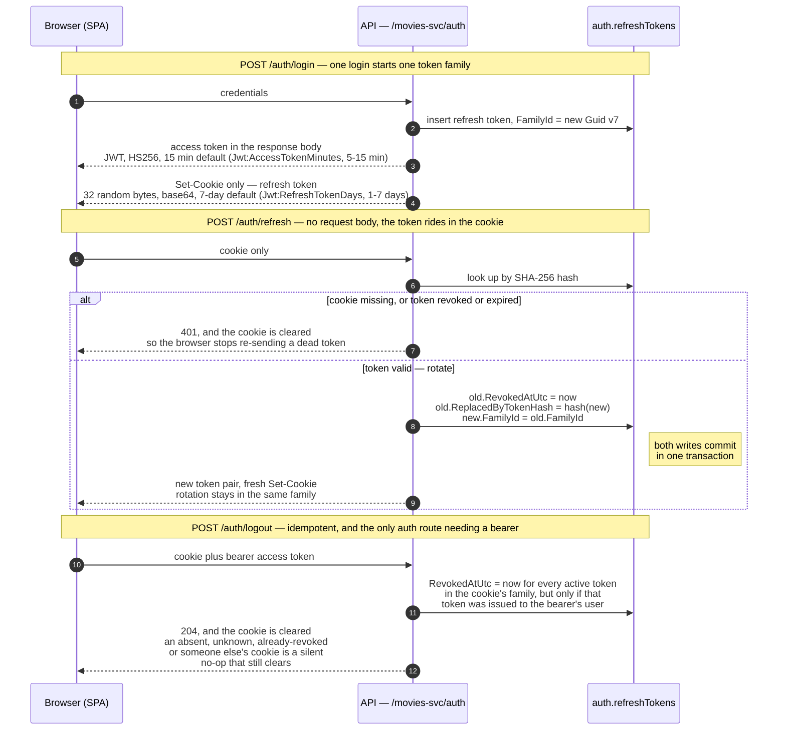

# Auth & Security Model

How authentication works in Cinedex: JWT access tokens, rotating refresh tokens, and where
ASP.NET Core Identity is allowed to live.

> **Also published, in adapted form, on the docs site.** This material is the source for the
> Security section of `@cinedex/docs-site`
> ([`frontend/apps/docs-site/docs/security/`](../frontend/apps/docs-site/docs/security/) — overview,
> token lifecycle, storage & retention, password reset, known gaps). That adaptation is curated
> prose, not a generated copy, so **nothing re-syncs it**: a change here silently leaves those pages
> stale. Update both, or note the divergence. (Only `/changelog` is mechanically generated — see
> `frontend/apps/docs-site/scripts/sync-changelog.mjs`.)

## Layering

Identity is a framework detail, so it is confined to a single adapter behind application-layer
ports. The domain and application layers never reference ASP.NET Core Identity.

| Layer | Type | Responsibility |
|-------|------|----------------|
| Domain | `UserAggregate/User` | Framework-free user aggregate. No password hashes, no tokens. |
| Application | `IIdentityService`, `ITokenService`, `IEmailSender`, `IEmailDispatcher` | Ports the use cases depend on. `IEmailSender` delivers; `IEmailDispatcher` only queues, and is what request-path code uses. |
| Application | `Auth/{Register,Login,Logout,Refresh,ForgotPassword,ResetPassword}` | One handler slice per use case, each with a FluentValidation validator. |
| Adapter | `Cinedex.Auth.Identity` | Implements `IIdentityService` and `ITokenService`: ASP.NET Core Identity for accounts, JWT for tokens, EF Core for hashed refresh-token storage. `ApplicationUser : IdentityUser<Guid>` maps to the domain `User`. |
| Adapter | `Cinedex.Email.Smtp` | Implements `IEmailSender` with MailKit, plus `IEmailDispatcher` (`ChannelEmailDispatcher`) and the `EmailDeliveryWorker` background service that drains the queue. Email delivery is a messaging concern, not authentication, so it lives in its own adapter. |
| Presentation | `Extensions/AuthenticationExtensions` | JWT bearer validation, authorization middleware. |
| Presentation | `Http/RefreshTokenCookie` | Reads, sets, and clears the HttpOnly refresh-token cookie. Keeps the cookie a transport detail the Application layer never sees. |

## Endpoints

All routes are relative to the `/movies-svc` base path.

| Method & route | Auth | Behavior |
|---|---|---|
| `POST /movies-svc/auth/register` | Anonymous | Create a user. `201 Created`. |
| `POST /movies-svc/auth/login` | Anonymous | Validate credentials; returns an access token + refresh token. |
| `POST /movies-svc/auth/refresh` | Anonymous | Exchange a refresh token for a rotated pair. |
| `POST /movies-svc/auth/logout` | **Bearer** | End the session the cookie's refresh token belongs to, if the bearer owns that token. `204 No Content`. |
| `POST /movies-svc/auth/password/forgot` | Anonymous | Always `202 Accepted`. |
| `POST /movies-svc/auth/password/reset` | Anonymous | Reset the password with a valid reset token. `204 No Content`. |

The catalog is members-only: **every Genre and Title endpoint requires a bearer token**, reads and
writes alike. Those endpoints simply omit `AllowAnonymous()` — FastEndpoints requires an
authenticated user by default — so the anonymous surface is exactly the five auth endpoints above.
Anonymous catalog requests receive `401 Unauthorized`
(pinned by `CatalogAuthorizationTests`).

## Token lifecycle

The whole life of one session, from the login that opens it to the logout that closes it. Only the
access token is ever returned in a response body; the refresh token exists for the browser solely as
a cookie.



Logout ends the **family**, not the row the cookie names. A session is a family — one login opens
one — so revoking only the presented hash would leave a rotation that landed moments earlier holding
a live successor, and the session would outlive the logout that ended it. Ending the family is also
bounded in the other direction: the user's other logins are other families and are untouched.

The ownership condition is part of the same statement, not a check made before it. It matters less
as a barrier than it looks — anyone holding another user's refresh token can already exchange it at
`/auth/refresh`, which is strictly worse than ending it — and more as the fix for a browser holding
one user's cookie alongside another's bearer token, where the wrong session used to end. Because
the response is `204` either way, the outcome is not observable from outside. Inside, a token that
exists and belongs to somebody else is logged as a warning under `RefreshTokenOwnershipMismatch`; an
unknown or already-revoked one is ordinary and logged as nothing.

### The refresh token cookie

The refresh token is returned to the browser only as a cookie, never in a response body, so a
cross-site scripting defect cannot read it. The access token remains in the body; it is short-lived
(15 minutes by default; configurable from 5 to 15 minutes) and the client needs to attach it as a
bearer header.

```
Set-Cookie: __Secure-cinedex_refresh_token=<raw token>;
            HttpOnly; Secure; SameSite=Strict; Path=/movies-svc/auth; Expires=<token expiry>
```

| Attribute | Purpose |
|---|---|
| `HttpOnly` | Unreachable from `document.cookie`. The reason for the change. |
| `Secure` | Required by the `__Secure-` prefix; the browser refuses to store the cookie unless it was set over HTTPS. |
| `SameSite=Strict` | The browser never attaches the cookie to a cross-site request, which makes CSRF against `/auth/refresh` structurally impossible rather than something to defend against. |
| `Path=/movies-svc/auth` | The cookie rides only on the auth endpoints, so it never appears in logs or traces for ordinary API traffic. |
| `Expires` | Taken from the token's own expiry, so the cookie and the database row agree on the lifetime. |

`RefreshTokenCookie` (Presentation layer) owns the cookie name and a single `CookieOptions` factory
shared by the set and the clear, so the two cannot drift apart — a cookie is only deleted when the
delete call's attributes match the ones it was set with. `Authentication:RefreshTokenCookie` configures
only `Secure`; `SameSite=Strict`, `HttpOnly=true`, and `Path=/movies-svc/auth` remain fixed, and no
`Domain` attribute is set. The Application layer is unchanged: it still produces the refresh token and
does not know it travels as a cookie.

On a failed refresh the endpoint clears the cookie via `HttpContext.Response.OnStarting`. A direct
clear would be lost, because rethrowing runs `UseExceptionHandler`, which calls `Response.Clear()`
before writing the 401; the `OnStarting` callback runs later, at header-flush time.

#### Deployment constraints

Both are load-bearing. Violating the first breaks authentication silently; violating the second
weakens it.

1. **The SPA and the API must be same-site.** `SameSite` is evaluated on registrable domain, not
   origin (ports are excluded, so `localhost:9000` → `localhost:8080` is already same-site). In
   production this means either one registrable domain (`app.cinedex.com` + `api.cinedex.com`) or the
   API served through the SPA's reverse proxy. A `SameSite=Strict` cookie is not sent cross-site, so
   hosting the UI on an unrelated domain breaks refresh entirely, with a bare 401. Same-site is not
   the same as same-origin: the two-subdomain option is still cross-origin and additionally needs
   CORS with credentials, whereas the reverse-proxy option needs neither.
2. **No untrusted content on sibling subdomains.** The cookie uses the `__Secure-` prefix rather than
   `__Host-`, because `__Host-` forbids a `Path` and would put the token on every API request. The
   trade-off is that `__Secure-` does not forbid a `Domain` attribute, so a sibling subdomain can set
   a same-named cookie scoped to the parent domain and shadow this one. For a refresh token that is
   session fixation. If untrusted subdomains ever become possible, switch to `__Host-` and accept
   `Path=/`.

### Access token claims

Issued by `JwtTokenService.CreateAccessToken`, signed HS256 with `Jwt:SigningKey`:

`sub` (user id) · `email` · `jti` (Guid v7) · `ClaimTypes.NameIdentifier` · `ClaimTypes.Name` ·
`ClaimTypes.Role` (repeatable — one entry per assigned role)

Roles are re-read from Identity on both issue and refresh, so a role change propagates on the next
refresh — the lag is bounded by the access-token lifetime (15 minutes by default; configurable
from 5 to 15 minutes).

Validation (`AuthenticationExtensions.AddJwtAuthentication`) checks issuer, audience, signing key,
and lifetime, with a 30-second clock skew. The JwtBearer default `RoleClaimType` is `ClaimTypes.Role`,
so `[Authorize(Roles = ...)]` reads these claims without further configuration.

### Why refresh tokens are hashed

The raw refresh token is returned to the client exactly once, at issue time — as the cookie above —
and is never persisted in raw form. The database stores only `SHA256(token)` as hex. A dump of the
`auth.refreshTokens` table therefore does not yield usable tokens.

Rotation on every use means a stolen refresh token has a bounded window: the moment the legitimate
client refreshes, the stolen token is revoked, and vice versa.

### Token families

Every refresh token carries a `FamilyId`: a Guid v7 minted by `POST /auth/login` and copied unchanged
onto each replacement by `POST /auth/refresh`. One login therefore produces one family, and the whole
rotation chain that follows shares a single indexed value. Two logins by the same account are two
families, so they can be reasoned about — and revoked — independently.

The identifier is already derivable by walking `ReplacedByTokenHash` hash by hash. The point of
storing it is that the walk collapses into one indexed lookup: a 15-minute default access token
over a 7-day default refresh window means a continuously-active session can accumulate several hundred rotations, so
chain-walking would cost that many sequential round-trips on the refresh path. It is also
forward-only, which leaves a chain's live tail unreachable from an older token.

`FamilyId` is immutable once written. A refresh can therefore use the value from its initial
non-tracked lookup to acquire the family's transaction-scoped advisory lock, then re-read the token
under that lock without any risk that it joined a different family while waiting.

### Reuse response

`POST /auth/refresh` applies one state policy to the presented row:

- An unknown or expired token returns the ordinary generic `401`; expiry takes precedence over reuse
  detection.
- A revoked token without a replacement link — for example one revoked by logout or by an earlier
  family response — returns the same `401` without raising a new reuse event.
- A known, unexpired token with `ReplacedByTokenHash` is evidence that an already-rotated token was
  replayed. Every active token in that family is revoked before the same generic `401` is returned.
- An unrevoked token is rotated normally.

Every known, unexpired family is serialized with a PostgreSQL transaction-scoped advisory lock whose
64-bit key is derived from `FamilyId`. Rotation and reuse both re-read state after acquiring it. This
closes the insertion race that a set-based update alone would leave open: if the active tail rotates
first, reuse sees and revokes the new replacement; if reuse wins, the tail observes its revocation and
cannot insert another token. A hash collision can only make unrelated families wait for one another;
the update still filters by the full `FamilyId`, so it cannot cross family boundaries.

Reuse revocation is one `ExecuteUpdate` covering every unrevoked, unexpired family row, committed in
the same transaction as detection. The service then emits warning event `1001` /
`RefreshTokenReuseDetected` with only `RevokedTokenCount`. The raw token, token hash, family id, user
id, email and username are deliberately absent. The event is emitted after commit, including when a
concurrent response already revoked the tail and the count is zero.

The public contract remains indistinguishable from every other invalid refresh attempt: RFC 7807
`401 Unauthorized` with the existing generic detail, and the refresh cookie is cleared. Only the
compromised login family is affected; other families for the same user remain valid. Already-issued
access tokens also remain valid until their normal expiry because early access-token invalidation is
a separate policy decision.

The revoked ancestors stay in the family until the retention sweep reaps them; see
[Refresh-token retention](#refresh-token-retention) for how long that is and why revoked rows
outlive expired ones.

The value never leaves the server — it is absent from the cookie and from the access-token claims.
Keep it that way: a Guid v7 embeds its creation timestamp, so exposing it would hand a client the
wall-clock time its session began.

## Storage

All Identity and refresh-token tables live in a dedicated **`auth` schema**, set via
`HasDefaultSchema("auth")` in `AuthDbContext`. Because `AuthDbContext` and the catalog's
`FilmDbContext` share one physical database, `AuthDbContext` also gets its own
`__EFMigrationsHistory` table inside the `auth` schema so the two migration histories cannot
collide.

`AuthDbContext` derives from `IdentityDbContext<ApplicationUser, IdentityRole<Guid>, Guid>`, so the
usual Identity role tables (`AspNetRoles`, `AspNetUserRoles`, `AspNetRoleClaims`) live in the `auth`
schema alongside users. Three roles are seeded via `HasData` in `RoleConfiguration` and applied by the
`AddIdentityRoles` migration:

| Role | Purpose |
|---|---|
| `User` | Baseline role. Every account created by `POST /auth/register` is placed here automatically by `IdentityService.RegisterAsync`. |
| `Moderator` | Reserved for future moderation surfaces (e.g., Title/Genre curation). No endpoint uses it yet. |
| `Administrator` | Full access. Bootstrapping the first Administrator is manual — assign via SQL against `auth."AspNetUserRoles"`, or add a config-driven seed later. |

Role names live as constants in `RoleNames`; reference them from `[Authorize(Roles = ...)]` rather
than string literals.

The `refreshTokens` table carries `familyId` (`uuid`, not null) under a non-unique index
`IX_refreshTokens_familyId`, alongside the unique `IX_refreshTokens_tokenHash` and
`IX_refreshTokens_userId`. The `AddRefreshTokenFamilyId` migration deletes every pre-existing row
rather than backfilling one: rows written before the column existed belong to no real family, and any
value invented for them would be a fiction that a later family-wide revocation would act on —
reporting a contained compromise while containing nothing. Refresh tokens are ephemeral by design and
losing one costs a single login, so the migration ends whatever sessions were live when it ran.
Deleting rather than aborting on existing data also keeps the migration unable to fail:
`movies.databasemigrator` gates the web service on its exit code, so a migration that could reject a
populated table would stop the stack from starting.

### Refresh-token retention

Nothing on the request path ever deletes a refresh token: a rotation revokes its predecessor and
inserts a replacement, so the table only grows. `Cinedex.SchedulerWorker` runs a
`RefreshTokenCleanupWorker` that sweeps it on an interval, deleting in bounded batches.

Two retention windows, because the two kinds of dead row are dead for different reasons:

| Category | Deleted when | Default |
|---|---|---|
| Expired, never revoked | `expiresAtUtc` is older than `ExpiredRetention` | 1 day past expiry |
| Revoked | `revokedAtUtc` is older than `ReuseDetectionWindow` (and the row has expired) | 14 days past revocation |

Neither window shortens a session. A token that has not yet expired is never touched by either
category, no matter how long it has sat unused — closing the browser with a still-valid refresh
cookie does not put that row at risk. Both windows only ever apply *after* the row is already dead
by its own rules (expired past `Jwt:RefreshTokenDays`, or revoked by a logout or rotation); the
question they answer is how much longer, past that point, the corpse is kept around.

The two buffers exist for opposite reasons, and are not interchangeable:

- **`ExpiredRetention` (1 day) is not a security boundary.** An expired-and-never-revoked row is
  inert the instant it expires — rotation already rejects it before checking anything else, so no
  code path treats it specially. The day of retention is pure operational slack: room for clock skew
  between the scheduler worker's host and the web service's, and so the row is still queryable for a
  day if someone needs to check when a session actually ended. It is safe to shrink this toward zero.
- **`ReuseDetectionWindow` (14 days) is a security boundary.** A revoked row is the *only* evidence
  that a token was rotated, and — once the family-wide reuse response below is built — the only
  trigger that lets it recognise a stolen, already-rotated token being replayed. Delete it too soon
  and that evidence is gone before it can ever be used. The window has to outlast the period an
  attacker could plausibly still be replaying the token it replaced, which is bounded by the token's
  own lifetime (`Jwt:RefreshTokenDays`, 7 days by default and configurable from 1 to 7 days) — hence
  double that as margin. Shrinking
  this window narrows how long reuse stays detectable; it is not a space-saving knob the way
  `ExpiredRetention` is.

**Revoked rows are kept deliberately, and the second window is the reason.** A revoked row is the
only thing that makes replaying an already-rotated token distinguishable from presenting an unknown
one — delete it and the future family-wide reuse response loses its trigger. `ReuseDetectionWindow`
must therefore stay comfortably above `Jwt:RefreshTokenDays`; nothing enforces that coupling,
because the scheduler worker does not bind the `Jwt` section at all.

Neither predicate can touch a row the service still depends on. Rotation rejects an expired token
before reading anything else and its conditional update requires `revokedAtUtc IS NULL`, so category
one is unreachable by every code path and category two is excluded by construction. A live session's
tail is unrevoked *and* unexpired, so it matches neither.

Both sweeps are served by the composite index `IX_refreshTokens_revokedAtUtc_expiresAtUtc`.
`revokedAtUtc` leads because it separates the two categories, and each sweep takes its ordering from
the index rather than sorting. Note the write-path cost this introduces: rotation updates
`revokedAtUtc`, which was previously in no index, so rotations are no longer HOT updates and now
maintain an index entry.

Operational notes:

- **Work per sweep is capped** at `BatchSize × MaxBatchesPerRun` (10,000 rows by default). A backlog
  drains across successive sweeps rather than in one long transaction. Raising `Interval` lowers the
  drain rate proportionally.
- **Each batch is its own transaction.** Row locks are held for one statement, never across a sweep,
  which is what keeps cleanup off the back of concurrent issuance and rotation.
- **Deletes go through `ExecuteDelete`, not `RemoveRange`.** The usual EF route — load the entities,
  `RemoveRange`, `SaveChanges` — would materialise up to 10,000 rows per sweep only to discard them,
  accumulate every batch in one sweep-scoped change tracker (making each successive `SaveChanges`
  slower as `DetectChanges` is O(tracked)), and wrap each batch in a transaction spanning
  `BatchSize` individual `DELETE` statements rather than one set-based statement — holding the same
  locks far longer. The cost of `ExecuteDelete` is that it bypasses the `SaveChanges` pipeline
  entirely: no interceptors, no concurrency checks, no domain events, and a row count rather than
  the rows themselves. That is safe here only because `AuthDbContext` has none of that machinery.
  **If it ever gains a `SaveChanges` interceptor, a soft-delete convention, or a concurrency token
  on `RefreshToken`, this decision has to be revisited** — the sweep would bypass all three silently,
  with no compile error to catch it.
- **A sweep runs at startup**, not after the first interval, so a redeployed worker starts reclaiming
  immediately.
- **Single replica assumed.** Compose runs one `movies.schedulerworker`. Two would race on
  overlapping batches — no corruption, since `DELETE` is idempotent and locking is per row, just
  duplicated work and double-counted log totals. If the worker is ever scaled out, wrap the sweep in
  a `pg_try_advisory_lock`.
- **Failures are swallowed and retried** on the next interval. An escaping exception would trip
  `BackgroundServiceExceptionBehavior.StopHost` and take the worker process down.
- The sweep logs counts and elapsed time only — never a token hash, user id, or family id.

### Identity options

Configured in `DependencyInjection.AddAuthenticationAdapter`:

- `RequireUniqueEmail = true`
- Lockout after 5 failed attempts, for 5 minutes
- **Password policy** — Identity is the single authority for password strength; the application-layer
  FluentValidation only checks the input is non-empty and at most 256 characters. The policy:
  - minimum length 8
  - at least one digit, one uppercase, one lowercase, and one non-alphanumeric character

  All rules are defined in `PasswordPolicyConstants` and applied explicitly in
  `AddAuthenticationAdapter` (not left to framework defaults), so the policy is visible in one place
  and enforced at registration and password reset.

## Configuration

The `Jwt` section is bound to `JwtOptions` and read by both the adapter (token issuance) and the
presentation layer (token validation) — the signing key must match on both sides.

| Key | Default | Notes |
|---|---|---|
| `Jwt:Issuer` | `https://cinedex.local` | |
| `Jwt:Audience` | `cinedex-api` | |
| `Jwt:SigningKey` | dev placeholder | **See below.** Minimum 32 bytes for HS256. |
| `Jwt:AccessTokenMinutes` | `15` | Configurable; must be between 5 and 15 minutes (inclusive). |
| `Jwt:RefreshTokenDays` | `7` | Configurable; must be between 1 and 7 days (inclusive). |

The `RefreshTokenCleanup` section is bound to `RefreshTokenCleanupOptions` and read only by
`Cinedex.SchedulerWorker`; the web service neither binds nor needs it. All values are validated at
startup via `ValidateOnStart`, so a bad one fails the worker at boot rather than at the first sweep.

| Key | Default | Notes |
|---|---|---|
| `RefreshTokenCleanup:Interval` | `00:10:00` | Time between sweeps. Raising it lowers the drain rate proportionally. |
| `RefreshTokenCleanup:ExpiredRetention` | `1.00:00:00` | How long an expired, never-revoked row is kept past expiry. |
| `RefreshTokenCleanup:ReuseDetectionWindow` | `14.00:00:00` | How long a revoked row is kept past revocation. **Keep well above `Jwt:RefreshTokenDays`.** |
| `RefreshTokenCleanup:BatchSize` | `500` | Rows per delete statement; bounds how long one statement holds row locks. |
| `RefreshTokenCleanup:MaxBatchesPerRun` | `20` | Batches per sweep; bounds total work per tick. |

> ⚠️ **The `Jwt:SigningKey` in `appsettings.json` is a committed, dev-only placeholder.** It is
> public and must never be used outside local development. Override it per environment via the
> `Jwt__SigningKey` environment variable or .NET User Secrets, the same way
> `ConnectionStrings:DefaultConnection` is handled. `AddJwtAuthentication` throws at startup if
> the key is absent, but it cannot tell a real key from the placeholder.

## Password reset

`POST /auth/password/forgot` **always returns `202 Accepted`**, whether or not the email
corresponds to a real account. This is deliberate: a `404` for unknown emails would turn the
endpoint into an account-enumeration oracle.

The reset token is generated by Identity's default token providers — `DataProtectorTokenProvider`,
which produces a stateless, data-protection-encrypted token rather than a stored one. It carries the
user id and a snapshot of the account's `SecurityStamp`, so a token stops working once the password
(or any other stamp-changing property) changes, and **expires one hour after issue**. That lifespan is
set explicitly in `AddAuthenticationAdapter` via `DataProtectionTokenProviderOptions.TokenLifespan`,
overriding Identity's one-day default; it applies to every token from the `Default` provider, which
today means password reset only. The value itself lives in `PasswordResetTokenPolicy` in
`Cinedex.Application`, which the reset email also formats its "expires in" sentence from, so the
configured expiry and the copy the recipient reads cannot drift apart. Note that the `email` query
parameter in the reset link is only a lookup convenience — the token alone is the proof of
authorization. The token is stateless rather than stored, so it is not single-use: it stops working
once a reset *succeeds* (the `SecurityStamp` changes) or once it expires, but until then the same
link can be followed again.

`ForgotPasswordHandler` composes the reset email — subject, the reset link built from the token and
the configured `Frontend:BaseUrl`, and the branded HTML body that `CinedexEmailLayout` renders
around them (with the Cinedex logo attached as an inline `cid:` image and a plain-text alternative
alongside) — into an `EmailMessage`, then hands that to the `IEmailDispatcher` port. Composition
is an application concern; the `SmtpEmailSender` implementation in the `Cinedex.Email.Smtp` adapter
is a thin MailKit transport that only delivers. It uses the configured `Smtp` section, requires
SMTP username/password authentication, and supports plain text and HTML with a plain-text
alternative.

Delivery happens **off the request path**. The handler hands the composed message to the
`IEmailDispatcher` port, which returns immediately; `ChannelEmailDispatcher` writes it to a bounded
in-memory channel, and `EmailDeliveryWorker` — a `BackgroundService` in the same adapter — drains the
channel and calls `IEmailSender`. This is what keeps the endpoint's *latency* identical for known and
unknown accounts. Before it, the known-account path additionally awaited a four-round-trip SMTP
conversation that the unknown path skipped, so the two were distinguishable from outside despite both
returning `202 Accepted`. Consequences worth knowing:

- **The queue is in-process and not durable.** A crash, or overflow of the 1,000-message queue, loses
  queued email; the drop is logged (without the recipient address) and the user must request another
  reset. A deliberate trade — an unbounded queue behind an anonymous endpoint is a memory-exhaustion
  vector, and a dropped reset is recoverable where an out-of-memory process is not.
- **Delivery failures never reach the caller.** `EmailDeliveryException` is caught and logged by
  `EmailDeliveryWorker`, without the recipient address or body. `202 Accepted` means the request was
  accepted, not that mail was sent.
- **Deliveries never observe the request's `CancellationToken`,** which is already cancelled once the
  response completes. The worker owns a separate token, cancelled only when the shutdown drain window
  expires.
- **Shutdown drains the queue.** `StopAsync` completes the channel writer and lets the worker finish
  the backlog within a five-second window (inside Docker's ten-second default stop grace), so a
  redeploy does not silently swallow an in-flight reset email.

## Errors

`InvalidCredentialsException` (thrown for bad logins and for invalid, revoked, or expired refresh
tokens) is translated to `401 Unauthorized` by `InvalidCredentialsExceptionHandler`, which
participates in the same chain-of-responsibility `IExceptionHandler` pipeline as the validation and
not-found handlers. All error responses are RFC 7807 problem details carrying the request's
correlation id.

## Known gaps

These are deliberate scope cuts, not oversights — but they are load-bearing if you are about to
build on this.

- **Migrations are not applied by the web service.** The `Cinedex.DatabaseMigrator` project applies
  both contexts, and Compose gates the web service on it completing successfully; the integration-test
  fixture migrates itself. Nothing in `Program.cs` migrates either context, so a `dotnet run` against a
  fresh database still needs the migrator or an explicit `dotnet ef database update`. See the
  [backend README](../backend/README.md#migrations).
- **The forgot-password response still carries a small timing signal.** Queueing the reset email
  removed the large one — the four-round-trip SMTP conversation that only the known-account path
  performed, which MailKit lets run for up to two minutes against an unresponsive relay. What remains
  is that a known account additionally runs `UserManager.GeneratePasswordResetTokenAsync` (an
  AES + HMAC-SHA256 `DataProtectorTokenProvider` operation over already-loaded user state, tens of
  microseconds) after the `FindByEmailAsync` lookup both paths share. That is one to three orders of
  magnitude below normal network and pipeline jitter, so exploiting it needs a large sample from a
  low-noise vantage point rather than a single observation — a narrow residue, not a closed hole.
  Closing it entirely would require a constant-time response: padding every response to a fixed
  latency floor, or moving token generation off the request path as well.
- **No rate limiting anywhere in the service.** `POST /auth/password/forgot` is anonymous and
  unthrottled, so nothing caps the sample size an attacker can collect against the residual timing
  signal above, and nothing stops them enqueuing reset emails to a known address in a loop. This is
  the higher-value next step for this endpoint.
- **No endpoint yet enforces roles.** The `User`, `Moderator`, and `Administrator` roles are seeded
  and the access token carries them, but no endpoint restricts by role — Genre and Title endpoints
  require authentication, not a particular role, so any logged-in account can edit the catalog.
  Bootstrapping the first `Administrator` is also manual (SQL against `auth."AspNetUserRoles"`);
  no `Auth:BootstrapAdminEmail` seed exists.
- **Direct HTTP local development is supported.** `appsettings.Development.json` sets
  `Authentication:RefreshTokenCookie:Secure=false` and permits credentialed CORS only from
  `http://localhost:5173`. The default direct WebService launch profile listens on
  `http://localhost:5186`. Browser requests that rely on the refresh cookie must use
  `credentials: "include"`. Production defaults to `Secure=true`; the secure cookie keeps its
  `__Secure-` prefix, while HTTP development uses an unprefixed name because browsers reject a
  `__Secure-` cookie without the `Secure` attribute. Compose and the Vite proxy remain same-origin
  local alternatives and do not need CORS. Non-local split-origin deployments must explicitly add
  their own credentialed CORS origin or provide an equivalent reverse proxy (see [Deployment constraints](#deployment-constraints)).
- **No email confirmation, external logins, or 2FA.**
