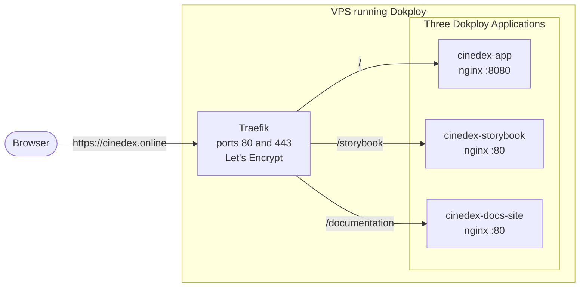

# Deploying the frontend with Dokploy

How the three frontend sites — the SPA, Storybook and the documentation site — are served from a
single domain by [Dokploy](https://dokploy.com/), a self-hosted PaaS that wraps Docker and
[Traefik](https://traefik.io/) behind a web UI.

This covers **the frontend only**. The web service, scheduler worker, Postgres, Seq and Mailpit
are not deployed here yet; [What this does not cover](#what-this-does-not-cover) says what changes
when they are.

## The layout

Everything lives on one origin, `https://cinedex.online`. The SPA owns the root, and the two
static bundles sit under a path prefix:



Three separate Applications rather than one Compose service, so Storybook and the docs site can
redeploy without touching the SPA, and each gets its own build arguments, logs and deploy history.

Why one domain and not three subdomains: the URLs are already baked into shipped metadata.
Storybook's social card hardcodes `https://cinedex.online/storybook/` in
`apps/storybook/.storybook/manager-head.html` (static HTML with no interpolation — it cannot read
the environment), and the docs site's `STORYBOOK_BASE_URL` build argument defaults to the same
value. Moving to subdomains means changing those too.

## The routing rule that matters

**Neither static bundle is served with its path prefix stripped.** Traefik forwards
`/storybook/...` and `/documentation/...` to the containers intact, and each container's nginx
config serves that prefix itself. This is the single most important setting on this page, and
getting it wrong fails silently.

Both bundles reference their assets *relative* to the page — Storybook emits
`./sb-manager/runtime.js` and `./assets/*`, Docusaurus resolves against its `baseUrl`. Relative
references work under any prefix, but only when the browser's URL ends in a slash. Ask for
`https://cinedex.online/storybook` without the trailing slash and the browser resolves
`./sb-manager/runtime.js` against the parent directory, requesting `/sb-manager/runtime.js` at
the site root. That path belongs to the SPA, whose nginx answers *every* unmatched path with
`index.html` at `200 OK`. The browser gets HTML where it asked for JavaScript, the page renders
blank, and nothing anywhere reports an error.

The fix is a redirect from `/storybook` to `/storybook/`, and only nginx can issue it — which it
can only do if it can see the prefix in the first place. Hence: **Strip Path off**. Both
`apps/storybook/nginx.conf` and `apps/docs-site/nginx.conf` carry that redirect and a `rewrite`
that drops the prefix for the file lookup alone.

This is checked, not reasoned about: the built `storybook-static/` bundle contains no absolute-root
asset path at all, and serving it through `apps/storybook/nginx.conf` on nginx 1.24 resolves
`/storybook` to `/storybook/` in a single hop and returns `sb-manager/runtime.js` as
`application/javascript`.

The same layout is wired into `compose.yaml` and the root `Caddyfile`, so
`docker compose up --build` exercises it locally — `https://localhost:9000/storybook/` and
`https://localhost:9000/documentation/` behave exactly as production does. Rehearse there before
touching the server.

## Before you start

- A VPS with Dokploy installed (`curl -sSL https://dokploy.com/install.sh | sh`), ports 80 and
  443 reachable.
- DNS: an `A` record for `cinedex.online` pointing at the VPS IP. Add `www` too if you want it.
  Let's Encrypt validates over HTTP, so this has to resolve *before* you enable HTTPS.
- The GitHub provider connected under **Settings → Git**. Use the GitHub App integration rather
  than a deploy key: Watch Paths and auto-deploy work with no further setup on GitHub, and need
  manual webhook wiring on every other provider.
- Build headroom. Three Node builds — Vite, Storybook and Docusaurus — are memory-hungry, and
  Dokploy's own guidance is to avoid building on the server for exactly this reason. On a small
  droplet add swap before the first deploy, or jump straight to
  [building in CI](#upgrade-path-build-in-ci-instead) below.

Create one project (**Projects → Create Project**, name it `cinedex`) and add all three
applications to it.

## The three applications

For each: **Create Service → Application**, then fill in the tabs below. Everything is on branch
`main` of `felipedferreira/Cinedex`, with **Build Type: Dockerfile**.

The two paths are both relative to the repository root, and they are not the same directory. The
frontend is an npm workspace whose lockfile is hoisted to `frontend/`, so the SPA and Storybook
build from there. The docs site builds from the repository root instead, because its changelog
page is generated from the root `CHANGELOG.md`.

| | `cinedex-app` | `cinedex-storybook` | `cinedex-docs-site` |
|---|---|---|---|
| **Dockerfile Path** | `frontend/apps/cinedex-app/Dockerfile` | `frontend/apps/storybook/Dockerfile` | `frontend/apps/docs-site/Dockerfile` |
| **Docker Context Path** | `frontend` | `frontend` | `.` |
| **Docker Build Stage** | leave empty | leave empty | leave empty |
| **Container Port** | `8080` | `80` | `80` |

Leave Build Stage empty on all three — each Dockerfile's last stage (`final`) is the nginx image
you want, and naming an earlier stage would ship the Node build container instead.

### Build arguments

Only the docs site needs any. Under **Environment → Build Time Arguments**:

```
DOCUSAURUS_BASE_URL=/documentation/
STORYBOOK_BASE_URL=https://cinedex.online/storybook
```

Both are already the Dockerfile's defaults, so the build is correct without them. Set them
anyway — they are the two values that decide where every generated link and asset URL on that
site points, and a future change to a default should not silently move a deployed site.

`DOCUSAURUS_BASE_URL` must keep its trailing slash. `STORYBOOK_BASE_URL` must not have one.

The SPA and Storybook take no build arguments. Storybook's is a genuinely static bundle, and the
SPA has no API to point at yet.

### Domains

Under **Domains → Add Domain** on each application:

| | `cinedex-app` | `cinedex-storybook` | `cinedex-docs-site` |
|---|---|---|---|
| **Host** | `cinedex.online` | `cinedex.online` | `cinedex.online` |
| **Path** | `/` | `/storybook` | `/documentation` |
| **Strip Path** | off | **off** | **off** |
| **Internal Path** | empty | empty | empty |
| **Container Port** | `8080` | `80` | `80` |
| **HTTPS** | on | on | on |
| **Certificate** | Let's Encrypt | Let's Encrypt | Let's Encrypt |

Same host three times is intentional. Traefik prioritises routers by rule length by default, so
`Host(cinedex.online) && PathPrefix(/storybook)` is matched before the SPA's shorter
`Host(cinedex.online) && PathPrefix(/)` and the prefixes win. If a future rule ever ties, the
per-application **Advanced → Traefik** editor is where an explicit `priority` goes.

Issue the certificate once, on whichever application you deploy first. All three routers share
the same host, so they share the certificate.

### Watch Paths

Without these, a commit touching only the backend redeploys all three sites. Under
**Deployments → Watch Paths**, with **Auto Deploy** enabled:

**`cinedex-app`**

```
frontend/apps/cinedex-app/**
frontend/packages/**
frontend/package.json
frontend/package-lock.json
```

**`cinedex-storybook`**

```
frontend/apps/storybook/**
frontend/packages/**
frontend/package.json
frontend/package-lock.json
```

**`cinedex-docs-site`**

```
frontend/apps/docs-site/**
frontend/packages/**
frontend/package.json
frontend/package-lock.json
CHANGELOG.md
```

`frontend/packages/**` is on all three because every app compiles the four `@cinedex/*` packages
from source — they have no build step and no `dist/`, so a change to `theme`, `atoms`, `compounds`
or `solution` is a change to all three bundles. `CHANGELOG.md` is on the docs site alone because
its `/changelog` page is generated from that file at build time.

## Verify

Deploy the SPA first so the certificate is issued against a working root, then the other two.
Then check the parts that fail quietly:

```bash
# The SPA answers at the root.
curl -sI https://cinedex.online/ | head -1

# Both prefixes redirect rather than 404 — this is the trailing-slash guard.
curl -sI https://cinedex.online/storybook     | grep -i '^location'
curl -sI https://cinedex.online/documentation | grep -i '^location'

# Assets come back as JavaScript, not the SPA's index.html.
curl -s https://cinedex.online/storybook/ \
  | grep -o './sb-manager/runtime.js'
curl -sI https://cinedex.online/storybook/sb-manager/runtime.js \
  | grep -i '^content-type'
```

That last check is the one worth keeping. `content-type: text/html` there means the request fell
through to the SPA — Strip Path is on somewhere it should not be.

Then open both sites in a browser. A blank Storybook with a green deploy is the failure this page
exists to prevent, and it only shows up in the browser console.

Also confirm the docs site's Storybook link, on its **Design choices and theme** page, points at
`https://cinedex.online/storybook` rather than `http://localhost:9001`. That link is the visible
proof `STORYBOOK_BASE_URL` was applied at build time.

## Upgrade path: build in CI instead

The setup above builds on the VPS on every push. It is the fastest way to get live and it is fine
for a portfolio, but Dokploy's own production guidance is to build elsewhere — a server that is
also serving traffic can stall or freeze under a Node build.

The migration is small, and only the first two rows of the application config change:

1. Add a GitHub Actions job that builds the three images and pushes them to GHCR.
2. Switch each application's **Source Type** from GitHub to **Docker**, naming the image
   (`ghcr.io/felipedferreira/cinedex-app:latest` and so on).
3. Copy the **Webhook URL** from each application's Deployments tab and call it from the workflow
   after the push.

Domains, ports and the Strip Path rule are unaffected. Note that the docs site's two build
arguments move into the workflow at that point, since the image is no longer built by Dokploy.

## What this does not cover

The backend is not deployed. When it is, three things on this page change:

- **A fourth router**, `/movies-svc`, pointing at the web service — mirroring what the
  `Caddyfile` already does locally.
- **The refresh-token cookie needs the API same-origin with the SPA.** It is issued
  `Secure` and `SameSite=Strict`, which is why the local stack puts both behind one Caddy origin.
  The path-based layout here preserves that property; subdomains would not have.
- **`ForwardedHeaders__Enabled`** must stay `true` so the web service reads Traefik's
  `X-Forwarded-*` rather than seeing every request as HTTP from the proxy's address.

Postgres, Seq and Mailpit are also unaddressed. Mailpit in particular is a development sink and
should not be what a deployed site sends mail through.

## See also

| Document | What it covers |
|---|---|
| [Getting Started](getting-started.md) | Running the whole stack locally with Docker Compose. |
| [Frontend README](../frontend/README.md) | Workspace layout, the three apps, the four packages. |
| [Docs site setup](../frontend/apps/docs-site/docs/frontend/documentation-site-setup.md) | `DOCUSAURUS_BASE_URL` and `STORYBOOK_BASE_URL` in detail. |
| [Auth & Security Model](auth-security-model.md) | Why the API has to stay same-origin with the SPA. |
