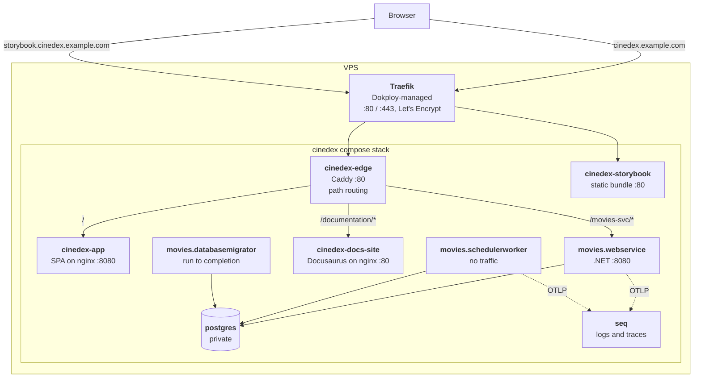

# Deploying Cinedex to a VPS with Dokploy

[Dokploy](https://dokploy.com/) is a self-hosted PaaS: it installs Docker, Traefik and a web UI on
your own VPS, then deploys applications from a Git repository. For this repository the relevant
mode is its **Compose** application type — Dokploy clones the repo on the server, runs
`docker compose up` against a compose file you name, and puts Traefik in front of whichever
services you give a domain to.

This repository ships three files for that path:

| File | Purpose |
|---|---|
| `compose.production.yaml` | The stack Dokploy deploys. No host ports, no `container_name`, no Mailpit, every secret from the environment. |
| `Caddyfile.production` | The internal edge that routes `/movies-svc`, `/documentation` and `/` behind Traefik. |
| `.env.production.example` | The variables to paste into Dokploy's Environment tab. |

The local `compose.yaml` is **not** deployable as-is, and the reasons are worth knowing before you
start — they are listed under [Why not just deploy `compose.yaml`?](#why-not-just-deploy-composeyaml).

## What the deployed stack looks like



Two public hostnames, and only two containers on `dokploy-network`: `cinedex-edge` and
`cinedex-storybook` (plus `seq`, if you choose to give it one). Everything else — the database
above all — lives on the stack's private `internal` network and is unreachable from outside the
VPS.

**The SPA and the API share one origin on purpose.** The refresh-token cookie is
`Secure; SameSite=Strict`, so an `api.cinedex.example.com` split would have the browser drop it on
every request and log users out at each access-token expiry. That is why path routing happens in
`Caddyfile.production` rather than as three separate Dokploy domains — and it keeps the routing
table in version control.

## Prerequisites

- **A VPS with at least 4 GB of RAM** if you let Dokploy build the images on the server. There are
  five image builds, three of them .NET SDK builds and two of them full npm installs; 2 GB is not
  enough and the failure looks like a killed process, not an out-of-memory error. See
  [Building the images](#building-the-images) for the lighter alternative.
- **A domain**, with two DNS `A` records pointing at the VPS IP: the apex (or a subdomain) for the
  app, and one for Storybook. Point them before you add the domains in Dokploy — Let's Encrypt
  validates over HTTP and fails on a name that does not resolve yet.
- **Docker's ports free**: nothing else on the host may hold :80 or :443.

## 1. Install Dokploy

On a fresh Ubuntu/Debian VPS, as root:

```bash
curl -sSL https://dokploy.com/install.sh | sh
```

The installer sets up Docker Swarm, Traefik, and the Dokploy UI on port 3000. Open
`http://<vps-ip>:3000`, create the admin account **immediately** — the first account to register
becomes the owner — and then, from the UI, give Dokploy itself a domain and let it move off the
raw IP.

It also creates the `dokploy-network` that `compose.production.yaml` joins as an external network.

## 2. Connect the repository

In the Dokploy UI: **Projects → Create Project → Create Service → Compose**.

- **Provider**: GitHub (install the Dokploy GitHub App and select `felipedferreira/Cinedex`), or
  Git with a deploy key for a private repo.
- **Branch**: `main`.
- **Compose Path**: `./compose.production.yaml` — this is the field that is easy to miss, and
  leaving it at the default deploys the *local* compose file.
- **Compose Type**: `docker-compose`.

## 3. Fill in the environment

Open the **Environment** tab and paste the contents of `.env.production.example`, filled in.
Dokploy writes them to an `.env` beside the compose file at deploy time; they never touch the
repository.

Three of them decide whether the deployment is actually sound:

- **`JWT_SIGNING_KEY`** — `appsettings.json` ships a committed development key. Deploy without
  overriding it and anyone who can read this public repository can forge a valid access token for
  your instance. `openssl rand -base64 48`.
- **`PUBLIC_BASE_URL`** — the JWT issuer and, more visibly, the host used to build password-reset
  links in outgoing email. Wrong value, and the app works fine while every reset email points
  somewhere else.
- **`SMTP_*`** — Mailpit is a development sink and is not deployed. With no real SMTP provider the
  forgot-password endpoint accepts the request and delivers nothing.

Note that Compose substitutes an unset variable with an empty string without complaining, so a
variable you forget surfaces as a runtime failure rather than a failed deploy.

## 4. Assign the domains

In the **Domains** tab, add two entries. Dokploy injects the Traefik labels for you at deploy time
— you do not need to write any label into the compose file.

| Host | Service | Container port | HTTPS |
|---|---|---|---|
| `cinedex.example.com` | `cinedex-edge` | `80` | on, Let's Encrypt |
| `storybook.cinedex.example.com` | `cinedex-storybook` | `80` | on, Let's Encrypt |

Storybook gets a hostname rather than a path because its bundle is built with Vite's default base
of `/` and references its assets as absolute `/assets/...` URLs. Mounted at `/storybook` the shell
would return 200 and every asset would 404 — a blank page with a green deploy.

Optionally add a third for `seq` (port `80`) if you want the log UI reachable; it is protected only
by its own login, so most deployments are better served by leaving it private and reading it
through an SSH tunnel.

## 5. Deploy

Hit **Deploy** and watch the logs. First deploy takes a while — five images, from scratch.

The order to expect: Postgres and Seq come up and go healthy, `movies.databasemigrator` runs to
completion applying both `FilmDbContext` and `AuthDbContext` migrations, and only then do the web
service and scheduler worker start. That gate is `condition: service_completed_successfully` in the
compose file, and it is why deployments carrying a new migration do not need a manual step.

Then finish the Seq setup, which is the one piece of first-run state the compose file cannot do for
you:

1. Open Seq, sign in as `admin` with `SEQ_ADMIN_PASSWORD`, choose a permanent password.
2. **Settings → API Keys → Add API Key**, and set its token to your `SEQ_API_KEY` value.
3. Redeploy so the services pick it up.

Until that key exists, everything works and no telemetry arrives.

## Verifying

```bash
curl -sf https://cinedex.example.com/movies-svc/health/ready
curl -sI https://cinedex.example.com/                     # SPA shell
curl -sI https://cinedex.example.com/documentation/       # docs site
```

Then register a user through the UI and confirm the password-reset email actually lands. That one
flow exercises SMTP, `PUBLIC_BASE_URL` and the database together.

If API calls come back as `307 Temporary Redirect` in a loop, the `X-Forwarded-Proto` chain is
broken — see the `trusted_proxies` note in `Caddyfile.production`, which exists for exactly that
failure.

## Building the images

By default Dokploy builds on the VPS, from the repository. That is the simplest setup and costs a
few minutes and a few GB of RAM per deploy.

If the VPS is small, or you want deploys to be fast, build in CI instead and have the VPS pull:

1. Extend `.github/workflows/` with a job that builds the five images and pushes them to GHCR,
   tagged with the commit SHA.
2. In `compose.production.yaml`, replace each `image: cinedex/<name>:${IMAGE_TAG:-latest}` with
   `ghcr.io/felipedferreira/cinedex-<name>:${IMAGE_TAG}` and delete that service's `build:` block.
3. Set `IMAGE_TAG` in Dokploy's Environment tab per release, and add a registry credential under
   **Settings → Registry** so the VPS can pull.

The image names in `compose.production.yaml` are already parameterized by `IMAGE_TAG` so only the
prefix and the `build:` blocks change.

## Operating it

**Backups.** `postgres_data` is a named Docker volume on the VPS and nothing backs it up
automatically. Either register the database under Dokploy's own **Databases → Backups** (S3-
compatible destination, scheduled `pg_dump`), or add a cron job on the host:

```bash
docker compose -p cinedex exec -T postgres pg_dump -U movies_rw movies | gzip > movies-$(date +%F).sql.gz
```

**Updates.** Push to `main` and hit Deploy, or enable Dokploy's auto-deploy webhook. The migrator
runs on every deploy and is a no-op when there is nothing to apply.

**Logs.** Seq holds the structured logs and traces from all three .NET services. Container-level
output is in the Dokploy UI per service.

**Reaching the database.** It publishes no port. For a psql session:

```bash
docker compose -p cinedex exec postgres psql -U movies_rw -d movies
```

## Why not just deploy `compose.yaml`?

The local file is built for a laptop, and four of its choices are actively wrong on a public host:

1. **`ports: "5432:5432"` on Postgres.** On a VPS that is the database, exposed to the internet,
   with a password from your `.env`. `compose.production.yaml` publishes no port at all.
2. **Caddy binds `127.0.0.1:9000:443` and serves `https://localhost` with `tls internal`.** A
   self-signed certificate for the wrong hostname, on a port Traefik does not use. Production
   terminates TLS at Traefik and runs the same routing table on plain `:80` internally.
3. **Mailpit.** A mail sink that captures everything and delivers nothing.
4. **Fixed `container_name` values.** They make the stack un-deployable twice and break Dokploy's
   isolated deployments, which suffix container names per deployment.

Plus the secrets: the local file never sets `Jwt__SigningKey`, so it silently runs on the committed
development key.

## Related

- [Getting Started](../getting-started.md) — the local Compose stack.
- [Auth & Security Model](../auth-security-model.md) — why the refresh cookie constrains the origin
  layout.
- [Dokploy: Docker Compose docs](https://docs.dokploy.com/docs/core/docker-compose/domains)
