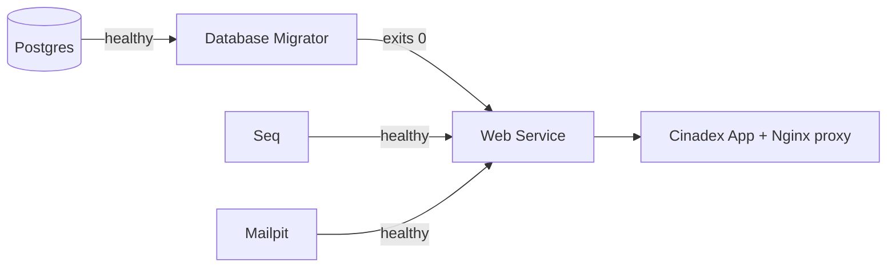

# Getting Started

This is the fastest path from a fresh clone to a running Cinedex stack — Postgres, the API,
the SPA, logs/traces, and a dev mail sink — all via Docker Compose.

> Want to run the backend without Docker, add a migration, or understand the architecture?
> This guide stops at "it's running." For everything after that, see
> **[backend/README.md](../backend/README.md)**.

## Prerequisites

Just two things:

- **Docker Desktop** (or Docker Engine + the Compose plugin)
- **Git**

That's it for this guide. (The no-Docker path needs the .NET 10 SDK and Node 22 — see the
[backend README](../backend/README.md#building-and-running).)

## The 5-minute path

```bash
git clone https://github.com/felipedferreira/Cinedex.git
cd Cinedex
cp .env.example .env       # then fill in the values below
docker compose up --build
```

First build takes a few minutes (Docker pulls images and builds the .NET and Node projects).
Keep reading — there's one manual step ([Seq setup](#3-one-time-setup-seq)) before logs show up.

## 1. Configure your `.env`

Compose reads secrets from a git-ignored `.env` file at the repo root — `docker compose up`
fails without it. Copy the template and fill in every value:

```bash
cp .env.example .env
```

| Variable | What to put there |
|---|---|
| `DB_PASSWORD` | Any password. Only applied the *first* time the Postgres volume is created. |
| `DB_CONNECTION_STRING` | Full connection string — the password **must match** `DB_PASSWORD` above. |
| `SEQ_ADMIN_PASSWORD` | Any password. This is your first-login password for the Seq UI (`admin`). |
| `SEQ_API_KEY` | Any random string. You'll register this as an ingestion key in [step 3](#3-one-time-setup-seq). |
| `MAILPIT_SMTP_USER` / `MAILPIT_SMTP_PASSWORD` | Any dev values. Avoid `:` in the password. |

> 💡 None of these need to be "real" secrets — this is all local-only. Pick anything memorable.

## 2. Start the stack

```bash
docker compose up --build
```

Compose brings services up in dependency order — the migrator waits for Postgres, the web
service waits for the migrator *and* Seq *and* Mailpit, and the UI waits for the web service:



The one-shot **Database Migrator** applies pending EF Core migrations for both the catalog and
auth schemas and exits — there's nothing else to run by hand for a fresh database.

| Service | Address | Purpose |
|---|---|---|
| `cinadex-app` | https://localhost:9000 | React SPA + reverse proxy (self-signed cert) |
| `cinedex-storybook` | http://localhost:9001 | Storybook for the `@cinedex/*` component libraries (static, plain HTTP) |
| `movies.webservice` | via the proxy at `/movies-svc` | ASP.NET Core API (not exposed directly) |
| `postgres` | localhost:5432 | Catalog + auth data |
| `seq` | http://localhost:5341 | Logs & traces |
| `mailpit` | http://localhost:8025 | Captured dev email |

## 3. One-time setup: Seq

Seq is the only piece that needs manual setup after `docker compose up`. It won't start
without an admin password, and it won't accept logs until an ingestion key is registered.

1. **Log in.** Open http://localhost:5341, sign in as `admin` with your `SEQ_ADMIN_PASSWORD`,
   and choose a permanent password when prompted. (This gets saved into the `seq_data` volume —
   changing `.env` afterwards won't update it.)
2. **Register your ingestion key.** Go to **Settings → API Keys → Add API Key**:
   - **Title:** anything, e.g. `Movies WebService`
   - **Token:** paste your `SEQ_API_KEY` value (don't let Seq generate a random one — it must match `.env`)
   - **Permissions:** `Ingest`
   - Save.
3. **Restart the web service** so it picks up the key:
   ```bash
   docker compose up -d movies.webservice
   ```

> Logs actually flow *without* this step too — Seq accepts unauthenticated events by default.
> Registering the key just attributes them properly and future-proofs against turning on
> ingestion auth later.

Forgot your Seq password, or started it with the wrong first-run settings? Reset just the Seq
volume (Postgres data is untouched):

```bash
docker compose down
docker volume rm cinedex_seq_data
docker compose up -d seq
```

## 4. Verify it's alive

```bash
curl -k https://localhost:9000/movies-svc/health/ready
# {"status":"Healthy","checks":[{"name":"postgres","status":"Healthy"}]}
```

(`-k` because the local cert is self-signed.) Full health-check reference:
[backend/README.md#-health-checks](../backend/README.md#-health-checks).

## 5. Try it out

Register a user, then trigger a password-reset email and watch it land in Mailpit:

```bash
curl -k -X POST https://localhost:9000/movies-svc/auth/register \
  -H "Content-Type: application/json" \
  -d '{"email":"you@example.com","userName":"you","password":"<A_PASSWORD>"}'

curl -k -X POST https://localhost:9000/movies-svc/auth/password/forgot \
  -H "Content-Type: application/json" \
  -d '{"email":"you@example.com"}'
```

Open **http://localhost:8025** — a "Reset your password" email should appear a moment after
the `202 Accepted` (delivery is queued, not sent inline, so give it a second). Click it to see
the rendered HTML, plain-text, and raw MIME views.

Other things worth poking at:
- **API docs:** https://localhost:9000/movies-svc/api-docs/v1 (Scalar UI)
- **OpenAPI spec:** https://localhost:9000/movies-svc/openapi/v1.json

Full walkthrough of the email flow, including how the reset token behaves:
[backend/README.md#-email-mailpit-dev-mail-sink](../backend/README.md#-email-mailpit-dev-mail-sink).

## Stopping the stack

```bash
docker compose down          # stop everything, keep data
docker compose down -v       # also wipe Postgres and Seq volumes — start clean
```

## Troubleshooting

<details>
<summary><strong>Browser or curl complains about the certificate</strong></summary>

The UI/proxy uses a self-signed TLS cert for local dev. Trust it in your browser on first
visit, or pass `-k` to curl.
</details>

<details>
<summary><strong>Seq UI won't load at http://localhost:5341</strong></summary>

On Docker Desktop / Windows, a dual-stack bind makes `localhost` resolve to IPv6 first, which
Docker Desktop fails to relay — that's why Seq is pinned to `127.0.0.1:5341`. Try
`http://127.0.0.1:5341` explicitly if `localhost` hangs.
</details>

<details>
<summary><strong>`docker compose up` fails immediately</strong></summary>

Almost always a missing or incomplete root `.env` — see [step 1](#1-configure-your-env).
</details>

## Where to next

| Doc | For |
|---|---|
| [Backend README](../backend/README.md) | Architecture, local (non-Docker) dev, EF migrations, testing & coverage |
| [Frontend README](../frontend/README.md) | Workspace layout, scripts, linting, testing; the `cinadex-app` app and the `@cinedex/theme`/`atoms`/`compounds`/`solution` packages |
| [Auth & Security Model](auth-security-model.md) | JWT design, refresh-token rotation, known gaps |
| [CONTRIBUTING](../CONTRIBUTING.md) | Workflow, code standards, PR checklist |
