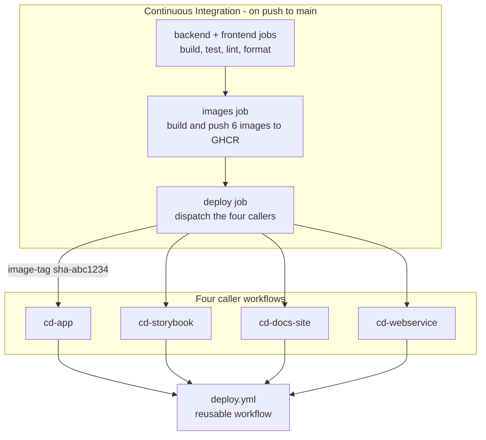

# CD Release Pipeline Implementation Plan

> **For agentic workers:** REQUIRED SUB-SKILL: Use superpowers:subagent-driven-development (recommended) or superpowers:executing-plans to implement this plan task-by-task. Steps use checkbox (`- [ ]`) syntax for tracking.

**Goal:** Replace CI's payload-free deploy webhook with a release pipeline that deploys a named, immutable image tag to each Dokploy service.

**Architecture:** One reusable workflow (`deploy.yml`) holds the deploy body — validate the tag in GHCR, pin the Dokploy application to it via `application.saveDockerProvider`, POST the deploy webhook, record a summary. Four thin caller workflows, one per service, pass their service name, image, and the *names* of their two per-service secrets; `secrets: inherit` supplies the values. CI dispatches the callers with `gh workflow run` after the images job, on `main` only.

**Scope note:** the scheduler worker is deliberately **not** in this plan — see *Services and identifiers*.

**Tech Stack:** GitHub Actions (`workflow_call`, `workflow_dispatch`), `gh` CLI, `curl`, `jq`, Docker/GHCR, the Dokploy REST API.

**Spec:** `docs/superpowers/specs/2026-08-30-cd-release-pipeline-design.md`

## Global Constraints

- **Image prefix:** `ghcr.io/felipedferreira/cinedex` — images are `<prefix>-<name>` (e.g. `ghcr.io/felipedferreira/cinedex-app`).
- **Tag contract:** `sha-<short>` for automated deploys. `workflow_dispatch` accepts any tag string so rollback is possible. No fallback to a moving tag.
- **Environment:** every deploy job runs with `environment: production`. The environment lives on the job inside `deploy.yml`, never on the callers.
- **Secrets:** callers use `secrets: inherit`. Per-service secrets are passed **by name** as inputs and resolved with `secrets[inputs.<name>]`.
- **Never echo an application ID.** Log the `service-name` input instead — GitHub masks secret values, so an echoed ID prints `***` and a failed run cannot be traced to a service.
- **Guards are load-bearing.** `secrets[inputs.app-id-secret]` yields an *empty string* for a name that does not exist, so a typo is silent. Every run must fail fast on an empty `DOKPLOY_APP_ID` or `WEBHOOK_URL`.
- **Build JSON with `jq`,** never string interpolation, so a value containing a shell metacharacter cannot break out of the body.
- **Runner:** all CD jobs run on `ubuntu-latest` (where `jq`, `gh`, `curl` and Docker are preinstalled), matching CI's existing `images` job. The self-hosted runner is for the backend/frontend test jobs only.
- **The migrator is out of scope entirely** — no CD workflow, no GHCR conversion, `autoDeploy` left on. Do not touch `Cinedex.DatabaseMigrator`.
- **Diagrams are Mermaid fences**, never ASCII box art (`scripts/check-diagrams.mjs`, run by CI).
- **Changelog:** edit only the root `CHANGELOG.md`; entries accumulate under `## [Unreleased]`.
- **Commits:** Conventional Commits — `type(scope): summary`.

## Services and identifiers

| Caller | Service name (`service-name`) | Image | App-ID secret | Webhook secret | Dokploy application ID |
| --- | --- | --- | --- | --- | --- |
| `cd-app.yml` | `cinedex-app` | `…/cinedex-app` | *********** | `DOKPLOY_WEBHOOK_APP` | *********** |
| `cd-storybook.yml` | `storybook` | `…/cinedex-storybook` | *********** | `DOKPLOY_WEBHOOK_STORYBOOK` | *********** |
| `cd-docs-site.yml` | `docs-site` | `…/cinedex-docs-site` | *********** | `DOKPLOY_WEBHOOK_DOCS_SITE` | *********** |
| `cd-webservice.yml` | `Cinedex.WebService` | `…/cinedex-webservice` | *********** | `DOKPLOY_WEBHOOK_WEBSERVICE` | *********** |

**Why two columns are redacted.** The **Dokploy application IDs** are secrets by decision — keeping the
Dokploy topology out of a public repository is the whole reason they live in
`DOKPLOY_APP_ID_*` rather than in the workflow files, and tabulating them here would have undone that.
The **App-ID secret names** are redacted alongside them.

Neither is needed to follow this plan: each caller already names its own two secrets, so
`.github/workflows/cd-*.yml` is the readable source for the names. The IDs live only in the GitHub
environment and in Dokploy itself — read them from the Dokploy UI, or via the MCP's `project-all`,
when creating or checking a secret.

Every task that says "verify the right application changed" means checking in Dokploy that the service
named in the run summary is the one whose `dockerImage` moved. That check does not need the ID written
down here; it needs you to look at the application.

**The scheduler worker is deferred.** It is the only service with no Dokploy application, so deploying
it means creating one from scratch — a different kind of work from the other four, which are
"same pattern, different values". Doing that while the pipeline itself is unproven mixes two unknowns.
CI keeps building and pushing `cinedex-schedulerworker`; nothing consumes it yet. Adding it later
follows *Adding a service later* in the spec, with no change to `deploy.yml`.

## File structure

| File | Responsibility |
| --- | --- |
| `.github/workflows/deploy.yml` | **Create.** The only copy of the deploy body. `workflow_call`, five string inputs, one job. |
| `.github/workflows/cd-app.yml` | **Create.** Caller for `cinedex-app`. |
| `.github/workflows/cd-storybook.yml` | **Create.** Caller for `storybook`. |
| `.github/workflows/cd-docs-site.yml` | **Create.** Caller for `docs-site`. |
| `.github/workflows/cd-webservice.yml` | **Create.** Caller for `Cinedex.WebService`. |
| `.github/workflows/continuous-integration.yml` | **Modify.** Remove the inline deploy step and `webhook-secret` matrix keys; add the `deploy` job (Task 7 only). |
| `CHANGELOG.md` | **Modify.** One `## [Unreleased]` entry. |

## A note on testing

Workflow YAML has no unit-test harness. The verification loop for every task is:

1. **`actionlint`** — static analysis of the workflow file. It is not installed locally (checked); Task 1 installs it.
2. **A real `workflow_dispatch` run** against Dokploy, one service at a time.

Steps 2 onward for the CD workflows **require the GHCR PAT**, which is deferred. Tasks 1–6 are all doable now; **Task 7 must not be started until the PAT exists** (see the gate on Task 7).

**Corrected during execution:** this plan originally wrote the Dokploy auth header as `x-api-key`. It is `Authorization` — see *Execution status*. `deploy.yml` was fixed before its first commit.

---

### Task 1: Install actionlint and baseline the existing workflow

**Files:**
- Test: none (tooling task)

**Interfaces:**
- Produces: a working `actionlint` binary on PATH, used by every later task's verification step.

- [ ] **Step 1: Install actionlint**

On Windows with Go available:

```bash
go install github.com/rhysd/actionlint/cmd/actionlint@latest
```

If Go is not installed, download the release binary instead:

```bash
curl -sSL https://raw.githubusercontent.com/rhysd/actionlint/main/scripts/download-actionlint.bash | bash
```

That script drops `actionlint` (or `actionlint.exe`) in the current directory. Move it somewhere on PATH, or invoke it by path in later steps.

- [ ] **Step 2: Verify it runs**

Run: `actionlint --version`
Expected: a version string such as `1.7.x`.

- [ ] **Step 3: Baseline the current workflow**

Run: `actionlint .github/workflows/continuous-integration.yml`
Expected: no output (exit 0). If it reports pre-existing problems, note them — they are **not** yours to fix in this plan, but you must not confuse them with errors you introduce.

- [ ] **Step 4: No commit**

Nothing in the repository changed. Do not commit. Do not add the binary to the repo.

---

### Task 2: Create the reusable deploy workflow

**Files:**
- Create: `.github/workflows/deploy.yml`

**Interfaces:**
- Produces: a `workflow_call` workflow with exactly these inputs, all `required: true`, `type: string`:
  - `service-name` — human-readable service name, safe to log (e.g. `cinedex-app`)
  - `image` — full GHCR image path without a tag (e.g. `ghcr.io/felipedferreira/cinedex-app`)
  - `image-tag` — the tag to deploy (e.g. `sha-abc1234`)
  - `app-id-secret` — the *name* of the secret holding the Dokploy application ID
  - `webhook-secret` — the *name* of the secret holding the Dokploy deploy webhook URL
- Consumes (from `secrets: inherit`): `DOKPLOY_URL`, `DOKPLOY_API_TOKEN`, `GHCR_PULL_USERNAME`, `GHCR_PULL_TOKEN`, plus the two named per-service secrets.

- [ ] **Step 1: Write the workflow**

Create `.github/workflows/deploy.yml`:

```yaml
name: Deploy (reusable)

# The only copy of the deploy body. Five thin callers—cd-app, cd-storybook,
# cd-docs-site and cd-webservice—supply what differs and
# inherit the secrets. Behaviour lives here; a caller only names a service.
on:
  workflow_call:
    inputs:
      service-name:
        description: Human-readable service name. Safe to log—never the application ID.
        required: true
        type: string
      image:
        description: GHCR image path with no tag, e.g. ghcr.io/felipedferreira/cinedex-app
        required: true
        type: string
      image-tag:
        description: Image tag to deploy, e.g. sha-abc1234
        required: true
        type: string
      app-id-secret:
        description: NAME of the secret holding this service's Dokploy application ID.
        required: true
        type: string
      webhook-secret:
        description: NAME of the secret holding this service's Dokploy deploy webhook URL.
        required: true
        type: string

permissions:
  contents: read

jobs:
  deploy:
    name: Deploy ${{ inputs.service-name }}
    runs-on: ubuntu-latest
    # The environment gates the job that actually uses the secrets, so it lives
    # here rather than on the callers—one place, and a future reviewer gate
    # would then cover all five services at once.
    environment: production
    permissions:
      contents: read
      packages: read

    env:
      # The per-service secrets arrive as NAMES, not values: GitHub expressions
      # cannot index `secrets` with a dynamic key inside an `if:`, so each is
      # resolved into an env var here and the steps read that. Same pattern the
      # images job already uses for secrets[matrix.webhook-secret].
      #
      # A name that does not exist yields an EMPTY STRING rather than an error,
      # so a typo in a caller is silent. The guard step below is what turns it
      # into a failed run.
      DOKPLOY_APP_ID: ${{ secrets[inputs.app-id-secret] }}
      WEBHOOK_URL: ${{ secrets[inputs.webhook-secret] }}
      IMAGE_REF: ${{ inputs.image }}:${{ inputs.image-tag }}

    steps:
      - name: Check required secrets are present
        env:
          DOKPLOY_URL: ${{ secrets.DOKPLOY_URL }}
          DOKPLOY_API_TOKEN: ${{ secrets.DOKPLOY_API_TOKEN }}
          GHCR_PULL_USERNAME: ${{ secrets.GHCR_PULL_USERNAME }}
          GHCR_PULL_TOKEN: ${{ secrets.GHCR_PULL_TOKEN }}
        run: |
          missing=""
          [ -n "$DOKPLOY_APP_ID" ]     || missing="$missing ${{ inputs.app-id-secret }}"
          [ -n "$WEBHOOK_URL" ]        || missing="$missing ${{ inputs.webhook-secret }}"
          [ -n "$DOKPLOY_URL" ]        || missing="$missing DOKPLOY_URL"
          [ -n "$DOKPLOY_API_TOKEN" ]  || missing="$missing DOKPLOY_API_TOKEN"
          [ -n "$GHCR_PULL_USERNAME" ] || missing="$missing GHCR_PULL_USERNAME"
          [ -n "$GHCR_PULL_TOKEN" ]    || missing="$missing GHCR_PULL_TOKEN"
          if [ -n "$missing" ]; then
            echo "::error::Missing or empty secrets for ${{ inputs.service-name }}:$missing"
            echo "A per-service secret resolves by NAME, so check the caller's app-id-secret and webhook-secret spelling as well as the environment." >&2
            exit 1
          fi

      - uses: docker/login-action@v3
        with:
          registry: ghcr.io
          username: ${{ github.actor }}
          password: ${{ secrets.GITHUB_TOKEN }}

      # Validate BEFORE touching Dokploy: a missing tag must fail here, leaving
      # the application pinned to whatever it was already running.
      - name: Verify the image tag exists in GHCR
        run: |
          if ! docker manifest inspect "$IMAGE_REF" > /dev/null 2>&1; then
            echo "::error::$IMAGE_REF not found in GHCR. Dokploy was not touched."
            exit 1
          fi
          echo "Found $IMAGE_REF"

      # Pins the application to this exact tag. Also flips sourceType to
      # "docker" as a side effect, which is how Cinedex.WebService is converted
      # off building from source on the server.
      #
      # jq builds the body: --arg values are JSON-escaped, so a token containing
      # a quote or backslash cannot break out of the payload.
      - name: Pin ${{ inputs.service-name }} to ${{ inputs.image-tag }}
        env:
          DOKPLOY_URL: ${{ secrets.DOKPLOY_URL }}
          DOKPLOY_API_TOKEN: ${{ secrets.DOKPLOY_API_TOKEN }}
          GHCR_PULL_USERNAME: ${{ secrets.GHCR_PULL_USERNAME }}
          GHCR_PULL_TOKEN: ${{ secrets.GHCR_PULL_TOKEN }}
        run: |
          body="$(jq -n \
            --arg applicationId "$DOKPLOY_APP_ID" \
            --arg dockerImage "$IMAGE_REF" \
            --arg registryUrl "ghcr.io" \
            --arg username "$GHCR_PULL_USERNAME" \
            --arg password "$GHCR_PULL_TOKEN" \
            '{applicationId: $applicationId, dockerImage: $dockerImage, registryUrl: $registryUrl, username: $username, password: $password}')"

          # --fail-with-body so a 4xx still prints Dokploy's message before exiting non-zero.
          curl --fail-with-body --silent --show-error --location \
            --max-time 60 --retry 3 --retry-connrefused \
            -X POST "${DOKPLOY_URL%/}/api/application.saveDockerProvider" \
            -H "Content-Type: application/json" \
            -H "x-api-key: $DOKPLOY_API_TOKEN" \
            -d "$body"

          echo "Pinned ${{ inputs.service-name }} to $IMAGE_REF"

      # The webhook takes no payload—it tells Dokploy to redeploy whatever the
      # application is now pinned to, which the previous step just set.
      - name: Trigger the Dokploy deploy webhook
        run: |
          curl --fail --silent --show-error --location \
            --max-time 60 --retry 3 --retry-connrefused \
            -X POST "$WEBHOOK_URL"
          echo "Deploy triggered for ${{ inputs.service-name }}"

      # Logs the SERVICE NAME, never the application ID: the ID is a secret and
      # would render as ***, leaving a failed run untraceable to a service.
      - name: Record what was deployed
        run: |
          {
            echo "### Deployed ${{ inputs.service-name }}"
            echo ""
            echo "- Image: \`$IMAGE_REF\`"
            echo "- Triggered by: ${{ github.event_name }}"
            echo ""
            echo "Dokploy accepted the deployment. This does **not** confirm the container is healthy."
          } >> "$GITHUB_STEP_SUMMARY"
```

- [ ] **Step 2: Lint it**

Run: `actionlint .github/workflows/deploy.yml`
Expected: no output (exit 0).

- [ ] **Step 3: Confirm the Dokploy auth header name**

> **Resolved during execution.** The header is `Authorization`, not `x-api-key` as this plan first
> said. Dokploy's OpenAPI document declares `"security": [{"Authorization": []}]` on
> `application.saveDockerProvider` specifically, and on 570 of its 571 operations; `x-api-key` appears
> nowhere in the document. `deploy.yml` was corrected before its first commit.

**One thing is still open:** whether the value needs a `Bearer ` prefix. The scheme's definition is
redacted by the MCP, so this could not be settled from the document. `deploy.yml` currently sends the
raw token.

Confirm before the first real dispatch, with a read-only call that changes nothing:

```bash
curl -sS -o /dev/null -w "%{http_code}\n" \
  -H "Authorization: $DOKPLOY_API_TOKEN" \
  "${DOKPLOY_URL%/}/api/project.all"
```

Expected: `200`. If it returns `401`, retry with `-H "Authorization: Bearer $DOKPLOY_API_TOKEN"`; if
that works, add the prefix to the `-H` line in `deploy.yml`.

Do not skip this on the grounds that the workflow "looks right": a wrong header fails at the pin step
of every service, and it is much cheaper to find here.

- [ ] **Step 4: Confirm the guard logic is right by reading it back**

Confirm all six of these are true. This step is a read, not a command — the guard is the only thing standing between a typo'd secret name and a silent no-op.

1. `DOKPLOY_APP_ID` and `WEBHOOK_URL` are set from `secrets[inputs.…]`, not from a hardcoded secret name.
2. The guard step checks all six secrets and exits 1 if any is empty.
3. The guard runs **before** the GHCR login and before any Dokploy call.
4. The `jq` invocation uses `--arg` for every value (no `\(...)` interpolation, no bare `"$VAR"` inside the JSON string).
5. No step echoes `$DOKPLOY_APP_ID`.
6. The summary names `inputs.service-name`.

- [ ] **Step 5: Commit**

```bash
git add .github/workflows/deploy.yml
git commit -m "ci(cd): add the reusable Dokploy deploy workflow"
```

---

### Task 3: Create the cd-storybook caller and verify it end to end

Storybook first, deliberately: it is the least load-bearing service running, so it is the right place to find out whether the reusable workflow actually works.

**Files:**
- Create: `.github/workflows/cd-storybook.yml`

**Interfaces:**
- Consumes: `deploy.yml`'s five inputs (Task 2).
- Produces: the caller shape every later caller copies.

- [ ] **Step 1: Write the caller**

Create `.github/workflows/cd-storybook.yml`:

```yaml
name: Deploy storybook

# A thin caller: it names the service and hands off. The deploy body lives in
# deploy.yml—see that file for what actually happens.
on:
  workflow_dispatch:
    inputs:
      image-tag:
        description: Image tag to deploy, e.g. sha-abc1234
        required: true
        type: string

permissions:
  contents: read

jobs:
  deploy:
    uses: ./.github/workflows/deploy.yml
    secrets: inherit
    with:
      service-name: storybook
      image: ghcr.io/felipedferreira/cinedex-storybook
      image-tag: ${{ inputs.image-tag }}
      app-id-secret: DOKPLOY_APP_ID_STORYBOOK
      webhook-secret: DOKPLOY_WEBHOOK_STORYBOOK
```

- [ ] **Step 2: Lint both files**

Run: `actionlint .github/workflows/deploy.yml .github/workflows/cd-storybook.yml`
Expected: no output (exit 0).

- [ ] **Step 3: Commit**

```bash
git add .github/workflows/cd-storybook.yml
git commit -m "ci(cd): add the storybook deploy caller"
```

- [ ] **Step 4: Push so the workflow is dispatchable**

```bash
git push
```

> **Corrected during execution.** This step originally claimed a caller could be dispatched from a
> feature branch. It cannot. **A `workflow_dispatch` workflow must exist on the default branch before
> GitHub will register it at all** — until then `gh workflow run` returns
> `HTTP 404: workflow cd-storybook.yml not found on the default branch`. The `--ref` flag chooses which
> branch's *code* runs; it does not make an unregistered workflow dispatchable.

This creates a real ordering problem: the workflows cannot be tested until they are on `main`, but
getting them onto `main` is what testing was meant to gate.

It is safe to resolve by merging first, because **nothing on `main` invokes the callers yet**. They
are `workflow_dispatch`-only, and CI is not wired to them until Task 7. Merging puts five dormant
workflow files on `main` that run only when a human dispatches them — no behaviour change until they
are proven.

So the order becomes: merge this PR (workflows only, CI untouched) → dispatch and verify each service
→ then Task 7 wires CI in a second PR.

- [ ] **Step 5: STOP — this step needs the GHCR PAT and the environment secrets**

Do not proceed past here until **all** of these exist on the `production` GitHub Environment:

`DOKPLOY_URL`, `DOKPLOY_API_TOKEN`, `GHCR_PULL_USERNAME`, `GHCR_PULL_TOKEN`, `DOKPLOY_APP_ID_STORYBOOK`, `DOKPLOY_WEBHOOK_STORYBOOK`.

`DOKPLOY_APP_ID_STORYBOOK` is the `storybook` application's ID, read from the Dokploy UI or the MCP's `project-all`. The webhook URL comes from the same application's Deployments tab; the API redacts it.

If the PAT does not exist yet, stop the plan here and report that Tasks 3–8 are blocked. Tasks 4–7 may still be written, but none can be verified.

- [ ] **Step 6: Find a real tag to deploy**

```bash
docker manifest inspect ghcr.io/felipedferreira/cinedex-storybook:latest > /dev/null && echo "latest exists"
```

Then pick a concrete `sha-` tag from the GHCR package page, or from a recent CI run's summary. Use a real immutable tag, not `latest` — deploying `latest` proves nothing about pinning.

- [ ] **Step 7: Dispatch the workflow**

```bash
gh workflow run cd-storybook.yml --ref felipedferreira11/cin-80-ops-13-split-ci-and-cd-deploy-pinned-image-tags-via-dokploy --field image-tag=sha-XXXXXXX
```

Replace `sha-XXXXXXX` with the tag from Step 6.

- [ ] **Step 8: Watch the run**

```bash
gh run list --workflow=cd-storybook.yml --limit 1
gh run watch
```

Expected: all steps green. If the guard step fails, a secret is missing or a name is misspelled — its error message lists which.

- [ ] **Step 9: Verify in Dokploy that the right application changed**

Check that the `storybook` application now has `dockerImage` ending in the tag you deployed, and that a new deployment appeared.

This is the check that catches a transposed application ID. Because the ID is masked, the logs show `***` either way and **cannot** reveal that the wrong service was pinned. Confirm the change landed on `storybook` and **only** on `storybook`.

- [ ] **Step 10: Confirm the run summary reads correctly**

Open the run's summary. Expected: `Deployed storybook`, with the image ref and tag. If it says `Deployed ***`, an application ID leaked into the summary — fix `deploy.yml` before continuing.

---

### Task 4: Create the cd-app and cd-docs-site callers

Both are already `sourceType: docker` in Dokploy, so pinning them changes only the tag.

**Files:**
- Create: `.github/workflows/cd-app.yml`
- Create: `.github/workflows/cd-docs-site.yml`

**Interfaces:**
- Consumes: `deploy.yml` (Task 2), the caller shape (Task 3).

- [ ] **Step 1: Write cd-app.yml**

```yaml
name: Deploy cinedex-app

# A thin caller: it names the service and hands off. The deploy body lives in
# deploy.yml—see that file for what actually happens.
on:
  workflow_dispatch:
    inputs:
      image-tag:
        description: Image tag to deploy, e.g. sha-abc1234
        required: true
        type: string

permissions:
  contents: read

jobs:
  deploy:
    uses: ./.github/workflows/deploy.yml
    secrets: inherit
    with:
      service-name: cinedex-app
      image: ghcr.io/felipedferreira/cinedex-app
      image-tag: ${{ inputs.image-tag }}
      app-id-secret: DOKPLOY_APP_ID_APP
      webhook-secret: DOKPLOY_WEBHOOK_APP
```

- [ ] **Step 2: Write cd-docs-site.yml**

```yaml
name: Deploy docs-site

# A thin caller: it names the service and hands off. The deploy body lives in
# deploy.yml—see that file for what actually happens.
on:
  workflow_dispatch:
    inputs:
      image-tag:
        description: Image tag to deploy, e.g. sha-abc1234
        required: true
        type: string

permissions:
  contents: read

jobs:
  deploy:
    uses: ./.github/workflows/deploy.yml
    secrets: inherit
    with:
      service-name: docs-site
      image: ghcr.io/felipedferreira/cinedex-docs-site
      image-tag: ${{ inputs.image-tag }}
      app-id-secret: DOKPLOY_APP_ID_DOCS_SITE
      webhook-secret: DOKPLOY_WEBHOOK_DOCS_SITE
```

- [ ] **Step 3: Lint**

Run: `actionlint .github/workflows/cd-app.yml .github/workflows/cd-docs-site.yml`
Expected: no output (exit 0).

- [ ] **Step 4: Commit and push**

```bash
git add .github/workflows/cd-app.yml .github/workflows/cd-docs-site.yml
git commit -m "ci(cd): add the SPA and docs-site deploy callers"
git push
```

- [ ] **Step 5: Add the four secrets**

On the `production` environment: `DOKPLOY_APP_ID_APP` and `DOKPLOY_APP_ID_DOCS_SITE`, each read from its application in Dokploy, plus `DOKPLOY_WEBHOOK_APP` and `DOKPLOY_WEBHOOK_DOCS_SITE` from the same applications' Deployments tabs.

- [ ] **Step 6: Dispatch and verify each, one at a time**

```bash
gh workflow run cd-docs-site.yml --ref felipedferreira11/cin-80-ops-13-split-ci-and-cd-deploy-pinned-image-tags-via-dokploy --field image-tag=sha-XXXXXXX
gh run watch
```

Then confirm in Dokploy that the `docs-site` application — and only it — changed.

Repeat for `cd-app.yml` against `cinedex-app`. Do the SPA **last** of the two: it serves `cinedex.online`, so a mistake there is the most visible.

---

### Task 5: Convert and deploy the web service

This is the first caller that changes a Dokploy application's *source type*, not just its tag: `Cinedex.WebService` is currently `sourceType: github` and compiles .NET on the server. The pin step flips it to `docker`.

**Files:**
- Create: `.github/workflows/cd-webservice.yml`

**Interfaces:**
- Consumes: `deploy.yml` (Task 2).

- [ ] **Step 1: Record the current configuration before changing it**

The conversion is not cleanly reversible from the workflow, so capture the current state first. Via the Dokploy MCP: `application-one` for the `Cinedex.WebService` application. Save the output — in particular `sourceType`, `dockerfile`, `dockerContextPath`, `buildArgs`, `buildSecrets`.

Reverting means setting `sourceType` back to `github` with those values.

- [ ] **Step 2: Write the caller**

```yaml
name: Deploy Cinedex.WebService

# A thin caller: it names the service and hands off. The deploy body lives in
# deploy.yml—see that file for what actually happens.
#
# The pin step also flips this application from sourceType "github" to "docker",
# so after the first successful run Dokploy stops compiling .NET on the server
# and pulls the image CI already built.
on:
  workflow_dispatch:
    inputs:
      image-tag:
        description: Image tag to deploy, e.g. sha-abc1234
        required: true
        type: string

permissions:
  contents: read

jobs:
  deploy:
    uses: ./.github/workflows/deploy.yml
    secrets: inherit
    with:
      service-name: Cinedex.WebService
      image: ghcr.io/felipedferreira/cinedex-webservice
      image-tag: ${{ inputs.image-tag }}
      app-id-secret: DOKPLOY_APP_ID_WEBSERVICE
      webhook-secret: DOKPLOY_WEBHOOK_WEBSERVICE
```

- [ ] **Step 3: Lint**

Run: `actionlint .github/workflows/cd-webservice.yml`
Expected: no output (exit 0).

- [ ] **Step 4: Commit and push**

```bash
git add .github/workflows/cd-webservice.yml
git commit -m "ci(cd): add the web service deploy caller"
git push
```

- [ ] **Step 5: Add the two secrets**

`DOKPLOY_APP_ID_WEBSERVICE`, read from the `Cinedex.WebService` application in Dokploy, and `DOKPLOY_WEBHOOK_WEBSERVICE` from its Deployments tab.

- [ ] **Step 6: Dispatch**

```bash
gh workflow run cd-webservice.yml --ref felipedferreira11/cin-80-ops-13-split-ci-and-cd-deploy-pinned-image-tags-via-dokploy --field image-tag=sha-XXXXXXX
gh run watch
```

- [ ] **Step 7: Verify the API is actually serving**

The workflow going green means Dokploy accepted the deployment, not that the service came up — and this one changed source type, so it is the most likely to fail at runtime.

```bash
curl -sS -o /dev/null -w "%{http_code}\n" https://cinedex.online/movies-svc/api-docs/v1
```

Expected: `200`. If it is not, check the container logs in Dokploy. Reverting means restoring the configuration captured in Step 1.

- [ ] **Step 8: Confirm the source type changed**

Via the MCP: `application-one` for `Cinedex.WebService`. Expected: `sourceType` is now `docker` and `dockerImage` ends in the tag deployed.

---

### Task 6: Disable autoDeploy on the four applications

Do this **after** all four callers work and **before** CI dispatches them. Until `autoDeploy` is off, a merge to `main` races Dokploy's own git webhook against CD — and for the `sourceType: docker` applications the git-triggered deploy redeploys the *previously* pinned tag, so deploys can run backwards.

**Files:** none (Dokploy configuration only)

- [ ] **Step 1: Disable autoDeploy on each of the four**

Via the MCP `application-update`, set `autoDeploy: false` for these four applications in the Cinedex
project's `production` environment — resolve each name to its ID with `project-all` first:

- `cinedex-app`
- `storybook`
- `docs-site`
- `Cinedex.WebService`

- [ ] **Step 2: Do NOT touch the migrator**

`Cinedex.DatabaseMigrator` keeps `autoDeploy: true`. This is deliberate — see *The migrator* in the spec. It means every merge to `main` continues to re-run production migrations unprompted, which is pre-existing accepted behaviour, not a bug to fix here.

- [ ] **Step 3: Verify all five**

Via the MCP `application-one` for each of the five IDs above plus the migrator. Expected: `autoDeploy: false` on the four, `autoDeploy: true` on the migrator.

- [ ] **Step 4: No commit**

Nothing in the repository changed.

---

### Task 7: Wire CI to dispatch the callers

> **GATE:** Do not start this task until every one of Tasks 3–6 has had a successful real dispatch. Wiring CI against an unverified pipeline means every merge to `main` fails.

**Files:**
- Modify: `.github/workflows/continuous-integration.yml`
- Modify: `CHANGELOG.md`

**Interfaces:**
- Consumes: all five callers, each dispatchable with `--field image-tag=<tag>`.

> **Steps 1–2 were done early, during the Task 3 review.** Removing the inline step turned out to be a
> merge blocker rather than a tidy-up: it reads `secrets[matrix.webhook-secret]` from the `images` job,
> which declares no `environment`, so the lookup happens at *repository* scope — where there are zero
> secrets. Its own guard would then fail the job, so merging the branch would have broken CI on `main`
> for all three UI images. Both steps are complete; CI is now byte-identical to `main`.

- [x] **Step 1: Remove the inline deploy step** — done

Delete the whole `Trigger Dokploy deploy` step (currently the last step of the `images` job, around line 280) **and** the explanatory comment block above it that begins `# Dokploy runs the three React UI images straight from GHCR`.

- [x] **Step 2: Remove the webhook-secret matrix keys** — done

Delete these three lines from the matrix entries, and the two-line comment above the `app` entry's key that begins `# Dokploy runs this image from GHCR`:

```yaml
            webhook-secret: DOKPLOY_WEBHOOK_APP
            webhook-secret: DOKPLOY_WEBHOOK_STORYBOOK
            webhook-secret: DOKPLOY_WEBHOOK_DOCS_SITE
```

Also delete the comment inside the matrix that begins `# The backend images have no webhook-secret in the matrix`.

- [ ] **Step 3: Add the deploy job**

Append to `continuous-integration.yml`, after the `images` job:

```yaml
  # CI's artifact is the image; deploying is CD's job. This dispatches each
  # service's caller with the exact tag just pushed, so what is deployed is
  # always identifiable and re-runnable.
  #
  # The five run independently: there is no transaction, and a partial rollout
  # is possible. Re-dispatch a failure individually rather than re-running all.
  deploy:
    name: Dispatch CD
    needs: [images]
    if: >
      github.ref == 'refs/heads/main' &&
      (github.event_name == 'push' || github.event_name == 'workflow_dispatch')
    runs-on: ubuntu-latest
    permissions:
      contents: read
      actions: write
    steps:
      - uses: actions/checkout@v6

      # Same short sha the images job tags with (type=sha,format=short,prefix=sha-),
      # so this always names an image that job just pushed.
      - id: tag
        run: echo "image-tag=sha-$(git rev-parse --short HEAD)" >> "$GITHUB_OUTPUT"

      - name: Dispatch each service's deploy workflow
        env:
          GH_TOKEN: ${{ secrets.GITHUB_TOKEN }}
          IMAGE_TAG: ${{ steps.tag.outputs.image-tag }}
        run: |
          failed=""
          for wf in cd-app cd-storybook cd-docs-site cd-webservice; do
            if gh workflow run "$wf.yml" --ref "${{ github.ref_name }}" --field "image-tag=$IMAGE_TAG"; then
              echo "Dispatched $wf at $IMAGE_TAG"
            else
              echo "::error::Failed to dispatch $wf"
              failed="$failed $wf"
            fi
          done
          {
            echo "### CD dispatched at \`$IMAGE_TAG\`"
            echo ""
            echo "Dispatch only—see each workflow's own run for the deploy result."
          } >> "$GITHUB_STEP_SUMMARY"
          if [ -n "$failed" ]; then
            echo "::error::Could not dispatch:$failed"
            exit 1
          fi
```

- [ ] **Step 4: Lint**

Run: `actionlint .github/workflows/continuous-integration.yml`
Expected: no output (exit 0), and no new findings versus the Task 1 baseline.

- [ ] **Step 5: Verify the short-sha tags match**

The `deploy` job computes `sha-$(git rev-parse --short HEAD)`; the `images` job tags with `type=sha,format=short,prefix=sha-`. Both are git's 7-character short sha, so they agree.

Confirm by reading `.github/workflows/continuous-integration.yml` — the `meta` step's `tags:` block must still contain `type=sha,format=short,prefix=sha-`. If that line was ever changed, this job would dispatch a tag that does not exist and every deploy would fail at the GHCR validation step.

- [x] **Step 6: Add the changelog entry** — done (rewritten to describe the release pipeline)

Under `## [Unreleased]` in the root `CHANGELOG.md` (never `backend/CHANGELOG.md`), matching the surrounding style:

```markdown
### Changed

- CI and CD are now separate pipelines. CI's artifact is the container image; a
  reusable deploy workflow pins each Dokploy application to an immutable
  `sha-<short>` tag and then triggers its deploy webhook, so what is running is
  always identifiable and a rollback is a re-run with an older tag.
```

- [ ] **Step 7: Commit and push**

```bash
git add .github/workflows/continuous-integration.yml CHANGELOG.md
git commit -m "ci: dispatch CD from the images job instead of deploying inline"
git push
```

- [ ] **Step 8: Verify on the next merge to main**

This cannot be verified before merge — the `deploy` job is gated on `github.ref == 'refs/heads/main'`.

After merging, confirm: the `deploy` job ran; five CD runs appeared; each pinned its own application; and the sites still serve.

```bash
gh run list --limit 8
curl -sS -o /dev/null -w "%{http_code}\n" https://cinedex.online/
curl -sS -o /dev/null -w "%{http_code}\n" https://cinedex.online/movies-svc/api-docs/v1
```

---

---

### Task 8: Document both pipelines on the docs site

The docs site has no delivery documentation at all — CI is undocumented too, not just CD. This adds one page covering both.

**Files:**
- Create: `frontend/apps/docs-site/docs/delivery/_category_.json`
- Create: `frontend/apps/docs-site/docs/delivery/build-and-release.md`

**Interfaces:**
- Consumes: the finished behaviour of Tasks 2–8. Write this **after** they work, so it documents what exists rather than what was planned.

**House style, from the existing pages:** frontmatter with `sidebar_position`, a single `#` H1, `##` sections, tables for anything enumerable, and **Mermaid fences for every diagram — never ASCII box art** (`scripts/check-diagrams.mjs` enforces this repo-wide and CI runs it).

- [ ] **Step 1: Create the category**

`frontend/apps/docs-site/docs/delivery/_category_.json`:

```json
{
  "label": "Delivery",
  "position": 4
}
```

Position 4 — after Features (1), Security (2) and Frontend (3).

- [ ] **Step 2: Write the page**

Create `frontend/apps/docs-site/docs/delivery/build-and-release.md`:

````markdown
---
sidebar_position: 1
---

# Build & Release

Cinedex has two pipelines. **CI** proves a commit is good and produces container images. **CD**
takes one of those images and puts it on the server. They are deliberately separate: CI's artifact
is the image, and deploying is a distinct act against a named, immutable tag.



## Continuous Integration

`.github/workflows/continuous-integration.yml` runs on every pull request and every push to `main`.

| Job | Runs on | What it does |
| --- | --- | --- |
| `backend` | self-hosted | `dotnet build` in Release, then `dotnet test`. Warnings are errors, so a style violation fails the build. |
| `frontend` | self-hosted | Checks diagrams, then `npm ci`, lint, format check, build and coverage across every workspace. |
| `images` | `ubuntu-latest` | Builds and pushes six images to GHCR. **`main` only.** |
| `deploy` | `ubuntu-latest` | Dispatches the four CD workflows. **`main` only.** |

All checks must pass to merge.

### Images

The `images` job builds six images and tags each three ways: `latest`, the release version from
`frontend/package.json`, and `sha-<short>` for the commit. Only the sha tag is used for deployment —
it is the only one that names exactly one build.

| Image | Deployed by |
| --- | --- |
| `cinedex-app` | `cd-app` |
| `cinedex-storybook` | `cd-storybook` |
| `cinedex-docs-site` | `cd-docs-site` |
| `cinedex-webservice` | `cd-webservice` |
| `cinedex-schedulerworker` | *nothing yet — deferred* |
| `cinedex-migrator` | *nothing — see below* |

## Continuous Deployment

Each service has its own caller workflow naming what makes it different — its service name, image,
and which secrets hold its Dokploy application ID and webhook URL. All four hand off to
`deploy.yml`, which holds the only copy of the deploy body:

1. **Validate** the tag exists in GHCR. A missing tag fails here, leaving Dokploy untouched.
2. **Pin** the Dokploy application to that exact tag via `application.saveDockerProvider`.
3. **Deploy** by POSTing the application's webhook, which makes Dokploy pull and recreate.
4. **Record** the service and tag in the run summary.

Pinning before deploying is what makes the deploy identifiable: the webhook itself carries no
payload, so without step 2 it would only redeploy whatever tag the application already had.

### Deploying by hand

Every caller is `workflow_dispatch`, so any service can be deployed to any existing tag:

```bash
gh workflow run cd-app.yml --field image-tag=sha-abc1234
```

**This is also how you roll back** — dispatch with an older tag. There is no separate rollback
mechanism and none is needed.

### What a green run does and does not mean

A successful CD run means **Dokploy accepted the deployment**, not that the service is healthy. The
webhook queues the deploy and returns immediately; the workflow does not wait for the container.
Check Dokploy itself if a deploy succeeds but the site does not change.

## Deliberate gaps

Two things are knowingly absent, and both are recorded rather than forgotten:

- **The migrator is not deployed by CD.** `Cinedex.DatabaseMigrator` still builds from source on the
  server with Dokploy's own git trigger, which means **every merge to `main` re-runs the production
  migrations unprompted**. EF Core migrations are idempotent, so a run with nothing pending applies
  nothing — but a merge carrying a new migration applies it at merge time, before the web service
  expecting that schema has rolled out.
- **There is no deployment health check or automated rollback.** See above.
````

- [ ] **Step 3: Verify the diagrams**

Run: `node scripts/check-diagrams.mjs`
Expected: `ok - <n> mermaid diagrams across <m> files, no ASCII box art.` — with the count one higher than before.

This guard catches ASCII box art and broken `sequenceDiagram` semicolons, but **not** invalid Mermaid generally: neither GitHub nor Docusaurus errors on a fence it cannot parse — both render it as a plain code block. A diagram can silently stop being a diagram with a fully green build.

- [ ] **Step 4: Build the docs site**

```bash
cd frontend && npm run build -w @cinedex/docs-site
```

Expected: build succeeds. A broken link or bad frontmatter fails here.

- [ ] **Step 5: Look at the rendered page**

```bash
cd frontend && npm run docs-site
```

Open http://localhost:9004/documentation/docs/delivery/build-and-release and confirm the **diagram renders as a diagram**, not as a code block. This is the only check that catches a Mermaid fence Docusaurus cannot parse.

Also confirm "Delivery" appears in the sidebar after "Frontend".

- [ ] **Step 6: Commit**

```bash
git add frontend/apps/docs-site/docs/delivery/
git commit -m "docs(docs-site): document the CI and CD pipelines"
git push
```

---

## Execution status — 2026-08-31

**All workflow files are written and linted. Nothing has been deployed yet — the next step is merging,
for the reason below.**

| Task | State |
| --- | --- |
| 1 · actionlint | **Done.** Installed 1.7.12 to the scratchpad (no Go on this machine, used the release-binary fallback). Baseline showed 4 findings, all false positives about the self-hosted runner's custom labels; added `.github/actionlint.yaml` declaring `cinedex` and `production`, so a clean exit code now means something. |
| 2 · `deploy.yml` | **Done.** actionlint clean. Two corrections from the plan's draft, both before first commit — see below. |
| 3 · `cd-storybook.yml` | **Written and linted. Not yet run.** |
| 4 · `cd-app`, `cd-docs-site` | **Written and linted. Not yet run.** Brought forward — see below. |
| 5 · `cd-webservice` | **Written and linted. Not yet run.** Brought forward. |
| 6 · disable `autoDeploy` | Not started. |
| 7 · wire CI | Steps 1, 2 and 6 **done early** (merge blocker — see the note on that task). The `deploy` job itself is not written. |
| 8 · docs-site page | Not started. |

### The environment is now configured

Verified against the API: the `production` environment exists with **all twelve secrets**, every name
matching what the callers reference, and every referenced GHCR image resolving at a real tag.
`DOKPLOY_URL` went in as a secret rather than a variable, which is what `deploy.yml` already expects.

Dokploy is reachable at `https://dokploy.cinedex.online` (HTTP 200; `/api/project.all` returns 401
unauthenticated, as it should), so the runners can reach it and no tailnet access is needed.

### Why all four callers were written before any was verified

**A `workflow_dispatch` workflow must exist on the default branch before GitHub will register it.**
Dispatching from a feature branch fails with
`HTTP 404: workflow cd-storybook.yml not found on the default branch`. The plan had this wrong; the
`--ref` flag chooses which branch's *code* runs, not whether the workflow is dispatchable.

So the callers must reach `main` before any of them can be tested, and testing one at a time would
mean four merges. All four are therefore written now and go in together.

This is safe because **nothing on `main` will invoke them**: they are `workflow_dispatch`-only, and
CI is not wired to them until Task 7. Merging adds four dormant files that run only when a human
dispatches them.

**Revised order:** merge this PR → dispatch and verify each service, storybook first → Task 6
(`autoDeploy` off) → Task 7's remaining work (the CI `deploy` job) in a second PR → Task 8 (docs).

**Three findings from execution:**

1. **The Dokploy auth header was wrong in the plan.** It is `Authorization`, not `x-api-key` — Dokploy's
   OpenAPI document declares `"security": [{"Authorization": []}]` on `application.saveDockerProvider`
   itself and on 570 of its 571 operations. Corrected in `deploy.yml` before it was committed. Whether
   the value needs a `Bearer ` prefix is still open; the first dispatch settles it.
2. **The inline CI deploy step was a merge blocker, not just stale.** It reads
   `secrets[matrix.webhook-secret]` from the `images` job, which declares no `environment`, so the
   lookup happens at *repository* scope — where there are zero secrets. Its own guard would then fail
   the job, so merging would have broken CI on `main` for all three UI images. Removed; CI is now
   byte-identical to `main`.
3. **All six GHCR images exist and are publicly pullable**, confirming the image paths in the callers
   and that the packages are public as the spec assumed.

## Verification checklist

Once every task is done:

- [ ] Five new workflow files exist (`deploy.yml` plus four callers); `actionlint` is clean on all six.
- [ ] All four services have been dispatched successfully at least once.
- [ ] Each pinned **its own** application — verified in Dokploy per service, not inferred from a green run.
- [ ] `autoDeploy` is `false` on the four, `true` on the migrator.
- [ ] `Cinedex.WebService` has `sourceType: docker` and the API still serves.
- [ ] CI no longer contains a `Trigger Dokploy deploy` step or any `webhook-secret` matrix key.
- [ ] `CHANGELOG.md` has the entry; `backend/CHANGELOG.md` is untouched.

## What this plan does not do

Carried from the spec, so an executor does not "fix" them:

- **No deployment health verification.** A green CD run means Dokploy accepted the deployment. The per-task curl checks are manual confirmations, not gates.
- **No automated rollback.** Rollback is a manual `workflow_dispatch` with an older tag.
- **No migrator changes.** Migrations keep auto-running on every merge to `main`.
- **No approval gate.** `environment: production` makes one possible; none is configured.
