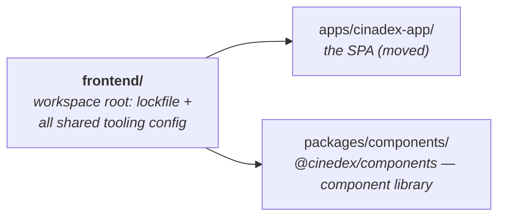

# Frontend workspace + `@cinedex/components` component library + Storybook

**Date:** 2026-08-05
**Status:** Implemented

## Problem

`frontend/cinadex-ui/` was a single standalone npm project containing an essentially untouched Vite scaffold — `App.tsx`, `main.tsx`, two global CSS files, one test. It had **no reusable components at all**.

The goal was a shared component library with a Storybook, consumed by the SPA. Since there was nothing to extract, this is a greenfield library plus the structural work to give it a home.

## Decisions

| Decision | Choice | Why |
| --- | --- | --- |
| Layout | `frontend/apps/*` + `frontend/packages/*` | Conventional monorepo shape; scales if a second app appears. Costs a one-time update of every hardcoded `frontend/cinadex-ui` path. |
| Names | `@cinedex/components`, `@cinedex/storybook`, `cinadex-app` | Each package is named for what it *is* rather than for the layer it sits in — `ui` said nothing useful once three packages existed, and `cinadex-ui` and `@cinedex/ui` were easy to confuse in prose. Folder names match package names. The SPA keeps the `cinadex` spelling, which is [deliberate](../../README.md). |
| Consumption | Source-consumed (`exports` → `src/`) | No library build to sequence in Docker or CI, no `composite: true`, HMR across the boundary, one compiled source for app/Storybook/Vitest. |
| Styling | CSS Modules + shared tokens | Scoped with zero config in Vite; keeps the existing custom-property theming rather than replacing it with a new toolchain. |
| v1 scope | Box, Button, TextField | Smallest slice that proves the workspace, the package boundary and Storybook end to end. |

**Compatibility check that gated the plan:** Storybook 10.5.6 declares `vite: ^5 || ^6 || ^7 || ^8`, `react: ^19`, `typescript: >= 4.9.x`, so it fits the bleeding-edge toolchain (Vite 8, React 19.2, TS 6, Vitest 4, ESLint 10) with nothing pinned back.

## Architecture



Storybook was later split out into `apps/storybook/` — see the follow-up spec.

### Source-consumed package boundary

```jsonc
"exports": {
  ".":            { "types": "./src/index.ts", "default": "./src/index.ts" },
  "./tokens.css": "./src/styles/tokens.css",
  "./base.css":   "./src/styles/base.css"
}
```

`moduleResolution: "bundler"` (already set in the app) follows the `exports` map to the TypeScript source. The library's `build` script is `tsc -b` — a typecheck, not an emit.

The tradeoff, stated plainly: `tsc -b` in the app also typechecks library source under the app's compiler flags, so `apps/cinadex-app/tsconfig.app.json` and `packages/components/tsconfig.lib.json` must stay in step.

### Styling and theming

Design tokens moved out of the app into `packages/components/src/styles/tokens.css`; base element styling (typography applied to bare HTML) into `base.css`. Both are exported and loaded by the app entry point *and* by Storybook's preview, so a component looks the same in a story as in the app. Only app-specific layout (`#root`, the social-icon dark filter) stayed behind in the app's `index.css`.

Colours use `light-dark()` rather than a duplicated `@media (prefers-color-scheme: dark)` block:

```css
:root {
  color-scheme: light dark;
  --accent: light-dark(#aa3bff, #c084fc);
}
```

Each token is declared once, and the used `color-scheme` picks a side. Default behaviour is unchanged (follows the OS), but a host can force a theme by setting `color-scheme` on the root — which is the whole mechanism behind Storybook's theme toolbar, and gives native form controls matching chrome for free. Because `light-dark()` resolves to a colour, `--shadow` is composed from two themed colour tokens rather than swapped wholesale.

Component stylesheets resolve every colour, space and radius through tokens — no literal hex, no spacing outside the `--space-*` scale.

### Components

`Box` (flex layout with `as`, `direction`, `padding`, `gap`, `align`, `justify`), `Button` (`variant`, `size`, defaults `type="button"`), `TextField` (label + input + optional error, `useId`-generated ids tying `htmlFor`/`aria-describedby`/`aria-invalid` together).

All three take `ref` as a plain prop (React 19 — no `forwardRef`), spread unknown props onto the underlying element, and merge a caller's `className`.

## Verification performed

- `npm run lint`, `npm run format:check` — clean across both packages.
- `npm run build` — both packages typecheck; app emits `dist/`.
- `npm run coverage` — app 2/2 (the pre-existing `App.test.tsx` passes unchanged, proving the `<Button>` swap preserved the accessible name), library 25/25.
- Storybook at 6006, verified in a real browser: `Button` computes to `rgb(170, 59, 255)` on `rgba(170, 59, 255, 0.1)`, radius 5px, padding 5px 10px, mono font — identical to the `.counter` rule it replaced. Forcing `color-scheme: dark` repaints to `#c084fc` / `#16171d`, matching the original dark tokens exactly. `TextField` label association, `aria-invalid` and `aria-describedby` all correct. `/icons.svg` returns 200, confirming `staticDirs`. No console errors.
- Dev server: Vite serves library source across the package boundary (HTTP 200) with `createHotContext` present — **HMR crosses packages and no `server.fs.allow` config is needed**, which was the main open risk in the plan. The React Compiler runtime appears in the transformed library output, confirming library and app components compile identically.
- `docker build -f apps/cinadex-app/Dockerfile -t cinadex-app frontend` — succeeds from the widened context.
- `dotnet build` from `backend/`, then `git diff --no-index CHANGELOG.md backend/CHANGELOG.md` — no drift.

## Notes / follow-ups

- `@storybook/addon-a11y`'s `test: 'error'` reports violations in the accessibility panel; it does **not** fail `build-storybook`. Making a11y a hard CI gate needs `@storybook/addon-vitest`, deliberately not installed for this slice.
- The library's branch coverage (~65%) is depressed by React Compiler memoization guards in the transformed output rather than by untested paths.
- `Button` deliberately dropped the old `.counter` rule's `margin-bottom: 24px`; external margin belongs to the parent, and `#center` already supplies the gap.
- `backend/src/Presentation/Cinedex.WebService`'s npm project stays outside the workspace with its own lockfile — it is a different toolchain generation driven by the MSBuild `BuildFrontend` target.
