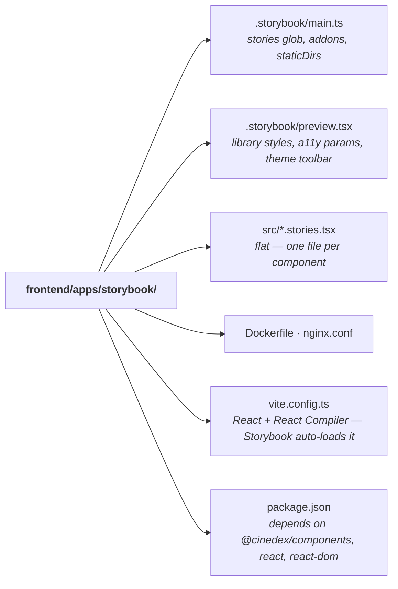

# Storybook as its own deployable workspace app

**Date:** 2026-08-05
**Status:** Implemented
**Follows:** [Frontend workspace + `@cinedex/components` component library + Storybook](2026-08-05-frontend-workspace-component-library-design.md)

## Problem

The first pass put Storybook *inside* the component library: `packages/components/.storybook/`, stories colocated at `packages/components/src/<Component>/<Component>.stories.tsx`, and the whole Storybook toolchain in the library's `devDependencies`. The library carried a workbench it doesn't need in order to be a library, and nothing forced the stories to respect the package's public surface — they imported components by relative path.

## Decisions

| Decision | Choice | Why |
| --- | --- | --- |
| Package | `@cinedex/storybook` at `frontend/apps/storybook` | It is an app that consumes the library, so it belongs under `apps/`, not `packages/`. |
| Stories | Move into the app, importing from `@cinedex/components` | Makes the dependency real and enforces the barrel. |
| Deployment | Dockerfile + nginx + Compose service on 9001 | A browsable component reference alongside the running stack. |

**The point of moving the stories** is that a story can now only use what `packages/components/src/index.ts` exports. A component missing from the barrel fails `build-storybook` — previously it would have gone unnoticed, because the story reached straight into the source folder. It also lets `packages/components` drop every Storybook dependency.

`preview.tsx` loads styles via the package exports (`@cinedex/components/tokens.css`, then `base.css`) rather than relative paths, which exercises those two export entries on every run. And since `@cinedex/components` declares React as a peer dependency, this app satisfying it is a genuine check on that contract.

## Architecture

The app carries its own `vite.config.ts` with the React Compiler Babel preset. Vite applies it to the linked `@cinedex/components` source as well as to the stories, so components compile here exactly as they do in the SPA rather than through an approximation. `staticDirs: ['../../cinadex-app/public']` keeps the `/icons.svg#id` sprite resolving.

The image is a two-stage build from the `frontend/` context (the lockfile is there): Node builds the static bundle, Nginx serves it on port 80, published on 9001. Plain HTTP — this container is not the stack's reverse proxy and Storybook calls no API, so there is nothing to terminate TLS for.

## Two traps this surfaced

- **`.dockerignore` had `**/.storybook`.** Harmless while Storybook was dev-only; fatal once it builds inside an image, since the config would be stripped from the build context. Removed, with a comment saying why it must stay removed.
- **`npm ci` validates the lockfile against the whole workspace, even scoped with `--workspace`.** Adding a third package meant the *existing* SPA Dockerfile needed a `COPY apps/storybook/package.json` line or it would fail. Both Dockerfiles now copy every manifest, and both READMEs say so.

## Verification performed

- `npm run lint`, `format:check` clean; `npm run build` typechecks all three packages.
- `npm run coverage` — SPA 2/2, library 25/25 unchanged. The library's coverage config lost its now-dead stories exclude.
- Storybook on 6006, checked in a real browser: the `Box` row story renders three composed `Button`s with `flex-direction: row`, `gap: 8px`, `padding: 16px` — proving `Box` and `Button` both resolve through the barrel — and `--accent` resolves to the `light-dark()` token pair, proving the CSS export entries load. `/icons.svg` returns 200, validating `staticDirs`.
- Both images build; the Storybook container serves `/`, `/iframe.html`, `/icons.svg` and an unknown-path fallback, all 200, with `<title>storybook - Storybook</title>`.
- `dotnet build` from `backend/`, then a changelog-sync check — no drift.

## A theming quirk found during verification

Toggling the theme toolbar left an invalid `TextField`'s border showing the previous theme's accent, while the error text on the same story updated correctly.

Isolated it: on a freshly created `
`, both `color` and `border-color` from `var(--accent)` resolve to the dark value; on the pre-existing `<input>`, `color` resolves dark but `border-color` stays light — same element, same token, same inline declaration. `appearance: none` made no difference. Loading a story with the theme already applied (`?globals=theme:dark`) resolves everything correctly.

So it is a Chrome style-invalidation quirk on **runtime** `color-scheme` changes, not a defect in the tokens or the components — a page that simply loads under a theme is unaffected, which means the SPA never hits it.

Fixed where it actually mattered, in the Storybook decorator: `<Story key={scheme} />` remounts the story on theme change, so styles are computed fresh. Verified by driving the real toolbar — System → Dark now repaints the border to `rgb(192, 132, 252)` without a manual reload.

## Note on a pre-existing console error

The Storybook manager logs three `MANAGER_UNIVERSAL-STORE` unhandled rejections at boot. These were verified to be **pre-existing** by stashing this change and booting the previous setup, which produced the identical errors. They are Storybook 10.5.6's own manager noise, not a consequence of the split, and nothing in the UI is affected. An earlier claim that the console was clean was based on checking only the story iframe, not the manager.
