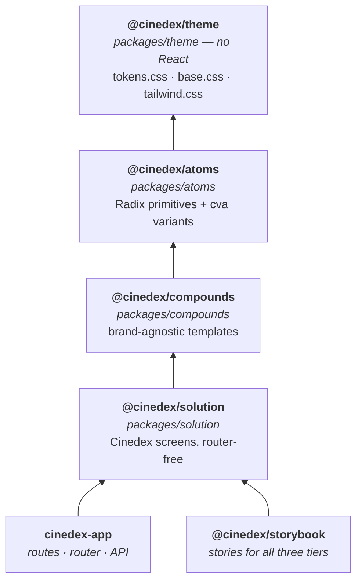

# Three-tier component libraries: `@cinedex/theme` → `atoms` → `compounds` → `solution`

**Date:** 2026-08-07
**Status:** Implemented
**Follows:** [Frontend workspace + `@cinedex/components` component library + Storybook](2026-08-05-frontend-workspace-component-library-design.md), [Storybook as its own app](2026-08-05-storybook-as-its-own-app-design.md)

## Problem

`3b7aa36` ("Updated auth UI", #57) shipped seven auth screens and eleven Tailwind-styled building
blocks — `AuthCard`, `AuthButton`, `PasswordField`, `OtpInput`, `Checkbox`, `Alert`, `StatPair` and
friends — but put every one of them **inside the app**, at `apps/cinedex-app/src/features/auth/`.
That was the right call at the time and the wrong place to leave them:

- **`@cinedex/components` is CSS-Modules-only by its own convention**, so the new components had
  nowhere to go. The library kept `Box`, `Button` and `TextField` while the project's best
  components lived in a feature folder.
- **The design system is split in two.** Colour, spacing and radii tokens live in the library's
  `tokens.css`; the `warning`/`success` ramps and the whole Tailwind `@theme inline` bridge live in
  the app's `styles/tailwind.css`. There is no one file a rebrand touches.
- **Tailwind is scoped to the app alone.** `@tailwindcss/vite` is only in `cinedex-app`'s
  devDependencies, so `apps/storybook` — which exists precisely to review components in isolation —
  cannot render any of the eleven. Storybook still only knows `Box`, `Button` and `TextField`.
- **Two styling systems, no path between them.** CSS Modules in the library, Tailwind in the app.

## Decisions

| Decision | Choice | Why |
| --- | --- | --- |
| Tiering | `atoms` → `compounds` → `solution` | Primitives, brand-agnostic templates, and Cinedex's own screens are three different rates of change. The auth work needed all three and had one. |
| Theme location | A **fourth** package, `@cinedex/theme` — React-free, CSS only | "Control the design system at core level" means one package that ships no components. The docs site can consume the brand without pulling in React. |
| `@cinedex/components` | Retired outright, renamed to `@cinedex/atoms` | Private package, two in-repo consumers, both migrated in the same branch. A compat shim would be a second barrel to keep in sync for no external benefit. |
| `Box` | Deleted | A flex container with `padding`/`gap` props is what Tailwind utilities already are. |
| Styling | Tailwind v4 everywhere; every `.module.css` removed | One system. The tokens survive — Tailwind resolves *through* them rather than replacing them. |
| Radix | Stable primitives only | `unstable_OneTimePasswordField` and `unstable_PasswordToggleField` cover exactly what the auth flow needs, but ship behind an `unstable_` prefix with an open value-persistence issue. The hand-rolled `OtpInput` is tested and works. Revisit on promotion. |
| Variants | `class-variance-authority` + `cn()` (clsx + tailwind-merge) | Typed `VariantProps`, and `tailwind-merge` makes a caller's `className` reliably beat the component's own — which the outgoing `cx()`/string-concat approach does not. |
| `solution` scope | Presentational only — no router, no `fetch` | Screens stay storyable and testable with no router mock. The app remains the only place that knows about the backend. |

## Architecture



All four stay **source-consumed** (`exports` → `src/`), as `@cinedex/components` already was: no
build step, no `dist/`, HMR across package boundaries, and `build` is `tsc -b` — a typecheck.

### Where the tier boundary actually falls

The line between `compounds` and `solution` is easy to state and easy to blur, so it is drawn on a
concrete case. `AuthCard` today hardcodes the "C" mark and the "Cinedex" wordmark in its brand row.
In the split:

- **`@cinedex/compounds`' `AuthCard`** takes `brand` as a `ReactNode`. It knows *where* a brand goes.
- **`@cinedex/solution`' `Brand`** is the "C" mark and the wordmark. It knows *which* brand.

Same test for navigation. `solution` *does* know Cinedex's route paths — `/register`,
`/forgot-password`, `/login` are Cinedex facts and belong in the Cinedex layer. What it does not
know is how to navigate. So the paths stay in the screens and only the link component is injected:

```tsx
export const SolutionProvider: ({ linkComponent, children }) => ReactNode  // defaults to 'a'
export function useLinkComponent(): ElementType
```

`cinedex-app` supplies TanStack Router's `Link` once in `routes/__root.tsx`; Storybook supplies
nothing and gets a plain `<a>`. This replaces `AuthInlineAction.tsx`, the single file that currently
imports `@tanstack/react-router` into what is otherwise presentational code.

### The design system, in one package

`packages/theme` ships three stylesheets and no JavaScript.

`tokens.css` gains the `warning`/`success` ramps promoted out of the app, and a **named type and
tracking scale**. The auth components currently repeat `text-[10px] tracking-[0.1em]`,
`text-[11.5px]`, `tracking-[0.14em]`, `text-[12.5px]`, `text-[13.5px]` and `text-[25px]` across a
dozen files; each becomes a step named for its role (`--type-label`, `--type-caption`, `--type-note`,
`--type-body`, `--type-title`, plus `--track-label` and `--track-eyebrow`), reachable as
`text-label`, `tracking-eyebrow` and so on. A component carries no pixel values.

The raw tokens stay unprefixed (`--accent`, `--bg`) but the new scales are `--type-*` / `--track-*`
rather than `--text-*` / `--tracking-*`. That is deliberate: `--text` is already the body colour, and
`--text-*`/`--tracking-*` are Tailwind's own theme namespaces — keeping the raw names distinct keeps
the bridge readable.

`tailwind.css` holds `@import 'tailwindcss'`, the `@theme inline` bridge and the `cdx-caret`
keyframes. `@theme inline` is what keeps one variable per token: with `inline`, Tailwind writes the
*value* into the utility (`background: var(--bg)`) instead of emitting its own `--color-bg`, so
`--color-bg: var(--bg)` is a bridge rather than a circular definition.

### The `@source` trap

Tailwind never scans `node_modules`, and npm workspaces symlink `node_modules/@cinedex/atoms` →
`packages/atoms`. Without explicit registration, **a class used only inside a library package
generates no CSS — silently.** No error, no warning, just an unstyled component. So `tailwind.css`
carries:

```css
@source "../../atoms/src";
@source "../../compounds/src";
@source "../../solution/src";
```

**Verified empirically before any component was written**, because the failure mode is invisible: a
probe package using three classes that appear nowhere in app source (`bg-social-bg`,
`tracking-eyebrow`, `text-brand`) was built through the real Vite pipeline and the emitted CSS
grepped for each. All three are generated, and app-only classes (`min-h-svh`, `animate-caret`)
continue to be generated alongside them. Two facts that experiment settled:

- **`@source` paths resolve relative to the CSS file that declares them**, not to the entry
  stylesheet or the project root. That is what lets the directives live in `theme` and serve every
  consumer, instead of being duplicated into each app's CSS entry.
- The repo-root `.gitignore`'s NuGet rule `**/[Pp]ackages/*` does **not** suppress the scan, even
  though Tailwind honours `.gitignore`. `frontend/.gitignore`'s `!packages/*` re-include — added
  earlier so `git add` would not silently skip the library — is respected here too.

**A new library package needs a line here**, or its classes vanish.

## Package contents

### `@cinedex/atoms`

`radix-ui` (stable primitives), `class-variance-authority`, `clsx`, `tailwind-merge`.

| Atom | Radix | Replaces |
| --- | --- | --- |
| `Button` | `Slot` (`asChild`) | `Button` + `AuthButton` + `authButtonClassName` |
| `Input` / `Label` / `Field` / `TextField` | `Label` | `TextField`'s internals, split into reusable parts |
| `Checkbox` | `Checkbox` | the `peer` + `sr-only` + `after:` CSS hack |
| `Alert`, `Card`, `OtpInput`, `PasswordInput` | — | the app-local versions |
| `ProgressBar` | `Progress` | the strength bar's `<span><i style={{width}}/></span>` |
| `Separator`, `VisuallyHidden` | both | inline `border-t` rules; new |
| `cn()` | — | `cx()` |

Deleted: `Box`, `cx`, `authButtonClassName`, every `.module.css`.

`Button`'s `asChild` is what lets a TanStack `<Link>` render with button styling, replacing
`<Link className={authButtonClassName('outline')}>`.

Every cva variant map lives in its own file (`Button/buttonVariants.ts`). `react-refresh/only-export-components`
fires on a file exporting both a component and a non-component, and the fix is structure, not a lint
exception.

### `@cinedex/compounds`

`AuthLayout`, `AuthCard` (brand injected), `PasswordField`, `PasswordStrengthMeter`,
`PasswordChecklist`, `StatPair`, `InlineActionRow` (the "No account? · Create one" row, currently
inlined in three screens), `strengthFromRequirements`. Depends on `atoms` only.

### `@cinedex/solution`

`Brand`, `SolutionProvider`/`useLinkComponent`, and the six screens moved from the app. Submit
handlers arrive as optional props defaulting to no-ops, so a story renders with zero wiring.

## Tests

All 63 existing cases move with their subjects and keep asserting behaviour and accessibility —
roles, label association, `aria-*` — rather than internals. The exception is the handful that match
hashed CSS Module class prefixes (`_button_<hash>`); those classes no longer exist and the
assertions are rewritten against behaviour.

| From | To | Cases |
| --- | --- | --- |
| `packages/components/src/{Box,Button,TextField}` | `atoms` (Box's `as`-prop cases retired with it) | 25 |
| app `components/{AuthButton,Checkbox,OtpInput,Alert,StatPair}` | `atoms` | 13 |
| app `components/{PasswordField,PasswordStrength}` | `compounds` | 6 |
| app `screens/*` | `solution` (no memory router needed any more) | 15 |
| app `login-routing.test.tsx`, `App.test.tsx` | stay in `cinedex-app` | 4 |

## Verification performed

- **The `@source` gate**, run before a single component was written. A probe package using three
  classes absent from app source (`bg-social-bg`, `tracking-eyebrow`, `text-brand`) was built through
  the real Vite pipeline and the emitted CSS grepped. Settled two things: `@source` resolves relative
  to the declaring CSS file, and the root `.gitignore`'s `**/[Pp]ackages/*` does not suppress the
  scan. (A first run appeared to fail; the probe package had been created at the repo root instead of
  under `frontend/`, so `@source` pointed at a directory that did not exist.)
- **The cascade-layer bug, found by reading computed styles in a browser.** `AuthCard`'s `<h1>`
  computed to 56px/500 rather than the `text-title`/`font-bold` it asked for. Confirmed pre-existing:
  `git show HEAD` shows the old `base.css` carried zero `@layer`, an `h1 { font-size: 56px }` rule,
  and was imported ahead of `@import 'tailwindcss'`, against an `<h1>` classed `text-[25px] font-bold`.
  After the `layer(base)` fix, the auth heading computes 25px/700 and the landing page's bare `<h1>`
  still computes 56px — which is the whole point of the layer choice.
- **`npm ci` from a wiped `node_modules`** — clean under `.npmrc`'s `strict-allow-scripts=true`;
  none of `radix-ui`, `class-variance-authority`, `clsx` or `tailwind-merge` carries an install script.
- **`npm run lint`, `format:check`, `build`, `build-storybook`, `coverage`** — all clean.
  **78 tests** (up from 63) across four coverage directories.
- **`cn()`'s custom class groups**, checked directly: `text-label text-accent` keeps both (size and
  colour), while `text-label text-title` and `rounded-sm rounded-md` each resolve to the last.
- **Storybook in a real browser.** All 12 sampled stories render with `sb-show-main` and no error
  display; the sign-in screen renders complete, and `atoms-otpinput--partially-filled` shows `4,8,1`
  across six boxes. Forcing dark repaints everything — card `#16171d`, inverted ink, dark inputs.
- **The SPA in a real browser.** All eight routes render the right heading, auth cards at 25px and the
  landing page at 56px. Clicking "Create one" navigates to `/register` with `performance` reporting a
  single navigation entry — client-side routing through the injected `RouterLink`, not a page load.
  No console errors. (Done over a temporary plain-HTTP Vite config: the dev server's `basic-ssl`
  certificate is rejected by the automation browser.)
- **`docker compose build cinedex-app cinedex-storybook`** — both images build.
- **`node scripts/check-diagrams.mjs`** — 20 Mermaid diagrams, no ASCII box art.
- **`dotnet build` from `backend/`** — 0 warnings (warnings are errors), and
  `git diff --no-index CHANGELOG.md backend/CHANGELOG.md` reports no drift.

## Notes / follow-ups

- **Both Dockerfiles' manifest-COPY comments were wrong, and the fix is the comment.** They claimed
  every workspace manifest is "required" because "a missing manifest fails the build" — and
  `apps/docs-site`'s was already absent from both. Tested directly: the image builds fine with any
  single manifest line removed, including a real dependency's (`packages/atoms`), because the later
  `COPY . .` fills the directory in and the workspace symlink resolves. So the list is about **layer
  caching**, not correctness: a missing line means the `npm ci` layer is not invalidated when that
  package's dependencies change, and the image silently ships without the new one. The lists are now
  complete — the four new packages plus the long-missing `apps/docs-site` — and say what they are for.
- **`tailwind-merge` 3.6.0 supports Tailwind 4.0–4.3** and the repo is on 4.3.3, the top of that
  range. A Tailwind 4.4 bump may need a `tailwind-merge` release first.
- **Four tsconfigs now have to stay in step**, not two: `tsc -b` in a consumer typechecks every
  linked library's source under the consumer's flags.
- Radix's `unstable_OneTimePasswordField` handles password-manager autofill and auto-submit, which
  the hand-rolled `OtpInput` does not. Worth revisiting when it stabilises.
