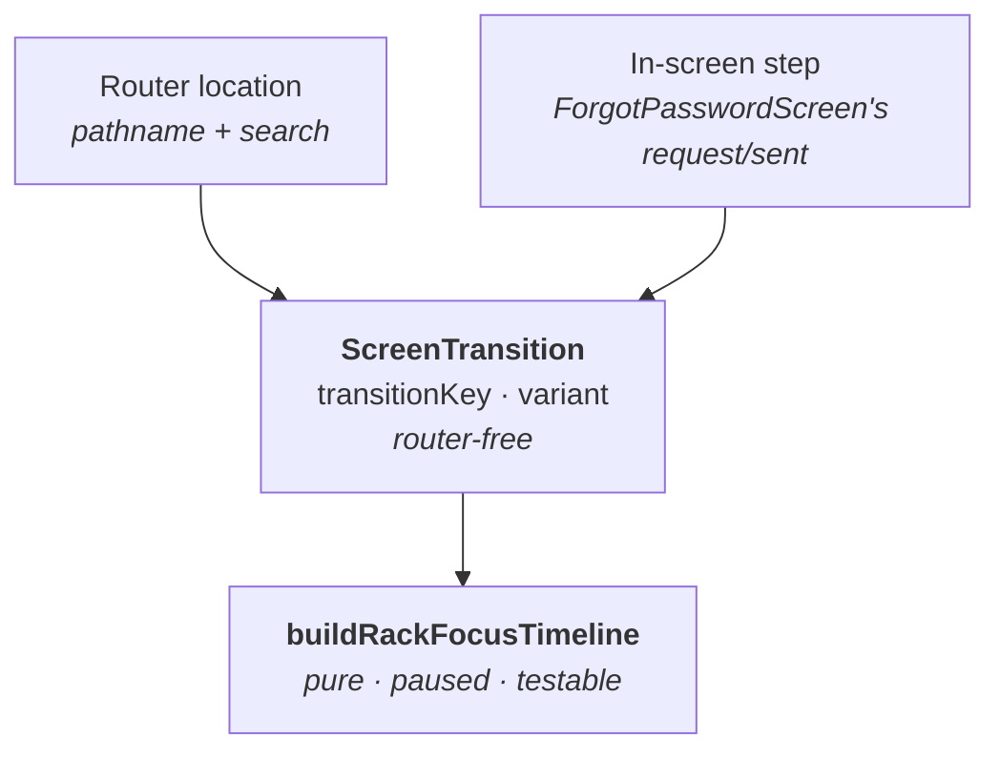
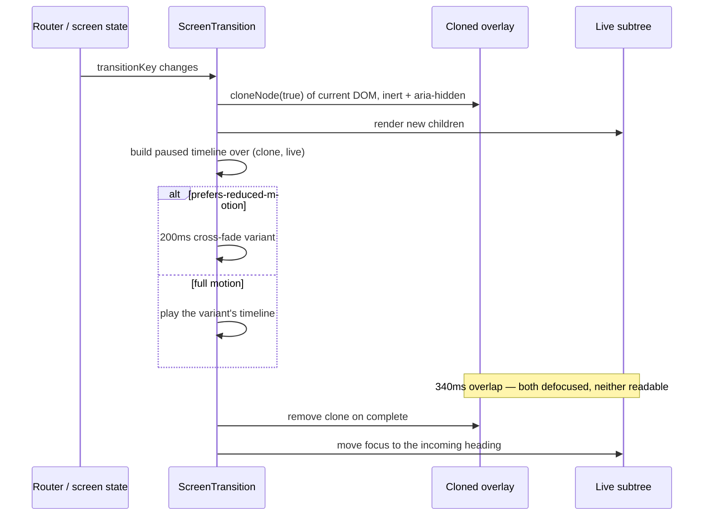
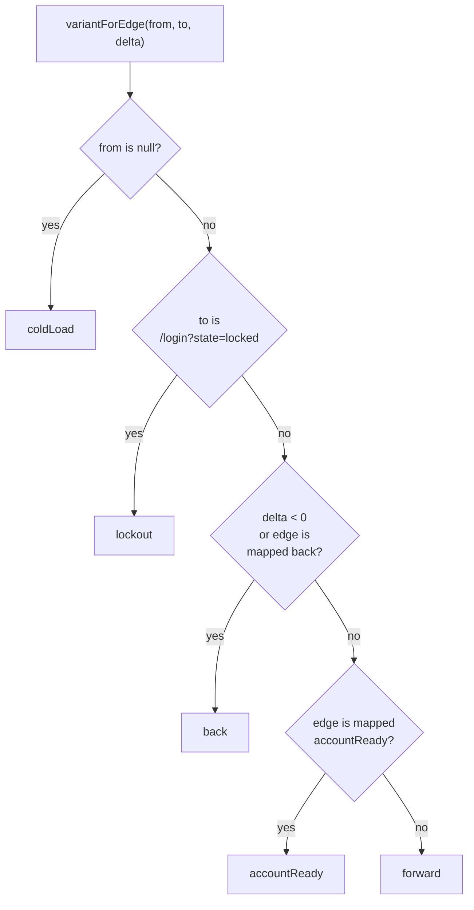

# Auth screen transitions: the "rack focus" move

**Date:** 2026-08-15
**Status:** Designed
**Follows:** [Three-tier component libraries](2026-08-07-three-tier-component-libraries-design.md)
**Source design:** Claude Design project `c482ae5b`, `Auth Transitions.dc.html` (turn `2a`, map `MAP · 2A`)

## Problem

The auth flow is ten screens that swap instantly. Every move between them — advancing to a
two-factor prompt, retreating from "Check your inbox" back to the request form, being pushed into a
lockout — looks identical: the old card vanishes, the new one appears in the same frame. Nothing in
the motion tells you whether you moved forward, went back, or failed.

The design specifies one transition, **rack focus**, borrowed from the camera language the brand
mark already uses: the outgoing screen defocuses and recedes while the incoming screen arrives out
of focus and resolves. Four edges deliberately break the default, because on those edges the motion
carries meaning the copy does not.

Two things make this more than a CSS exercise:

- **The router unmounts the outgoing screen before it can animate.** A 340ms overlap needs both
  screens on the page at once, which TanStack Router does not provide.
- **Half the interesting edges are not navigations at all.** See below — this is what shaped the
  design.

## The discovery that shaped this: two triggers, not one

The design's edge map reads as a set of route transitions. It is not. Checking the screens against
the routes:

| Design edge | What it actually is |
| --- | --- |
| `07 → 08` Reset request → Check inbox | `useState<'request' \| 'sent'>` inside `ForgotPasswordScreen` — one component, an early return |
| `08 → 07` "Start over" | The same state going back — **the only backward edge reachable by clicking today** |
| `01 → 03` Sign in → Locked | A search-param change (`?state=locked`), same component, `locked` prop |
| `01 → 04`, `01 → 07`, `10 → 01` | Genuine route changes |

A router-level transition host would animate none of the first three. So the primitive is keyed on
**an arbitrary string**, and the router is one of two things that can supply it:



This keeps the primitive inside `@cinedex/solution`'s hard rule — no router import — so it stays
storyable and testable with no router mock, exactly like the screens it animates.

## Decisions

| Decision | Choice | Why |
| --- | --- | --- |
| Animation engine | **GSAP**, already a dependency of `@cinedex/solution` | Zero new dependencies, and `Brand/timelines.ts` already established the builder/hook/scrub-test pattern this extends. Introducing a second animation paradigm alongside it is the cost of any other option. |
| Rejected: View Transitions API | Not used | `::view-transition-old/new` are not in the DOM tree and cannot be inspected from JS. The transition would be structurally untestable — a poor trade in a repo that wrote 338 lines of tests for a logo animation. Also still needs a fallback path. |
| Rejected: CSS keyframes | Not used | Closest to the prototype, but jsdom computes no animation state, so tests could only assert that a class name is present. Same mount problem as GSAP with none of the testability. |
| Keeping the outgoing screen alive | `cloneNode(true)` into an `inert` overlay | `AnimatePresence`-style approaches keep the exiting subtree mounted, but that subtree still contains a live `<Outlet />` which re-renders against the **new** router state — you cross-fade a screen with itself. A DOM clone is frozen by construction, and unlike view-transition pseudo-elements it is real DOM a test can assert on. |
| Transition trigger | An opaque `transitionKey` string | Half the design's edges are in-screen state changes, not navigations. See above. |
| Direction source | Edge map, overridden by history delta | The map is the design's `MAP · 2A` table verbatim. The browser Back button must read as backward regardless of what the map says, so a negative history delta wins. |
| Easing | A hand-rolled cubic-bezier solver, passed to GSAP as a function ease | The design specifies exact beziers. Mapping them onto GSAP's named eases is where this repo has already been bitten: `Brand/timelines.ts` documents that `powerN` is off by one from the usual vocabulary and that "fixing" a cubic ease-out to `power3` overshoots by up to 0.11. Solving them exactly costs ~30 lines and removes the class of problem. |
| Animated value transport | CSS custom properties, not `style.filter` / `style.transform` | jsdom's `CSSStyleDeclaration` implements only a subset of real properties and can silently drop `filter` — which would leave the screen correct and the tests asserting nothing. Custom properties always round-trip, which is what keeps the sequence scrubbable. |
| Motion tokens | None added to `@cinedex/theme` | One TS module is the single source of truth. CSS tokens would only earn their place if CSS were also animating these values, and it is not. |
| Scope | Router-wire the reachable edges only | Seven of ten screens are unreachable by clicking; `05 Verify email` and `06 Account ready` have no component and the design flags their copy as draft. Storybook covers the rest. |
| E2E framework | **None** | See "Why no Cypress" below. |

## Module layout

In `packages/solution/src/transitions/`:

| File | Responsibility |
| --- | --- |
| `cubicBezier.ts` | Solves the design's exact CSS beziers into a `(t) => number` GSAP takes as an ease |
| `rackFocus.ts` | `buildRackFocusTimeline(out, in, opts)` — the variant table, returns a paused timeline |
| `authEdges.ts` | `variantForEdge(from, to, wentBack)` — the `MAP · 2A` table |
| `ScreenTransition.tsx` | The clone host and its `useCaptureOutgoing` context — router-free, keyed on a string |

Plus a `.test.ts` beside each. In the app, `routes/__root.tsx` gains a
`RouterScreenTransition` wrapping its `<Outlet />`.

`rackFocus.ts` mirrors `Brand/timelines.ts`: pure, returns a **paused** timeline, no React, no DOM
queries beyond the two elements it is handed. `ScreenTransition` mirrors `useMarkTimeline`: a
`useLayoutEffect`, a `prefers-reduced-motion` branch, `kill()` on cleanup.

Everything lives in `@cinedex/solution` rather than splitting the mechanics into
`@cinedex/compounds`. The tier rules would argue for the split — a rack focus is brand-agnostic —
but the edge map is a pure Cinedex fact, GSAP is already a `solution` dependency, and
`Brand/timelines.ts` set the precedent for animation living here. Splitting a ~200-line feature
across two packages for a purity point is not worth the seam.

## The variant table

This is the contract. It is also, verbatim, the test fixture.

| Variant | Total | Outgoing | Incoming | Scale (out / in) |
| --- | --- | --- | --- | --- |
| `forward` | 820ms | 520ms @0 | 640ms @180 | 1 → 0.94 / 1.05 → 1 |
| `back` | 820ms | 520ms @0 | 640ms @180 | 1 → 1.05 / 0.94 → 1 |
| `lockout` | 520ms | 330ms @0 | 406ms @114 | none — held at 1 |
| `accountReady` | 1020ms | 520ms @200 | 640ms @380 | as `forward` |
| `coldLoad` | 640ms | — | 640ms @0 | — / 1.05 → 1 |
| *reduced motion* | 200ms | 200ms @0 | 200ms @0 | none |

Constant across every non-reduced variant:

- **Opacity** — outgoing 1 → 0, incoming 0 → 1
- **Blur** — outgoing 0 → 9px, incoming 11px → 0
- **Easing** — outgoing `cubic-bezier(.4, 0, .6, 1)`, incoming `cubic-bezier(.16, .8, .24, 1)`

Durations are expressed in milliseconds here for readability; the builder works in seconds, as GSAP
does.

### Two ambiguities in the source design, and how they are resolved

**1. `lockout`'s 520ms total.** The design's map gives `03 Too many attempts` a 520ms duration, but
the base transition's *outgoing half alone* is 520ms — so the number cannot mean "the standard move,
shortened at the end". It is resolved as **the `forward` timing scaled by `520/820`, with scale
locked at 1**, which preserves the 41% overlap ratio and is one multiplication in the builder. The
alternative reading — outgoing only, no incoming half — would leave the locked screen appearing with
no animation at all, contradicting the "Forward" entry in the map's Direction column.

**2. Reduced motion collapses every variant.** The design specifies one reduced-motion treatment
("drop blur and scale, keep a 200ms opacity cross-fade") without saying whether the per-edge
deviations survive it. They do not: **all five variants become the same 200ms cross-fade**, including
`accountReady`'s 200ms hold. This matches how `useMarkTimeline` treats reduced motion — a single
settle path rather than a parallel set of reduced variants that can drift from the full ones.

## The transition lifecycle



The clone is taken in a `useLayoutEffect`, before the browser paints the swapped children — the same
reasoning that makes `useMarkTimeline` a layout effect rather than an ordinary one.

**Interruption.** A `transitionKey` change while a timeline is running kills the timeline, drops the
existing clone, and starts over from the current DOM. No queueing, no reversal — a user who clicks
through three screens in 500ms should land on the third, not watch two more transitions.

## Edge map

`authEdges.ts` resolves `(from, to, historyDelta) → variant`:



Mapped backward edges: `/signed-out` from anywhere (the app recedes), and
`ForgotPasswordScreen`'s `sent → request`. Everything else defaults forward.

Edges wired in the app in this pass, all currently reachable by clicking:

| From | To | Variant |
| --- | --- | --- |
| cold load | `/login`, `/reset-password` | `coldLoad` |
| `/login` | `/register` | `forward` |
| `/login` | `/forgot-password` | `forward` |
| `/` (HomeScreen's index link) | `/login?state=locked` | `lockout` |
| `/forgot-password` request | `sent` *(in-screen)* | `forward` |
| `/forgot-password` sent | `request` *(in-screen)* | `back` |
| any | `/signed-out` | `back` |
| `/signed-out` | `/login` | `forward` |

`accountReady` and the `05`/`06` edges have no reachable route. They exist in the builder, are
covered by unit tests, and are reviewable in Storybook — but nothing in the app triggers them until
the backend work lands.

## Accessibility

For 340ms this design puts **two `<h1>` elements on the page**. That is a real regression the
transition introduces, and it is the kind of thing a visual review passes over silently. Three
requirements, all tested:

- The cloned overlay carries `inert` and `aria-hidden="true"` from the moment it is created.
- Focus moves to the incoming screen's heading when the timeline completes, not when it starts.
- `prefers-reduced-motion: reduce` takes the 200ms cross-fade with no blur and no scale.

`@storybook/addon-a11y` is already configured and will see the settled state; the mid-flight state
is what the unit tests cover.

## Testing

Three layers, each answering a different question. No new test runner, no CI change.

### 1. Vitest on the timeline builder — the load-bearing layer

A direct port of the pattern in `Brand/timelines.test.ts`, which exists precisely because the
previous `requestAnimationFrame` implementation could not be tested at all. A paused GSAP timeline
can be driven to any instant with `progress(p)` and flushes its writes synchronously, with no ticker
involved:

```ts
const tl = buildRackFocusTimeline(outEl, inEl, { variant: 'forward' });

expect(tl.duration()).toBeCloseTo(0.82, 5);

tl.progress(0);
expect(opacityOf(outEl)).toBe(1);
expect(opacityOf(inEl)).toBe(0);        // the 180ms delay has not elapsed

tl.progress(1);
expect(filterOf(inEl)).toBe('none');
expect(scaleOf(inEl)).toBeCloseTo(1, 4);
```

The variant table above becomes a `describe.each`, so the design document is executable. This is
what catches the failure that actually matters: someone flattening the four deviations into one
uniform curve, which no visual review would notice on the three edges that are unreachable anyway.

Assertions are written as the **designed values** — the durations, offsets and easing curves from
the source design — not as recorded output, so these are regression tests against the spec rather
than a snapshot of whatever the first implementation produced. Same discipline as
`timelines.test.ts`.

### 2. Vitest + Testing Library on `ScreenTransition`

Structural contract, not pixels:

- The clone exists during the transition and is gone after it.
- The clone carries `inert` and `aria-hidden="true"`.
- Focus lands on the incoming heading on completion.
- A `transitionKey` change mid-flight leaves exactly one clone, not two.
- `prefers-reduced-motion` selects the 200ms path.

> **Trap:** `test/setup.ts`'s `matchMedia` stub defaults `matches` to `true`, so **every existing
> test in this repo already takes the reduced-motion path**. Tests of the full-motion path must
> override that stub explicitly, or they will silently assert the 200ms cross-fade and pass for the
> wrong reason.

### 3. Storybook — for review, not assertion

A `Solution/AuthTransitions` story reproducing the prototype's rail: chips for the screens,
Prev/Next, the "Now showing" readout, and the spec panel. It is a near-mechanical port of
`Auth Transitions.dc.html` and it is the design-review surface, sitting next to the components it
animates.

Eight screens are real components. `05 Verify email` and `06 Account ready` appear as explicit
"not built — copy unreviewed" placeholder panels, so the flow reads complete without committing
draft copy into `@cinedex/solution`.

Automated assertions in Storybook would need `@storybook/addon-vitest` and Playwright browsers in
CI, which this repo deliberately does not have. Layers 1 and 2 already cover what it would check.

### Why no Cypress (or Playwright, or any E2E)

1. **Timing assertions on animations are flaky by construction.** A test that waits 820ms and checks
   opacity goes red on a loaded CI runner. The assertions that *are* valuable at that level —
   "Create one lands on `/register`", "no duplicate heading mid-flight" — are cheaper and more stable
   in `login-routing.test.tsx`, which already mounts the real route tree.
2. **The only thing a real browser adds is visual truth** — whether `blur(9px)` composites without
   jank. That is a screenshot concern, and the deterministic way to capture it is to scrub
   `tl.progress(0.5)` and shoot, not to race a wall clock. Even the visual case is better served by
   exposing `progress()` than by adopting a runner.
3. **CI is currently two fast jobs.** Browser downloads, a served build and a new required check is
   a permanent tax.

If E2E earns its place later it will be when the screens are wired to `/movies-svc/auth/*` and there
is a real sign-in round trip worth asserting — and **Playwright, not Cypress**, for the browser
matrix and the trace viewer. The transitions would come along for free rather than being the reason
to adopt it.

Manual verification stays what it is for the brand animations: the dev server in a browser.

## Out of scope

- `VerifyEmailScreen` and `AccountReadyScreen` (`05`, `06`). The design flags both as draft copy with
  no component upstream.
- Transitions anywhere outside the auth flow. `HomeScreen` is an index, not part of the flow.
- Motion tokens in `@cinedex/theme`.
- Any change to `@cinedex/compounds` or `@cinedex/atoms`.

## Risks

| Risk | Mitigation |
| --- | --- |
| `filter: blur()` on a full card is GPU-expensive and can jank on low-end hardware | Blur is on two elements, not a tree, and both are composited. Verify by hand on the dev server before merge; the reduced-motion path drops blur entirely. |
| The DOM clone diverges from what React would render (e.g. a portal, a Radix popover anchored outside the subtree) | Auth screens are static cards with no portals today. `AuthCard`'s subtree is self-contained. If a portal appears later, the clone drops it — acceptable for a 340ms overlap. |
| TanStack Router's history-index accessor is not public API | **Resolved in the plan:** every `popstate` is treated as backward, which needs no router internals. Right for the Back button, wrong for Forward — a deliberate trade, since forward-button use inside an auth flow is vanishingly rare. |
| The `lockout` timing assumption is wrong | It is one constant. Flagged above so a reviewer can catch it before implementation. |
