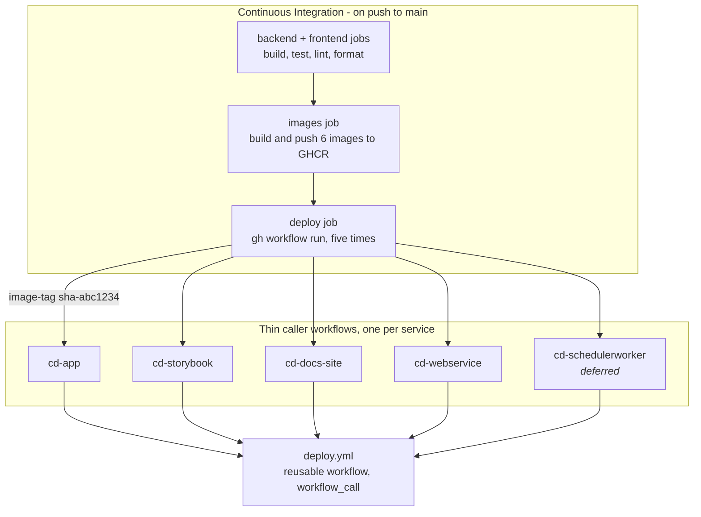
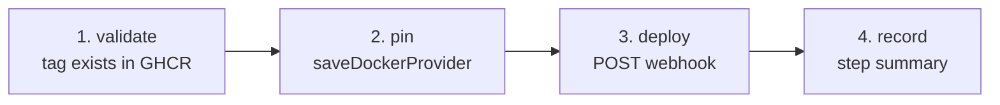

# CD release pipeline: pinned images, five services

**Date:** 2026-08-30
**Status:** Designed

## Problem

CI builds six container images and pushes them to GHCR. Getting them onto the server is currently
one step tacked onto the end of that build job: for the three React UI images, `curl -X POST` at a
Dokploy deploy webhook. That step has no notion of *which* build it is deploying. Every Dokploy
application is pinned to `:latest`, and the webhook carries no payload — it tells Dokploy "redeploy
yourself", and Dokploy pulls whatever tag it was already configured for.

Three consequences:

- **Nothing identifies what is running.** "Which build is live?" has no answer beyond "whatever
  `:latest` pointed at when the container last started."
- **There is no rollback.** Reverting means pushing a new commit that rebuilds an old state.
- **Deploys can run backwards.** Every application also has `autoDeploy: true` on a GitHub push
  trigger, so a merge to `main` fires Dokploy's own git webhook *and* CI's. For the three
  `sourceType: docker` applications, the git-triggered deploy redeploys the *currently pinned* tag —
  which, until CI's webhook lands, is the previous one. The two race, and the wrong one can win.

Separately, the build and the deploy disagree about what the stack is. CI builds six images; Dokploy
has five applications, two of which ignore GHCR entirely and compile .NET on the server; and the
scheduler worker has an image but nowhere to run.

This design separates the two pipelines: CI's artifact is the image, and a **release pipeline** takes
an immutable image tag, verifies it exists, pins each application to it, and triggers the deploy.

## The shape



Each caller supplies its own inputs and secrets; `deploy.yml` holds the only copy of the four steps:



The migrator is deliberately absent from CD, and its Dokploy application is left exactly as it is —
see *The migrator* below.

## Decisions

| Decision | Choice | Why |
| --- | --- | --- |
| How CD identifies a build | **Immutable tag, pinned via the Dokploy API, then the webhook** | The webhook alone cannot express *which* build to deploy. Pinning with `application.saveDockerProvider` before triggering makes the running image identifiable and makes rollback "re-run with the old tag". |
| Rejected: webhook only, apps stay on `:latest` | Not used | This is what exists today. No rollback, and "which build is live?" stays unanswerable. |
| Which tag is the contract | **`sha-<short>`** | Unique per push to `main`, so every build is addressable. Manual dispatch accepts any tag string, which is what makes rollback usable. |
| Rejected: the version tag | Not used | `frontend/package.json`'s version moves only at release, so many `main` builds share one value. Pinning to it does not pin a build. |
| Workflow structure | **One reusable workflow (`deploy.yml`) plus five thin callers** | Each service keeps its own file, run history and dispatch button, while the validate/pin/deploy body exists once. Adding a sixth service is ~15 lines; fixing a bug is one edit rather than five. |
| Rejected: five standalone workflows | Not used | Chosen first, then reversed. Full independence, but the body would be duplicated five times — and it is not trivial: fourteen secret references and a masking rule about logging service names rather than application IDs. That is exactly the kind of subtlety that rots under copy-paste, and the cost grows with every service added. |
| Rejected: one workflow with a service matrix | Not used | Collapses five run histories into one; "each service has its own pipeline" stops being true. |
| Rejected: composite action | Not used | Packages steps rather than a job, so every caller still declares its own triggers, environment and permissions — more per-service boilerplate than `workflow_call` for no gain here. |
| Rejected: org-level workflow template | Not used | Scaffolding for new repositories: it copies once at creation and then drifts. A starting point, not shared code. |
| How CI reaches CD | **`gh workflow run` per service** | Dispatching fires each caller's `workflow_dispatch` trigger — the same entry point used manually, so the automated and manual paths exercise identical code. |
| Migrator in CD | **Excluded, and its Dokploy application left entirely untouched** | The migrator must complete before the web service restarts, an ordering constraint five independent workflows cannot enforce. Encoding an ordering the pipeline cannot guarantee is worse than leaving it out. |
| Rejected: CD orchestrates migrator → services | Not used | Correct, but requires polling the Dokploy deployment API and a timeout policy. Deferred. |
| Secrets | **GitHub Environment `production`** | Scopes the secrets to deploy workflows and leaves a required-reviewer gate available later without rework. Kept even though there is only one environment: the point is the narrower scope and the gate hook, not having several. Repository-level secrets would let any workflow in the repo read the Dokploy API token. |
| Passing secrets to the reusable workflow | **`secrets: inherit`** | The callers are in the same repository, under our control, and draw on one environment. Naming all six in every caller would cost six lines across five files that must stay in step with `deploy.yml`, so adding a secret would mean editing six files rather than one — the duplication this structure exists to remove. |
| Application IDs | **Secrets, with the service name logged in their place** | Keeps Dokploy topology out of a public repository. Logging the service name instead avoids the cost that would otherwise come with it: GitHub masks secret values, so a workflow echoing its ID would print `***` and a failed run could not be traced to a service. |
| Rejected: application IDs as plain `env` values | Not used | Readable logs and self-contained workflow files, but publishes the Dokploy application identifiers. |
| GHCR pull | **Authenticated** | `saveDockerProvider` marks `registryUrl`/`username`/`password` required. The applications currently pull anonymously because the packages are public; sending explicit credentials avoids both a validation failure and a dependency on the packages staying public. |
| `autoDeploy` | **Disabled on the five deployed applications; left on for the migrator** | It is the direct cause of the backwards-deploy race, so CD becomes the only deploy path for the five. The migrator is deliberately excluded from this change — see *The migrator* below. |
| Backend build location | **GHCR, not the server** | The web service currently compiles .NET on the box (~2 min per deploy) while CI builds the same image anyway. Converting makes one build serve both. |
| `:latest` | **Still pushed, no longer load-bearing** | Free to keep and useful for local `docker pull`; nothing in Dokploy consumes it once applications are pinned. |

## Services and identifiers

| CD workflow | Dokploy application | Application ID | GHCR image |
| --- | --- | --- | --- |
| `cd-app.yml` | `cinedex-app` | *********** | `cinedex-app` |
| `cd-storybook.yml` | `storybook` | *********** | `cinedex-storybook` |
| `cd-docs-site.yml` | `docs-site` | *********** | `cinedex-docs-site` |
| `cd-webservice.yml` | `Cinedex.WebService` | *********** | `cinedex-webservice` |
| `cd-schedulerworker.yml` | `Cinedex.SchedulerWorker` | *no application yet — **deferred**, see below* | `cinedex-schedulerworker` |
| *(none — see below)* | `Cinedex.DatabaseMigrator` | *********** | `cinedex-migrator` |

**The scheduler worker is deferred to a later pass.** It is the only service with no Dokploy
application, so deploying it means creating one from scratch — a different kind of work from the other
four, which are "same pattern, different values". Doing that while the pipeline itself is unproven
mixes two unknowns, so the first implementation covers four services. CI keeps building and pushing
`cinedex-schedulerworker`; nothing consumes it yet. Adding it later follows *Adding a service later*
below, with no change to `deploy.yml` — which is the property that makes deferring it cheap.

**Application IDs are environment secrets, and never appear in log output.** Each workflow reads its
own ID from a per-service secret and logs the *service name* instead — `cinedex-app`, rather than the
opaque identifier. They are not written into the workflow files, and they are redacted from this
document too: tabulating them here would have undone the reason they are secrets. Read them from the
Dokploy UI, or via the MCP's `project-all`, when creating or checking a secret.

This is obfuscation, not access control, and it is worth being precise about which. The ID is a bare
identifier that grants nothing on its own — acting on it additionally requires `DOKPLOY_URL` *and*
`DOKPLOY_API_TOKEN`, both already secrets. Keeping the IDs out of a public repository raises the cost
of reconnaissance against the Dokploy instance; it does not gate anything.

The reason the logging rule travels with the decision: GitHub masks secret values wherever they
appear in output, so a workflow that echoed its application ID would print `Pinning ***` and a failed
run could not be traced to a service. With five services sharing one reusable workflow that is exactly
the signal needed to debug one. Logging the service name — which each caller passes in as the
`service-name` input — keeps failures legible while the ID stays masked.

All applications sit in the Cinedex project's `production` environment.

## The migrator

`Cinedex.DatabaseMigrator` is out of scope for this work in every respect: no CD workflow, no
conversion to GHCR, and **`autoDeploy` left on**. It keeps building from source on the server via
Dokploy's own GitHub integration, exactly as it does today. CI still builds and pushes the
`cinedex-migrator` image; nothing consumes it for now.

This is a deliberate decision, taken with its consequence understood:

> **Every merge to `main` re-runs the database migrations on the production server, unprompted.**
> This is current behaviour, not something this design introduces — the migrator's `autoDeploy` is
> already `true` with a push trigger on `main`. It is recorded here so that a later reader does not
> mistake it for an oversight.

In practice this is survivable because EF Core migrations are idempotent — a run with nothing pending
applies nothing. The exposure is that a merge containing a new migration applies it to production at
merge time, with no deliberate step in between, and before the web service that expects the new
schema has rolled out.

Revisiting this is the natural follow-up to this design. The options, in rough order of effort:
disable `autoDeploy` on the migrator (one API call, makes migrations deliberate); convert it to a
pinned GHCR image like the rest; or take the orchestration that was rejected here — CD deploys the
migrator, polls for completion, then fans out the services.

## The caller workflows

Five near-identical files, one per service, each about fifteen lines. A caller declares only what
makes it different — its service name, its GHCR image, and which secrets carry its application ID and
webhook URL — then hands off to `deploy.yml`:

```yaml
# .github/workflows/cd-app.yml
name: Deploy cinedex-app
on:
  workflow_dispatch:
    inputs:
      image-tag:
        description: Image tag to deploy, e.g. sha-abc1234
        required: true
        type: string

jobs:
  deploy:
    uses: ./.github/workflows/deploy.yml
    secrets: inherit
    with:
      service-name: cinedex-app
      image: ghcr.io/felipedferreira/cinedex-app
      image-tag: ${{ inputs.image-tag }}
      app-id-secret: DOKPLOY_APP_ID_APP
      webhook-secret: DOKPLOY_WEBHOOK_APP
```

`deploy.yml` resolves the two per-service secrets by name from the inherited set. Adding a sixth
service means copying this file and changing five values.

**Why `secrets: inherit`.** The alternative — naming all six secrets in every caller — was considered
and rejected. It buys nothing here: the caller already says which service it deploys through
`service-name` and `image`, so the secret list adds no information a reader lacks. What it costs is
six lines per caller across five files, each of which must stay in step with `deploy.yml`'s own
`secrets:` block — so adding a secret would mean editing six files rather than one. That is the exact
duplication this structure exists to remove. Inheriting is safe here because the callers live in the
same repository, are all under our control, and draw on a single environment.

## The reusable workflow

`deploy.yml` holds the only copy of the deploy logic. It declares `workflow_call` with five string
inputs — `service-name`, `image`, `image-tag`, `app-id-secret`, `webhook-secret` — and no `secrets:`
block, since the callers inherit. One job, `environment: production`, permissions `packages: read`.

The last two inputs are secret *names*, not values. GitHub expressions cannot index `secrets` with a
dynamic key inside an `if:`, so each is resolved into an `env:` var first and the steps read that —
the same pattern the current CI workflow already uses for `secrets[matrix.webhook-secret]`:

```yaml
env:
  DOKPLOY_APP_ID: ${{ secrets[inputs.app-id-secret] }}
  WEBHOOK_URL: ${{ secrets[inputs.webhook-secret] }}
```

The four shared secrets — `DOKPLOY_URL`, `DOKPLOY_API_TOKEN`, `GHCR_PULL_USERNAME`, `GHCR_PULL_TOKEN`
— are referenced directly by name, since they are identical for every service.

**Where `environment: production` lives.** On the job inside `deploy.yml`, not on the callers — the
environment gates the job that actually uses the secrets, and putting it in one place means a future
reviewer gate applies to all five services at once.

**1 · Validate the tag exists in GHCR.** After `docker/login-action`:

```bash
docker manifest inspect "ghcr.io/felipedferreira/cinedex-app:$IMAGE_TAG"
```

A missing tag fails here with Dokploy untouched. This is the step that stops a typo from pinning an
application to an image that does not exist.

**2 · Pin the application.** `POST $DOKPLOY_URL/api/application.saveDockerProvider`, authenticated
with the API token, body:

```json
{
  "applicationId": "$DOKPLOY_APP_ID",
  "dockerImage": "ghcr.io/felipedferreira/cinedex-app:sha-abc1234",
  "registryUrl": "ghcr.io",
  "username": "$GHCR_PULL_USERNAME",
  "password": "$GHCR_PULL_TOKEN"
}
```

Every value except `dockerImage` comes from an environment secret. The application ID is never
echoed — see *Services and identifiers*. Build the body with `jq` rather than string interpolation,
so a value containing a shell metacharacter cannot break out of the JSON.

This call also sets `sourceType` to `docker` as a side effect, which is how `Cinedex.WebService` is
converted.

**3 · Trigger the deploy webhook.**

```bash
curl --fail --silent --show-error --location \
  --max-time 60 --retry 3 --retry-connrefused \
  -X POST "$WEBHOOK_URL"
```

`--fail` turns a 4xx/5xx into a failed run rather than a silently stale deployment. The step guards
on `$WEBHOOK_URL` being non-empty first, so a missing secret is a clear error rather than a `curl`
usage message. The same guard applies to `$DOKPLOY_APP_ID` before step 2 — with the IDs now in
secrets, an unset one would otherwise reach the API as an empty string.

These guards carry more weight than they would with values passed directly. Because the per-service
secrets are resolved by *name*, `secrets[inputs.app-id-secret]` yields an empty string for a name
that does not exist — a typo in a caller is silent, not an error. The guards are what turn it into a
failed run.

**4 · Step summary.** One line naming the **service** and the tag — `Deployed cinedex-app at
sha-abc1234` — so a run's history records what it deployed. The service name arrives as the
`service-name` input, never the secret application ID, which would render as `***`.

### What this structure costs

Two things get worse, and both are worth knowing before the first failure:

- **A failure reads as two nested jobs** in the Actions UI — the caller, then the called job inside
  it. The real error is one click deeper than it would be in a flat workflow.
- **`deploy.yml` is a single point of failure.** A bug there breaks all five services at once. This
  is the direct trade for having one copy; the mitigation is to change it deliberately and re-verify
  one service before the rest.

Reading `cd-app.yml` alone also no longer tells you what deploying means — it names a service and
hands off. That is the intended shape, but it means `deploy.yml` is where the behaviour lives and
where comments explaining it belong.

## Secrets

On the `production` GitHub Environment:

| Secret | Scope | Notes |
| --- | --- | --- |
| `DOKPLOY_URL` | shared | Base URL of the Dokploy instance. |
| `DOKPLOY_API_TOKEN` | shared | Authorises `saveDockerProvider`. |
| `GHCR_PULL_USERNAME` | shared | For the authenticated registry pull. **Placeholder for now.** |
| `GHCR_PULL_TOKEN` | shared | PAT with `read:packages`. **Placeholder for now** — see below. |
| `DOKPLOY_WEBHOOK_APP` | `cd-app` | Already exists. |
| `DOKPLOY_WEBHOOK_STORYBOOK` | `cd-storybook` | Already exists. |
| `DOKPLOY_WEBHOOK_DOCS_SITE` | `cd-docs-site` | Already exists. |
| `DOKPLOY_WEBHOOK_WEBSERVICE` | `cd-webservice` | New. |
| `DOKPLOY_WEBHOOK_SCHEDULERWORKER` | `cd-schedulerworker` | **Deferred** with the service. |
| `DOKPLOY_APP_ID_APP` | `cd-app` | New. |
| `DOKPLOY_APP_ID_STORYBOOK` | `cd-storybook` | New. |
| `DOKPLOY_APP_ID_DOCS_SITE` | `cd-docs-site` | New. |
| `DOKPLOY_APP_ID_WEBSERVICE` | `cd-webservice` | New. |
| `DOKPLOY_APP_ID_SCHEDULERWORKER` | `cd-schedulerworker` | **Deferred** with the service. |

The three existing webhook secrets are currently repository-level; they move to the environment.

### Blocked until the PAT exists

The GHCR pull credentials are deferred by decision, so the pipeline is **written but not live** until
they are real. Concretely:

| | Works with a placeholder | Blocked |
| --- | --- | --- |
| Writing and linting the seven workflow files | ✅ | |
| Dokploy conversion, pinning, `autoDeploy` off | ✅ | |
| Step 1 — validating a tag in GHCR | ✅ (uses `GITHUB_TOKEN`) | |
| Step 2 — `saveDockerProvider` | | ❌ rejected or writes broken credentials |
| Verification step 2 — the live `cd-storybook` dispatch | | ❌ |
| Wiring CI's `deploy` job | | ❌ — would fail every merge |

So implementation stops after the workflows exist and the Dokploy side is converted. **CI must not be
wired to dispatch CD until the PAT is in place**, or every merge to `main` ends in a failed deploy.

**Known limitation:** `DOKPLOY_API_TOKEN` can modify any application in the Dokploy organisation,
including the unrelated Wiki Site project. Dokploy's token model has no per-application scoping. The
environment's optional reviewer gate is the available mitigation.

## Dokploy-side changes

Applied via the Dokploy MCP during implementation, sequenced so nothing is left half-converted:

1. **Disable `autoDeploy`** on the four deployed applications (`application.update`). Do this
   *first*: until it is off, adding CD makes deploys less predictable, not more, because two
   mechanisms race. **The migrator is excluded** — it keeps `autoDeploy: true`, see *The migrator*.
2. **Convert and pin `Cinedex.WebService`.** `saveDockerProvider` switches it from
   `sourceType: github` to `docker` and pins it in one call. Its existing `buildArgs`/`buildSecrets`
   become irrelevant but are left in place — clearing them is unrecoverable and they are harmless.
   `env` is separate and unaffected.

**Deferred:** creating `Cinedex.SchedulerWorker`. When it happens, it goes in the Cinedex project's
`production` environment as `sourceType: docker` against `cinedex-schedulerworker`, sharing the web
service's database configuration, with **no domain** — it is a background worker and nothing routes
to it. Creation yields the application ID and webhook URL its two secrets need.

Two steps stay manual, because the API cannot supply them:

3. **Collect the four webhook URLs** from each application's Deployments tab. The API redacts
   `refreshToken`, which the URL is derived from. To rotate one, call `application.refreshToken`
   *before* copying, or the stored secret goes stale.

   Store the **four application IDs** as secrets at the same time, from the table in *Services and
   identifiers*.
5. **Mint the GHCR pull token** — a PAT with `read:packages` from the repository owner's account.
   **Deferred by decision.** The workflows reference `GHCR_PULL_USERNAME` / `GHCR_PULL_TOKEN` as
   normal, and the environment carries placeholder values until the real PAT is minted. See
   *Blocked until the PAT exists* below for exactly what does not work in the meantime.

## CI changes

- Remove the `Trigger Dokploy deploy` step from the `images` job. CI stops deploying.
- Remove `webhook-secret` from the matrix entries; it has no remaining consumer.
- Add a `deploy` job, `needs: [images]`, under the same `main`-only condition, that computes
  `sha-<short>` and runs `gh workflow run` five times. Needs a token with `actions: write`.

The `backend` and `frontend` jobs are unchanged.

## Adding a service later

The reusable workflow exists so that this path is cheap. To deploy a sixth service:

1. Add its image to CI's `images` matrix, if it is not built already.
2. Create the Dokploy application (`sourceType: docker`, `autoDeploy: false`).
3. Store its application ID and webhook URL as two new environment secrets.
4. Copy an existing caller, changing the service name, image, and those two secret names — about
   fifteen lines.
5. Add one `gh workflow run` line to CI's `deploy` job.

No change to `deploy.yml`.

## Verification

No unit test is meaningful for a workflow file, so verification is staged and manual:

1. `actionlint` over the seven workflow files locally (five callers, `deploy.yml`, and CI) — catches
   syntax and expression errors before push. Not added as a required check.
2. Dispatch each CD workflow by hand with a known-good existing tag, **one service at a time,
   starting with `storybook`** — the least load-bearing thing running. A green run proves
   validate → pin → webhook end to end against real Dokploy.
3. Confirm in Dokploy that `dockerImage` actually changed and a deployment appeared — **on the
   expected application, and only on it.** With the IDs in masked secrets, a transposed one would pin
   the wrong service silently, and the logs would show `***` either way. This check is what catches
   it, so it is worth doing for each of the five rather than only the first.
4. Only then wire CI's `deploy` job and let a real merge exercise it.

**Steps 2–4 require the GHCR PAT** and cannot run before it exists. Step 1 and the whole Dokploy
conversion can. This split is what makes the deferral safe rather than merely postponed.

## Failure modes

| Mode | Behaviour | Recovery |
| --- | --- | --- |
| Tag absent from GHCR | Fails at step 1; Dokploy untouched | Fix the tag |
| Pin succeeds, webhook fails | Application pinned to the new tag, still running the old container | Re-run; the pin is idempotent |
| Webhook succeeds, container fails to start | **CD reports green** | Visible only in Dokploy — see below |
| Partial rollout (3 of 5 succeed) | No transaction across the five callers; each run is independent | Re-dispatch the failures individually |
| A bug in `deploy.yml` | Breaks **all five** services at once, where five standalone copies would have broken one | The trade for one copy of the logic. Mitigated by dispatching one service at a time when changing `deploy.yml` — `storybook` first, as in *Verification* |
| Secret missing or wrong | 401 at the first API call | Fix the environment secret |
| Application-ID secret unset or wrong | Guarded before step 2, so an unset one fails fast; a *wrong* one pins the wrong application | Verify each ID against the table above when creating the secrets |
| Typo in a caller's `app-id-secret` / `webhook-secret` **name** | Resolves to an empty string rather than erroring — caught by the guards, which fail the run | Fix the name in the caller; the guard message names which value was empty |

**A green CD run means Dokploy accepted the deployment, not that the service is healthy.** The
webhook queues the deploy and returns immediately; confirming the container actually came up would
require polling the deployment API, which is out of scope here.

## Out of scope

Deployment health verification · automated rollback · approval gates (the environment makes one
possible; none is configured) · deploying the Wiki Site project.

**The migrator entirely** — no CD workflow, no GHCR conversion, `autoDeploy` left on, with the
unprompted-migrations consequence recorded above.

## Follow-ups

| | Why it is not done here |
| --- | --- |
| Mint the GHCR `read:packages` PAT and replace the placeholder secrets | Deferred by decision; blocks going live |
| Revisit the migrator's `autoDeploy` | Deliberately deferred; see *The migrator* |
| Deployment health verification / automated rollback | Needs Dokploy deployment-API polling |
