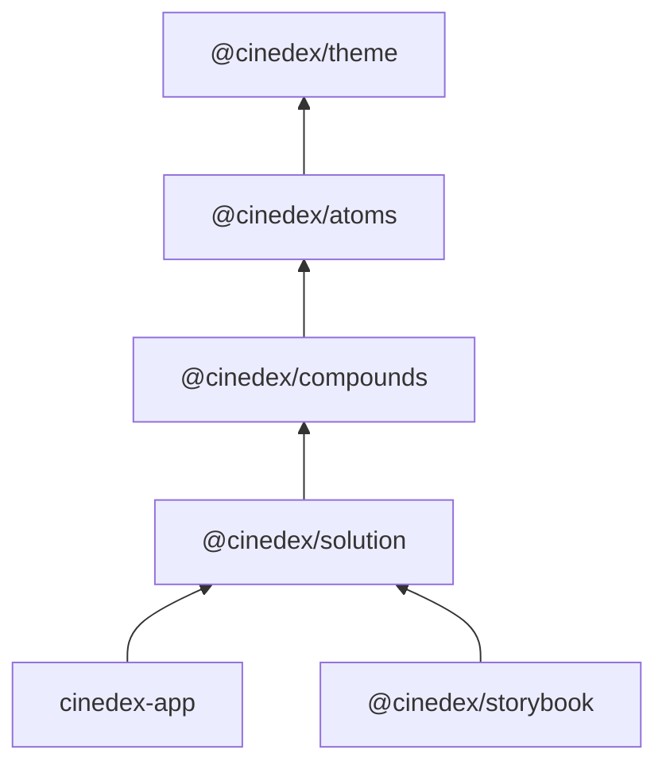

# frontend

npm **workspace root** for the Cinedex frontend. The lockfile lives here — there is no lockfile inside the packages.

| Package              | Path                  | What it is                                                                                                                   |
| -------------------- | --------------------- | ---------------------------------------------------------------------------------------------------------------------------- |
| `cinedex-app`        | `apps/cinedex-app/`   | The React 19 + Vite SPA. Nginx serves its static bundle over internal HTTP; Compose's Caddy edge owns HTTPS and API routing. |
| `@cinedex/storybook` | `apps/storybook/`     | Storybook for all three component tiers. Owns the stories. Served on 9001 in compose.                                        |
| `@cinedex/docs-site` | `apps/docs-site/`     | Cinedex-branded Docusaurus site. Renders the root `CHANGELOG.md`; Compose publishes it through Caddy at `/documentation/`.   |
| `@cinedex/theme`     | `packages/theme/`     | The design system: tokens, base element styling, the Tailwind theme. **No React** — four stylesheets.                        |
| `@cinedex/atoms`     | `packages/atoms/`     | Primitives — Radix-backed, Tailwind-styled, one job each.                                                                    |
| `@cinedex/compounds` | `packages/compounds/` | Templates — brand-agnostic assemblies of atoms.                                                                              |
| `@cinedex/solution`  | `packages/solution/`  | Cinedex's own screens. Presentational: no router, no data fetching.                                                          |

All four packages are **source-consumed** — `exports` point at `src/`, so there is no build step and no `dist/`.



## Commands (all from `frontend/`)

```bash
npm ci
npm run start            # app on http://localhost:5173 (strictPort)
npm run storybook        # Storybook on http://localhost:9001
npm run docs-site        # Docs site on http://localhost:9004
npm run build            # every package, including static Storybook (--workspaces --if-present)
npm run test:run         # every package
npm run test:ui          # one Vitest UI across the testable workspaces
npm run coverage         # what CI runs — one coverage/ dir per package
npm run lint             # eslint . — one pass across all packages
npm run format:check     # prettier — run `npm run format` before pushing
```

Target one package with `-w cinedex-app`, `-w @cinedex/atoms`, `-w @cinedex/compounds`, `-w @cinedex/solution`, `-w @cinedex/storybook` or `-w @cinedex/docs-site`, e.g. `npm run test -w @cinedex/atoms` for watch mode. `@cinedex/theme` has no scripts at all — it ships CSS.

## Where does a component go?

- **atoms** — one job, no internal arrangement. `Button`, `Input`, `Checkbox`, `PasswordInput`.
- **compounds** — a named layout assembled from atoms, **with no brand in it**. `AuthCard`, `PasswordField`, `StatPair`.
- **solution** — Cinedex-specific: the screens, the copy, the `Brand`. The only tier that names the product.

The sharpest illustration is `AuthCard`: it takes `brand` as a prop and never draws the wordmark, while `@cinedex/solution`'s `Brand` supplies it. Compounds know _where_ a brand goes; solution knows _which_.

**That injection is the exception, not the house style — see [`packages/compounds/CLAUDE.md`](packages/compounds/CLAUDE.md#prop-apis) for the three rules on prop APIs.** The short form: a `ReactNode` slot needs the parent to own the arrangement _and_ the content to be unable to be `children`; type a node prop by what callers actually pass (`string`, not `ReactNode`, unless someone really passes markup); and a story may only demo a prop a screen already passes. There are exactly **8** `ReactNode` props and **one** `ComponentType` across all three tiers, and that is the point — every one is a deliberate port, not a convenience.

## Styling

**Tailwind v4 everywhere, resolved through `@cinedex/theme`'s tokens.** There are no CSS Modules left. Three traps, all of which fail silently — details in [`packages/theme/CLAUDE.md`](packages/theme/CLAUDE.md):

- A new library package needs an `@source` line in `theme/src/tailwind.css`, or none of its classes generate.
- `base.css` must stay `layer(base)` and after `@import 'tailwindcss'`, or unlayered CSS outranks every utility.
- A new `--type-*`/`--track-*` step needs registering in `packages/atoms/src/utils/cn.ts` too, or `tailwind-merge` misfiles it as a colour.

## Notes

- **Shared config is hoisted here**, not per-package: `eslint.config.js`, `.prettierrc.json`, `.prettierignore`, `.gitignore`, `.dockerignore`. ESLint's `projectService` resolves the nearest `tsconfig` per file, so the single root config covers every package. **Its `allowDefaultProject` list is the one exception, and a new root-level `*.config.ts` has to be added to it.** This directory is the only one with no `tsconfig` of its own — every other config file is covered by its package's `tsconfig.node.json` — so a file sitting _here_ resolves to no project at all and type-aware linting fails on it outright (`was not found by the project service`), failing `npm run lint` rather than skipping the file. `vitest.config.ts` is currently the only entry.
- **Consumers compile library source directly.** Vite compiles the TSX and HMR crosses package boundaries; `tsc -b` in a consumer therefore also typechecks library source under that consumer's compiler flags. Four `tsconfig` sets now have to stay in step, not two.
- **Each library exports nothing but its barrel.** `packages/<tier>/src/index.ts` is the whole public surface — the Storybook app imports through it, so a component missing from a barrel fails the workspace build rather than going unnoticed.
- **Docker builds from this directory**, not from an app folder — the lockfile is here. Both images set `context: ./frontend` with an explicit `dockerfile:`. Every workspace manifest is `COPY`d before `npm ci`; that list is for **layer caching**, not build correctness (a missing one does not fail the build — it leaves a stale install layer). See the comment in either Dockerfile.
- **Never add `**/.storybook` to `.dockerignore`** — `apps/storybook` builds inside its image and needs that config.
- **Install scripts are default-deny.** `.npmrc` sets `strict-allow-scripts=true`, so any dependency carrying a `preinstall`/`install`/`postinstall` script that is not listed in the root `package.json`'s `allowScripts` map makes `npm ci` **fail** rather than warn. npm's default is warn-and-run, which is the exact vector CVE-2025-54313 used against `eslint-config-prettier`. `esbuild` and `fsevents` are set to `false` — neither script is needed, since esbuild's binary ships via `optionalDependencies` and `fsevents` is macOS-only. `core-js` and `@swc/core` (pulled in by `@cinedex/docs-site`'s `@docusaurus/faster`) are also `false`: `core-js`'s postinstall is only a local donation banner, and `@swc/core`'s only downloads a WASM fallback when its native binary fails to load — Windows/Linux/macOS x64 all get a working prebuilt native binary via `optionalDependencies`, so the fallback never triggers. A new script surfacing means a dependency changed shape: review it, then `npm approve-scripts <pkg>` (pinned to the version by default) or `npm deny-scripts <pkg>`. Never reach for `--dangerously-allow-all-scripts`. (`radix-ui`, `class-variance-authority`, `clsx` and `tailwind-merge` all install clean.)
- **`.npmrc` must be `COPY`d before `npm ci` in both Dockerfiles**, or images install with the guard off. It holds config only — never put a token in it, since it is committed and copied into build contexts.
- **`@cinedex/docs-site`'s `/changelog` page is generated, not written.** `apps/docs-site/scripts/sync-changelog.mjs` copies the root `CHANGELOG.md` into `apps/docs-site/src/pages/changelog.md` (git-ignored) before every `start`/`build`, rewriting its repo-relative links to absolute GitHub URLs since the site doesn't host the rest of the repo. Edit only the root `CHANGELOG.md` — never that generated file.
- **`apps/docs-site` keeps Docusaurus's own single `tsconfig.json`** (`extends: "@docusaurus/tsconfig"`) rather than the `tsconfig.json` + `tsconfig.*.json` split the other packages use. Docusaurus's own bundler doesn't read tsconfig for compilation the way Vite does — that file exists only for editor support and the standalone `typecheck` script — so the split buys nothing here. `projectService: true` still resolves it as the nearest tsconfig, same as everywhere else.
