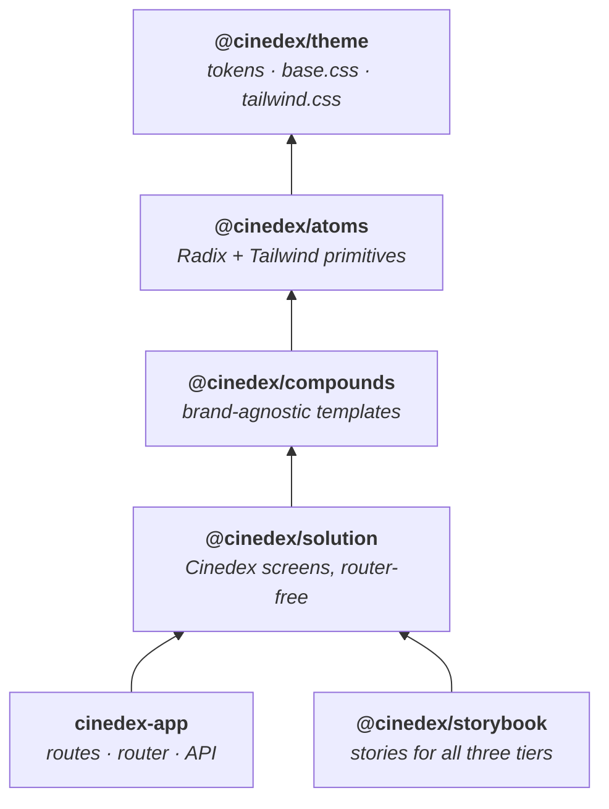

# Cinedex Frontend

npm **workspace root** for the Cinedex frontend. The lockfile and all shared tooling config live here; the packages hold only what is specific to them.

| Package                                              | Path                  | What it is                                                                                 |
| ---------------------------------------------------- | --------------------- | ------------------------------------------------------------------------------------------ |
| [`cinedex-app`](apps/cinedex-app/README.md)          | `apps/cinedex-app/`   | The React 19 + Vite SPA, served by Nginx behind Compose's Caddy HTTPS/API edge.            |
| [`@cinedex/storybook`](apps/storybook/README.md)     | `apps/storybook/`     | Storybook for all three component tiers. Owns the stories; served on port 9001 in Compose. |
| [`@cinedex/docs-site`](apps/docs-site/README.md)     | `apps/docs-site/`     | Branded Docusaurus site; Compose publishes it through Caddy at `/documentation/`.          |
| [`@cinedex/theme`](packages/theme/README.md)         | `packages/theme/`     | The design system — tokens, base element styling, the Tailwind theme. **No React.**        |
| [`@cinedex/atoms`](packages/atoms/README.md)         | `packages/atoms/`     | Primitives — Radix-backed, Tailwind-styled, one job each.                                  |
| [`@cinedex/compounds`](packages/compounds/README.md) | `packages/compounds/` | Templates — brand-agnostic assemblies of atoms.                                            |
| [`@cinedex/solution`](packages/solution/README.md)   | `packages/solution/`  | Cinedex's own screens. Presentational: no router, no data fetching.                        |



Nothing depends on an app.

## 🚀 Getting Started

Prerequisites: [Node.js](https://nodejs.org/) 22 and npm.

```bash
npm ci
npm run start        # app        → http://localhost:5173
npm run storybook    # Storybook  → http://localhost:9001
```

The direct dev server runs at `http://localhost:5173` and proxies `/movies-svc` to the WebService at `http://localhost:5186`. This keeps the browser's refresh cookie same-site; the WebService also allows credentialed direct calls from that origin. Override the backend target with `VITE_API_PROXY_TARGET`. Aspire is a separate HTTP workflow on `http://localhost:9000`; Docker Compose remains the HTTPS-proxied workflow.

## 📜 Scripts

All run from this directory.

| Script                 | Description                                             |
| ---------------------- | ------------------------------------------------------- |
| `npm run start`        | Start the app's Vite dev server with HMR                |
| `npm run storybook`    | Start Storybook on port 9001                            |
| `npm run docs-site`    | Start the docs site on port 9004                        |
| `npm run build`        | Type-check and build every package, including Storybook |
| `npm run test:run`     | Run every test suite once (CI-friendly)                 |
| `npm run test:ui`      | Start one Vitest UI across the testable workspaces      |
| `npm run coverage`     | Run tests and write a `coverage/` report per package    |
| `npm run lint`         | Lint every package with ESLint                          |
| `npm run format:check` | Check formatting without writing (CI-friendly)          |

Scope any of them to one package with `-w cinedex-app`, `-w @cinedex/atoms`, `-w @cinedex/compounds`, `-w @cinedex/solution`, `-w @cinedex/storybook` or `-w @cinedex/docs-site` — for example `npm run test -w @cinedex/atoms` for watch mode. `@cinedex/theme` has no scripts; it ships CSS.

## 🧩 Three tiers, and where a component goes

- **atoms** — one job, no internal arrangement: `Button`, `Input`, `Checkbox`, `PasswordInput`.
- **compounds** — a named layout assembled from atoms, **with no brand in it**: `AuthCard`, `PasswordField`, `StatPair`.
- **solution** — Cinedex-specific: the screens, the copy, the `Brand`. The only tier that names the product.

The clearest illustration is `AuthCard`. It takes `brand` as a prop and never draws the wordmark; `@cinedex/solution`'s `Brand` supplies it. **Compounds know where a brand goes; solution knows which.**

`@cinedex/solution`'s screens are the same idea applied to navigation. They know Cinedex's route paths — those are Cinedex facts — but not how to navigate them, so the host injects a link component:

```tsx
<SolutionProvider linkComponent={RouterLink}>
```

With no provider, links fall back to plain anchors. That is why a full sign-in screen renders in Storybook with **no router and no mock**.

## 🔗 How the packages fit together

All four library packages are **source-consumed**: `exports` point at `src/`, not at a built `dist/`.

```jsonc
"exports": {
  ".": { "types": "./src/index.ts", "default": "./src/index.ts" }
}
```

That buys three things and costs one:

- No build step for the libraries, so nothing to sequence in Docker or CI.
- HMR crosses package boundaries — editing an atom refreshes the running app.
- Storybook, Vitest and the SPA all compile the exact same source.
- The cost: `tsc -b` in a consumer also typechecks library source under that consumer's compiler flags, so the tsconfigs should stay in step — four sets now, not two.

Each library exports nothing but its barrel, and the Storybook app is a consumer like any other: its stories `import { Button } from '@cinedex/atoms'` rather than reaching into `packages/atoms/src`. A component missing from a barrel fails the workspace build.

## 🎨 Styling

Tailwind v4 everywhere, resolved through `@cinedex/theme`'s tokens — no CSS Modules, no hard-coded hex, no raw pixel values where a named type step exists. One import gets the whole design system:

```ts
import '@cinedex/theme/tailwind.css'; // pulls in tokens.css and base.css itself
```

Colours use `light-dark()`, so a single declaration covers both themes and the used `color-scheme` picks a side — which is the entire mechanism behind Storybook's theme toolbar.

Three things here fail **silently** rather than erroring; see [`packages/theme/README.md`](packages/theme/README.md):

- A new library package needs an `@source` line in `theme/src/tailwind.css`, or none of its classes generate.
- `base.css` must stay `layer(base)` and after `@import 'tailwindcss'` — unlayered CSS outranks every Tailwind layer.
- A new `--type-*`/`--track-*` step needs registering in `packages/atoms/src/utils/cn.ts`, or `tailwind-merge` misfiles it as a colour.

## 🎨 Linting & Formatting

One ESLint flat config at this level covers every package. It uses `projectService: true`, which resolves the nearest `tsconfig.json` per file, so type-aware rules work across the workspace without per-package configs.

```bash
npm run lint          # report problems
npm run lint:fix      # report + auto-fix
npm run format        # rewrite files to match Prettier
npm run format:check  # verify formatting (used in CI)
```

## 🐳 Docker

The SPA and Storybook images build from **this** directory, because the lockfile is here:

```bash
docker build -f apps/cinedex-app/Dockerfile -t cinedex-app .
```

```bash
docker build -f apps/storybook/Dockerfile -t cinedex-storybook .
```

The docs site additionally needs the repository-root `CHANGELOG.md`, so build it from the repository root:

```bash
docker build -f frontend/apps/docs-site/Dockerfile -t cinedex-docs-site ..
```

`compose.yaml` at the repo root supplies those contexts explicitly. The SPA container serves internal HTTP; the Caddy edge publishes the UI, API, and built docs site on 9000 using its persistent local CA—the docs live at `/documentation/`. Storybook remains on 9001, and the docs container is also exposed directly on 9004 for diagnostics.

Two things these Dockerfiles depend on, both easy to break:

- **Every workspace manifest is `COPY`d before `npm ci`**, even though each install is scoped with `--workspace`. This is for **layer caching**, not build correctness — a missing `package.json` does _not_ fail the build (the later source copy fills the directory in), but it means the `npm ci` layer is not invalidated when that package's dependencies change, so a new dependency silently never lands in the image. Adding a package means adding a `COPY` line to all three files.
- **`.dockerignore` must not ignore `**/.storybook`.** The Storybook image runs its `build` script inside the container and needs that config in the context.
