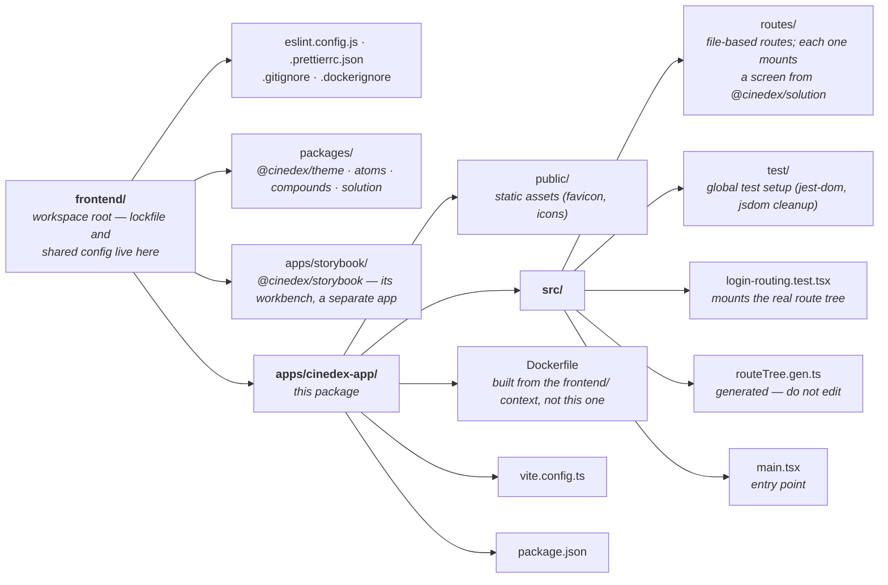

# cinedex-app

The SPA for Cinedex. In Docker Compose, Nginx serves its static bundle over internal HTTP and Caddy publishes the SPA plus backend under the single `https://localhost:9000` origin.

One of seven packages in the [`frontend/` npm workspace](../../README.md). Its auth screens come from [`@cinedex/solution`](../../packages/solution/README.md), primitives from [`@cinedex/atoms`](../../packages/atoms/README.md), and the design system from [`@cinedex/theme`](../../packages/theme/README.md).

## 📁 Layout



## 🧰 Tech Stack

- **[React 19](https://react.dev/)** with the [React Compiler](https://react.dev/learn/react-compiler)
- **[TypeScript](https://www.typescriptlang.org/)**
- **[Vite](https://vite.dev/)** for dev server, HMR, and builds
- **[Vitest](https://vitest.dev/)** with [Testing Library](https://testing-library.com/) for unit/component tests
- **[ESLint](https://eslint.org/)** with type-aware rules (`typescript-eslint` strict + stylistic, React Hooks)
- **[Prettier](https://prettier.io/)** for consistent code formatting

## 🚀 Getting Started

Prerequisites: [Node.js](https://nodejs.org/) (LTS recommended) and npm. **Run these from `frontend/`**, the workspace root — npm installs every package from there.

```bash
npm install     # install the whole workspace
npm run dev     # start the dev server with HMR
```

The dev server runs on https://localhost:9000 (configured in [`vite.config.ts`](vite.config.ts)).
It uses a local HTTPS certificate and proxies `/movies-svc` to the backend's HTTPS dev profile at
`https://localhost:7201`, so auth cookies use the same secure, same-origin shape as Docker Compose.
Override the backend target with `VITE_API_PROXY_TARGET` if your API runs somewhere else, for example
`VITE_API_PROXY_TARGET=https://localhost:7443 npm run dev`. The port comes from `PORT` when that is
set, falling back to 9000.

You do not have to start this yourself: `dotnet run --project aspire/Cinedex.AppHost` (from
`backend/`) runs this same `npm run dev` as one of its resources. It pins the port to 9000 (passed both as
`--port` and as `PORT`) and sets `VITE_API_PROXY_TARGET` to the web service it started, rather than
the `7201` default — so the URL and the proxy are both already correct. It installs dependencies
first when `node_modules` is missing. Turn the whole resource off there with
`Features:EnableFrontendUiSvc`.

## 📜 Scripts

All run from `frontend/`. Build and test scripts fan out across the workspace — add `-w cinedex-app` to scope one to this package.

| Script                    | Description                                      |
| ------------------------- | ------------------------------------------------ |
| `npm run dev`             | Start the Vite dev server with HMR               |
| `npm run build`           | Type-check and build every package to `dist/`    |
| `npm run preview`         | Preview the production build locally             |
| `npm run storybook`       | Start Storybook on port 9001                     |
| `npm run lint`            | Lint every package with ESLint                   |
| `npm run lint:fix`        | Lint and auto-fix fixable problems               |
| `npm run format`          | Format all files with Prettier                   |
| `npm run format:check`    | Check formatting without writing (CI-friendly)   |
| `npm run test:run`        | Run every test suite once (CI-friendly)          |
| `npm run coverage`        | Run tests once and generate coverage per package |

Watch mode and the Vitest UI are per-package: `npm run test -w cinedex-app`, `npm run test:ui -w cinedex-app`.

## 🎨 Linting & Formatting

[ESLint](https://eslint.org/) handles code quality and [Prettier](https://prettier.io/) handles formatting; the two are kept from overlapping via [`eslint-config-prettier`](https://github.com/prettier/eslint-config-prettier).

- ESLint uses **type-aware** rules (`typescript-eslint` `strictTypeChecked` + `stylisticTypeChecked`), so it reads the TypeScript project to catch type-level issues. One config at the workspace root covers every package: [`eslint.config.js`](../../eslint.config.js).
- Prettier settings live in [`.prettierrc.json`](../../.prettierrc.json) (single quotes, semicolons).

```bash
npm run lint          # report problems
npm run lint:fix      # report + auto-fix
npm run format        # rewrite files to match Prettier
npm run format:check  # verify formatting (used in CI)
```

CI runs `lint`, `format:check`, `build`, and `coverage` for the frontend, so all four must pass before a change can merge. The workspace build includes Storybook.

## 🧪 Testing

Tests are written with [Vitest](https://vitest.dev/) and [Testing Library](https://testing-library.com/), running in a [jsdom](https://github.com/jsdom/jsdom) environment.

- Configuration lives in the `test` block of [`vite.config.ts`](vite.config.ts).
- Global setup (jest-dom matchers and DOM cleanup) is in `src/test/setup.ts`.
- Test files live next to the code they cover and are named `*.test.ts` / `*.test.tsx`.

```bash
npm run test        # watch mode during development
npm run test:run    # single run, e.g. in CI
```

### Interactive UI

For a richer development experience, [`@vitest/ui`](https://vitest.dev/guide/ui.html) opens a browser dashboard to explore tests, results, and module graphs:

```bash
npm run test:ui
```

### Coverage

Coverage is collected with the [V8 provider](https://vitest.dev/guide/coverage.html) and written to `coverage/` (git-ignored):

```bash
npm run coverage
```

The following reporters are configured in [`vite.config.ts`](vite.config.ts) so the output works both locally and in CI pipelines:

| Reporter    | Output                            | Use                                             |
| ----------- | --------------------------------- | ----------------------------------------------- |
| `text`      | terminal                          | quick summary while developing                  |
| `html`      | `coverage/index.html`             | browsable local report                          |
| `lcov`      | `coverage/lcov.info`              | Codecov, Coveralls, SonarQube, etc.             |
| `cobertura` | `coverage/cobertura-coverage.xml` | GitLab CI, Azure DevOps, Jenkins coverage gates |

## 🔌 Backend

The SPA consumes the backend API. With the backend running (see the [root README](../../../README.md)), the API is available at:

- **npm dev server:** https://localhost:9000/movies-svc
- **npm dev OpenAPI Spec:** https://localhost:9000/movies-svc/openapi/v1.json
- **Docker Compose:** https://localhost:9000/movies-svc
- **Docker Compose OpenAPI Spec:** https://localhost:9000/movies-svc/openapi/v1.json

In both local modes, browser code should call the API with relative paths such as `/movies-svc/auth/login`.
