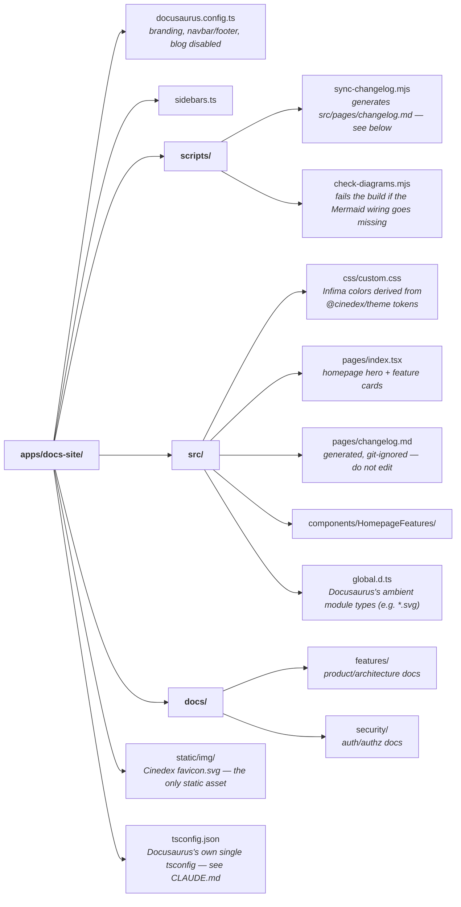

# @cinedex/docs-site

A [Docusaurus](https://docusaurus.io/) site for Cinedex, branded with the same purple accent, favicon and typography as the SPA and Storybook.

It is a real app in the [`frontend/` workspace](../../README.md), with two doc sections —
**Features** (the movie catalog, architecture, frontend, and dev workflow) and **Security**
(authentication/authorization) — plus a changelog page generated from the repo's root
`CHANGELOG.md`.

```bash
npm run docs-site        # from frontend/ → http://localhost:9004
```

## 📁 Layout



## 📜 Scripts

Run from `frontend/`; `docs-site` delegates here with `-w @cinedex/docs-site`.

| Script                                | Description                                                     |
| ------------------------------------- | --------------------------------------------------------------- |
| `npm run docs-site`                   | Dev server with HMR on port 9004, plus a live changelog watcher |
| `npm run build -w @cinedex/docs-site` | Static production build to `build/` (git-ignored)               |

## 🔄 The Changelog page

`/changelog` is not hand-written. `scripts/sync-changelog.mjs` copies the repository's root `CHANGELOG.md` into `src/pages/changelog.md` before every dev-server start and every build, rewriting any repo-relative links (e.g. `docs/auth-security-model.md`) into absolute GitHub URLs, since this site doesn't host the rest of the repo. While the dev server is running, editing the root `CHANGELOG.md` regenerates the page live.

**Edit only the root `CHANGELOG.md`.** `src/pages/changelog.md` is generated and git-ignored — never edit it directly.

## 📚 Features & Security docs

`docs/features/` and `docs/security/` are curated, one-time adaptations of the repo's own
documentation (root `README.md`, `backend/README.md`, the frontend package READMEs,
`docs/auth-security-model.md`, and the auth design specs) — not a live sync like `/changelog`.
That means the site can drift from those source docs over time; there's no automated re-sync.
`docs/security/how-this-was-built.md` also ships without a live Linear issue list, since the
Linear connector wasn't authorized when this content was written — see its own note for how to
extend it.

## 🎨 Branding

Colors come from [`@cinedex/theme`](../../packages/theme/CLAUDE.md)'s `--accent` design token — see `src/css/custom.css` for how the Infima color scale is derived from it. The favicon and navbar logo are a copy of `cinadex-app`'s `favicon.svg`.

## 🐳 No Docker / Compose / Aspire yet

Unlike `cinadex-app` and `@cinedex/storybook`, this app is **local dev only** for now — no Dockerfile, no `compose.yaml` service, no Aspire AppHost resource. `npm run lint`, `npm run format:check` and `npm run build` already cover it automatically, since those commands run across every workspace package.
