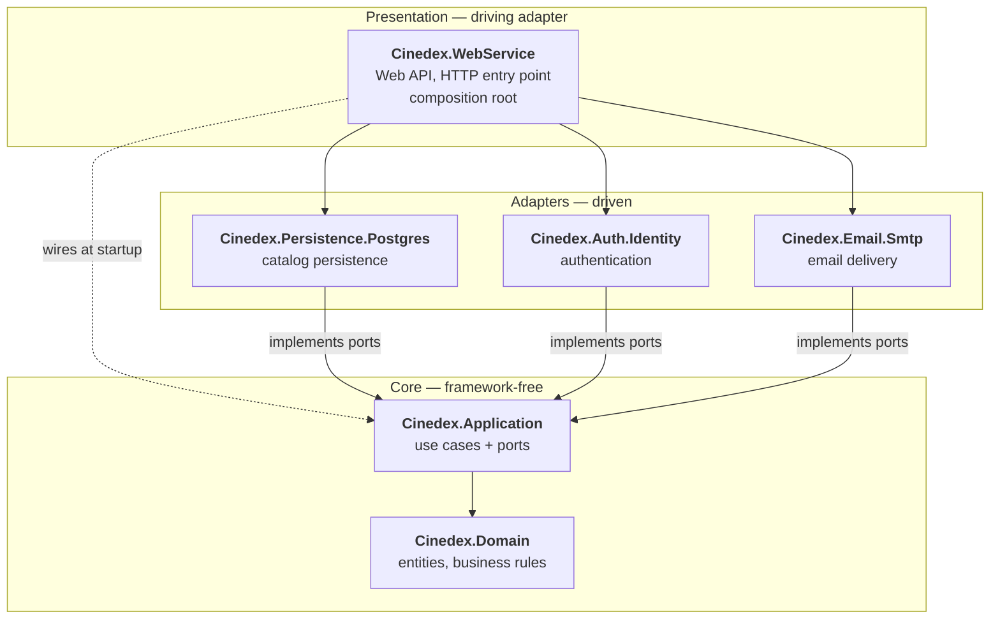
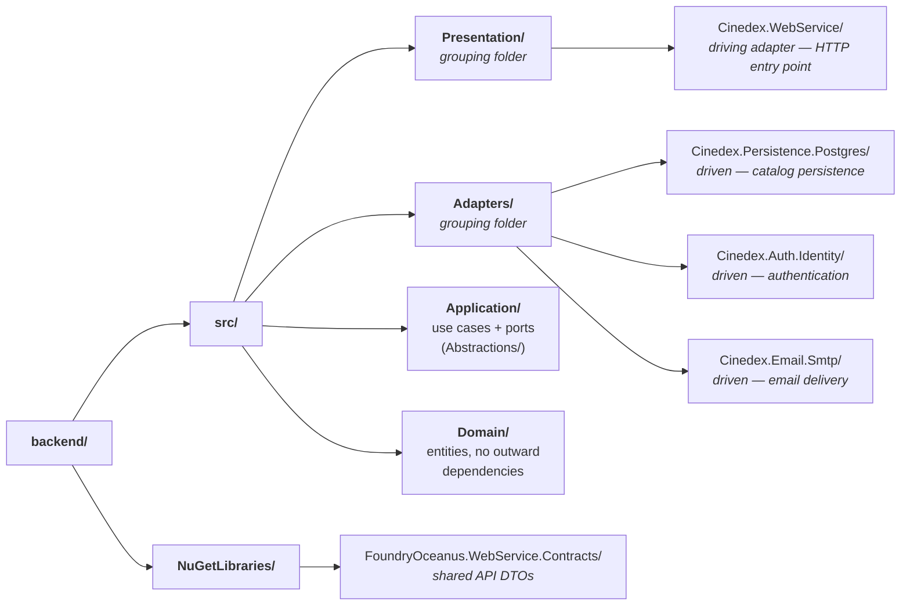

# Architecture

The backend is a hexagonal (ports & adapters) .NET 10 solution. Dependencies flow inward — outer
layers depend on inner layers, never the reverse.

Every arrow below is a compile-time project reference, and every one of them points **inward**. There
is no arrow out of Domain, and none back up from Application to an adapter — that absence is the
whole architecture.

All three adapters implement ports defined in `Cinedex.Application` and depend inward on it; the
Presentation layer wires them together at startup.

## Solution layout

Projects are grouped on disk by hexagonal layer. Layers that can have multiple projects
(Presentation, Adapters) keep a grouping folder; the single Application and Domain projects sit
directly under `src/`.

## The six projects

1. **`Cinedex.Domain`** — pure business logic and domain entities: `Title`, `Genre`, and `User`
   aggregates (each in its own `*Aggregate/` folder), plus supporting types like the `TitleType`
   enum. No dependencies, no EF, no web frameworks.
2. **`Cinedex.Application`** — implements use cases and defines the ports they depend on. Depends
   only on `Cinedex.Domain`. Handlers expose asynchronous use cases through `HandleAsync(...)`:
   create handlers assign the new domain id and return that `Guid` so Presentation can build the
   `Location` header; update/delete handlers return `Task`; query handlers return application DTOs
   for presentation mapping. Repository create ports persist supplied domain models and return
   `Task` rather than echoing the saved entity.
3. **`Cinedex.Persistence.Postgres`** — the catalog's data-persistence adapter: `FilmDbContext` (EF
   Core with Fluent API configurations, keeping the domain layer EF-free), concrete repository
   implementations, migrations. Adapts PostgreSQL to the repository ports `Cinedex.Application`
   defines.
4. **`Cinedex.Auth.Identity`** — the authentication adapter, implementing `IIdentityService`
   (registration, credential validation, password reset via `UserManager`) and `ITokenService` (JWT
   issuance and refresh-token rotation). `AuthDbContext` holds the Identity user store and hashed,
   rotating refresh-token storage in its own `auth` schema. Full detail in
   [Security](../security/overview.md).
5. **`Cinedex.Email.Smtp`** — sends transactional email (currently password-reset only), kept
   separate from `Auth.Identity` because email delivery is a messaging concern, not authentication.
   Implements `IEmailSender` via MailKit, and owns delivery scheduling: `ChannelEmailDispatcher`
   queues onto a bounded in-memory channel, and a background `EmailDeliveryWorker` drains it —
   keeping SMTP off the HTTP request path. See
   [Security → Password reset](../security/password-reset.md) for why that matters.
6. **`Cinedex.WebService`** — the web API and HTTP entry point. Wires everything together via
   dependency injection, exposes FastEndpoints-based endpoints, and owns Docker containerization.

## Dependency rules

| From                                | To                    | Allowed?                                   |
| ----------------------------------- | --------------------- | ------------------------------------------ |
| Domain                              | Anything              | ❌ No — Domain has no outward dependencies |
| Application                         | Domain                | ✅ Yes                                     |
| Adapters (Persistence, Auth, Email) | Application, Domain   | ✅ Yes                                     |
| WebService                          | Application, Adapters | ✅ Yes                                     |
| WebService                          | Domain                | ✅ Yes (transitively)                      |

## How it works together

1. **WebService** is the entry point — it handles HTTP requests and delegates to **Application**.
2. **Application** implements business logic by orchestrating **Domain** entities.
3. **Application** calls repository methods defined by its own ports (interfaces under
   `Abstractions/`).
4. **Persistence.Postgres** implements those ports, translating repository calls to database
   operations.
5. **Domain** contains the pure business rules that drive everything.

## Why this shape

- **Testability** — business logic in Domain and Application can be tested without a database.
- **Maintainability** — changes to infrastructure (e.g. switching databases) only touch Adapters.
- **Flexibility** — new adapters (a different persistence store, a message queue) slot in without
  changing core logic.
- **Clarity** — each layer has one job, and the dependency direction is enforced, not just
  documented.
