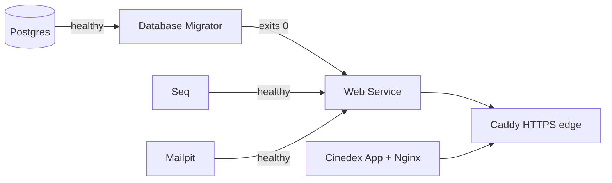

# Observability & Local Dev Workflow

## Health checks

The web service exposes two health endpoints, following the standard liveness/readiness split. Both
live under the `/movies-svc` base path and return a minimal JSON body alongside an HTTP status code
(`200` healthy, `503` unhealthy) — the payload intentionally omits exception detail so the endpoints
don't leak internal information.

| Endpoint                       | Purpose                                                         | Dependencies checked |
| ------------------------------ | --------------------------------------------------------------- | -------------------- |
| `GET /movies-svc/health/live`  | **Liveness** — confirms the process is up and serving requests. | None                 |
| `GET /movies-svc/health/ready` | **Readiness** — confirms the service can handle traffic.        | PostgreSQL           |

```bash
curl -k -s https://localhost:9000/movies-svc/health/ready
# {"status":"Healthy","checks":[{"name":"postgres","status":"Healthy"}]}
```

## Structured logs and traces (Seq)

The web service emits structured logs and distributed traces through OpenTelemetry, exported over
OTLP to a [Seq](https://datalust.co/seq) instance — **http://localhost:5341**. Traces cover incoming
HTTP requests, outbound `HttpClient` calls, and PostgreSQL queries (the `Npgsql` activity source).
Every request's correlation id is attached to both its log events and its trace, so you can pivot
between the two for the same request.

The shared `AddObservability` extension (`FoundryOceanus.Observability.OpenTelemetry`) wires this up
identically for every host — the generic-host workers (`DatabaseMigrator`, `SchedulerWorker`) and the
ASP.NET Core web host alike — driven by the standard `OTEL_EXPORTER_OTLP_*` environment variables.
When no OTLP endpoint is configured, logging and tracing still run locally; nothing tries to reach a
Seq that isn't there.

Seq needs a one-time setup after first start: log in, register an API key matching your `.env`, then
restart the web service so it picks the key up. Full walkthrough in the repository's
[Getting Started guide](https://github.com/felipedferreira/Cinedex/blob/main/docs/getting-started.md#3-one-time-setup-seq).

## Dev mail sink (Mailpit)

Auth flows like password reset need to send email. Rather than deliver real mail in development,
the stack runs [Mailpit](https://mailpit.axllent.org/) — a fake SMTP server that captures every
message and shows it in a web UI at **http://localhost:8025**, with no login required. Nothing
leaves your machine.

Delivery happens off the request path — see
[Security → Password reset](../security/password-reset.md) for why — so a message lands in Mailpit a
moment after the API responds, not before. Register an account and request a password reset, then
open the inbox:

```bash
curl -k -X POST https://localhost:9000/movies-svc/auth/register \
  -H "Content-Type: application/json" \
  -d '{"email":"you@example.com","userName":"you","password":"<A_PASSWORD>"}'

curl -k -X POST https://localhost:9000/movies-svc/auth/password/forgot \
  -H "Content-Type: application/json" \
  -d '{"email":"you@example.com"}'
```

The message view has four tabs — **HTML** (what a recipient sees), **Text** (the plain-text
fallback, easiest place to copy the reset URL from), **Raw** (full MIME source), and **Source** (the
unrendered HTML markup).

## Running the stack locally

Two ways, mutually exclusive (both bind PostgreSQL's 5432 and the SPA's 9000):

### Docker Compose — the prod-like path

```bash
cp .env.example .env       # database, Seq, and Mailpit values
docker compose up --build
```

Compose brings services up in dependency order — the migrator waits for Postgres, the web service
waits for the migrator _and_ Seq _and_ Mailpit, and the UI waits for the web service:



| Service             | Address                               | Purpose                                 |
| ------------------- | ------------------------------------- | --------------------------------------- |
| `cinedex-edge`      | https://localhost:9000                | Caddy HTTPS edge for the SPA and API    |
| `cinedex-app`       | internal only                         | React SPA static bundle on Nginx        |
| `cinedex-storybook` | http://localhost:9001                 | Storybook — static, plain HTTP          |
| `cinedex-docs-site` | https://localhost:9000/documentation/ | Docusaurus through the Caddy edge       |
| `movies.webservice` | via the proxy at `/movies-svc`        | ASP.NET Core API (not exposed directly) |
| `postgres`          | localhost:5432                        | Catalog + auth data                     |
| `seq`               | http://localhost:5341                 | Logs & traces                           |
| `mailpit`           | http://localhost:8025                 | Captured dev email                      |

The one-shot **Database Migrator** applies pending EF Core migrations for both the catalog and auth
schemas and exits — there's nothing else to run by hand for a fresh database.

### The Aspire dev loop — faster for day-to-day work

```bash
cd backend/aspire/Cinedex.AppHost
dotnet user-secrets set "Parameters:postgres-password" "<choose a password>"   # once
dotnet run
```

PostgreSQL and Mailpit run as containers; the migrator, web service, scheduler worker, and both
frontend dev servers (the SPA's and Storybook's) run as local processes with hot reload, with logs
and traces on the Aspire dashboard. The difference from Compose: Compose serves **built bundles**,
Aspire runs **dev servers** — both land on the same ports (9000 for the SPA, 9001 for Storybook), so
picking one over the other doesn't change what you type into a browser.

Each resource can be switched off individually — useful on a machine without Node/npm, or for a
backend-only session:

| Flag                                   | Off means                                                                     |
| -------------------------------------- | ----------------------------------------------------------------------------- |
| `Features:EnableDatabaseMigrationsSvc` | Nothing applies migrations — faster, but the schema must already be current   |
| `Features:EnableFrontendUiSvc`         | No SPA on 9000; the API is only reachable directly at `http://localhost:9002` |
| `Features:EnableStorybookSvc`          | No Storybook on 9001                                                          |
| `Features:EnableMailpitSvc`            | Outgoing email has nowhere to land (logged, not fatal)                        |

Set any of them with `dotnet user-secrets set "<flag>" "false"` from
`backend/aspire/Cinedex.AppHost`, or copy `appsettings.Development.json.example` to
`appsettings.Development.json` (git-ignored). Both are per-developer and touch no tracked file.
