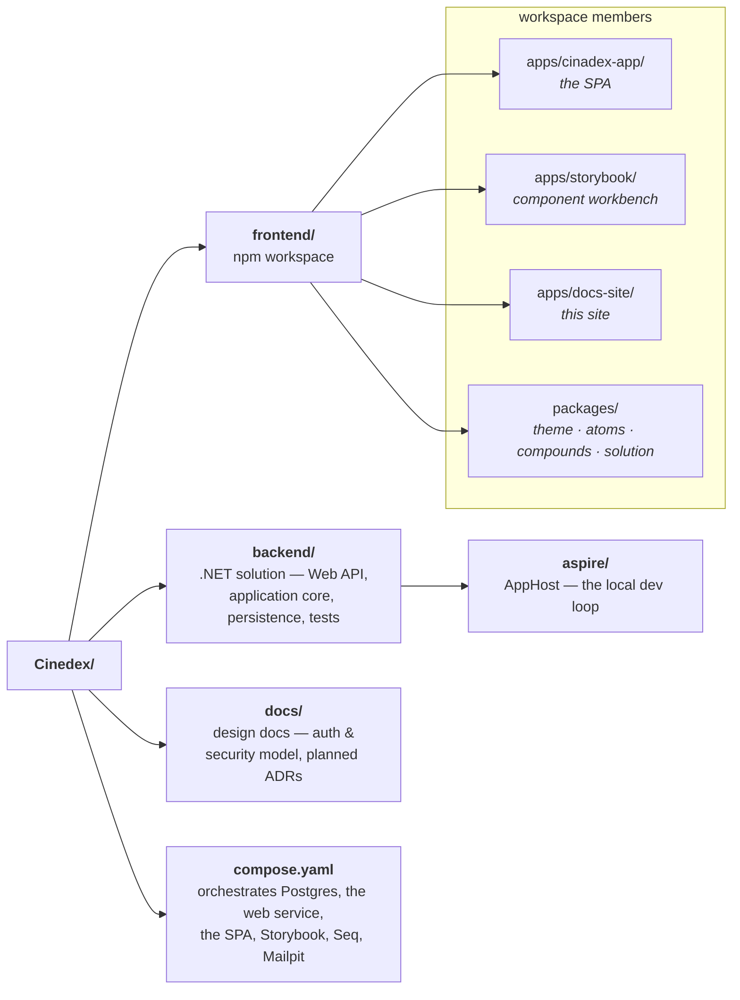

# Overview

Cinedex is a full-stack portfolio application for cataloging movie titles and their genres —
inspired by IMDB — with JWT-based authentication in front of a members-only catalog.

:::info Adapted from the repository's READMEs
This section is a curated adaptation of the root `README.md`,
[`backend/README.md`](https://github.com/felipedferreira/Cinedex/blob/main/backend/README.md), and
the frontend package READMEs. It is **not** regenerated from them, so if these pages ever disagree
with the code, the code and those source docs win.
:::

## Repository layout



## What's in this section

- **[Movie Catalog & API](./movie-catalog.md)** — genres, titles, and the request/response contracts.
- **[Architecture](./architecture.md)** — the hexagonal (ports & adapters) layering and how the six
  projects fit together.
- **[Frontend & Component Library](./frontend.md)** — the React SPA, the `@cinedex/theme` design
  system and the three component tiers built on it, and the Storybook workbench.
- **[Observability & Local Dev Workflow](./observability-and-dev-workflow.md)** — structured
  logging/tracing via Seq, health checks, the dev mail sink, and the two ways to run the stack
  locally (Docker Compose or the Aspire dev loop).

For how authentication and authorization work, see the [Security](../security/overview.md) section.

## Two ways to run it

**Docker Compose** — the prod-like path, built images behind a Caddy HTTPS edge:

```bash
git clone https://github.com/felipedferreira/Cinedex.git
cd Cinedex
cp .env.example .env       # fill in the database, Seq, and Mailpit values
docker compose up --build
```

Then open **https://localhost:9000** (Caddy local-CA certificate — trust it, or use `curl -k`).

**The Aspire dev loop** — faster for day-to-day work: runs the .NET services and the frontend dev
servers as local processes instead of rebuilding images, and applies database migrations for you.

```bash
cd backend/aspire/Cinedex.AppHost
dotnet user-secrets set "Parameters:postgres-password" "<choose a password>"   # once
dotnet run
```

Full detail, including how to switch individual resources off, is in
[Observability & Local Dev Workflow](./observability-and-dev-workflow.md).
