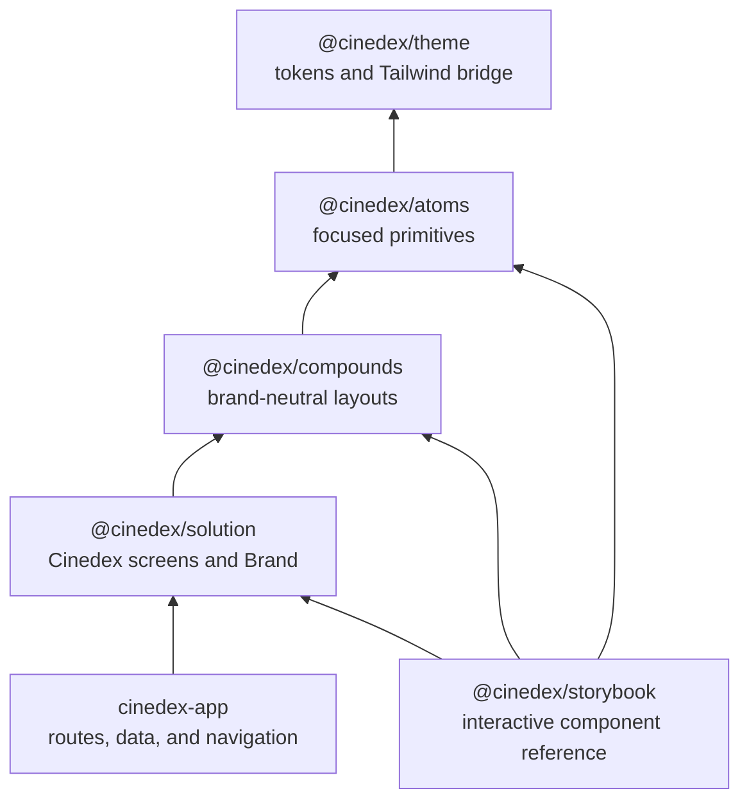

# Frontend architecture

Cinedex's frontend is a React 19 and TypeScript workspace. Vite serves the SPA
and compiles it in development; Vitest and Testing Library exercise the same
source that ships to users. The UI libraries are source-consumed: their package
exports point at `src/`, rather than a generated `dist/`, so the application,
tests, and component workbench always compile one implementation.



## Component tiers

The tiers express responsibility, not merely component size:

- **Atoms** have one job and no internal arrangement. `Button`, `Input`,
  `Checkbox`, `PasswordInput`, and `OtpInput` live here. Interactive atoms use
  Radix where it supplies valuable behavior and accessibility semantics.
- **Compounds** compose atoms into named, reusable layouts without knowing the
  Cinedex brand. `AuthCard`, `PasswordField`, and `StatPair` are examples.
- **Solution** is the product layer: Cinedex copy, the `Brand`, and complete
  presentational screens. It may know product route paths, but it does not
  import a router or fetch data. The host injects navigation and submit
  handlers instead.

This boundary keeps reusable layout independent from product identity. For
example, `AuthCard` owns where a brand belongs, while `Brand` supplies which
brand it is. Swapping the latter rebrands every screen without changing the
layout primitive.

## The application and the workbench

`cinedex-app` owns the runtime concerns that do not belong in a component
library: routing, API integration, and page-level state. It consumes the three
component tiers through their public exports.

[@cinedex/storybook](http://localhost:9001) is the companion workbench. Its
stories are grouped as **Atoms**, **Compounds**, and **Solution**, matching the
architecture above. It imports only public package exports, so a missing barrel
export fails the Storybook build instead of becoming an undocumented component.
Use it to review a component in isolation, switch between System, Light, and
Dark themes, and run the accessibility panel.

```bash
npm run storybook # from frontend/ → http://localhost:9001
```
