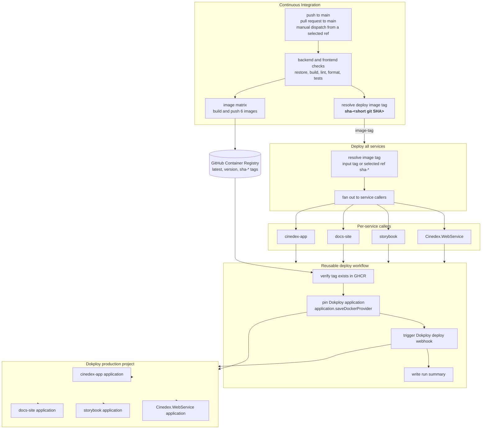
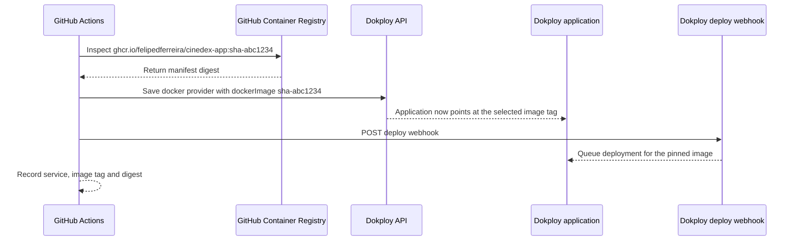

# Build and deploy pipelines

Cinedex separates **building an artifact** from **deploying an artifact**. GitHub Actions builds and
publishes container images to GitHub Container Registry, then the deploy workflow tells Dokploy
exactly which image tag each production application should run.

:::info[Source of truth]
This page describes the current GitHub Actions workflows:
[`continuous-integration.yml`](https://github.com/felipedferreira/Cinedex/blob/main/.github/workflows/continuous-integration.yml),
[`deploy-all-services.yml`](https://github.com/felipedferreira/Cinedex/blob/main/.github/workflows/deploy-all-services.yml),
the four thin per-service deploy callers, and
[`deploy.yml`](https://github.com/felipedferreira/Cinedex/blob/main/.github/workflows/deploy.yml).
If this page ever disagrees with those files, the workflow files win.
:::

## The shape



## What runs when

| Trigger                    | Checks                     | Images                        | Deploy                                                           |
| -------------------------- | -------------------------- | ----------------------------- | ---------------------------------------------------------------- |
| Pull request to `main`     | Yes                        | No                            | No                                                               |
| Push to `main`             | Yes                        | Yes, six images               | Yes, four Dokploy applications                                   |
| Manual CI dispatch         | Yes, from the selected ref | Yes, six images from that ref | Yes, using that ref's `sha-*` image tag                          |
| Manual deploy-all dispatch | No build step              | No new images                 | Yes, using the typed image tag or the selected ref's `sha-*` tag |

The important distinction is the manual path. When someone runs **Continuous Integration** by hand,
GitHub's branch selector chooses the ref that is checked out, built, tagged and deployed. The deploy
tag is derived from that exact commit:

```bash
sha-${GITHUB_SHA::7}
```

So a manual dispatch against a branch at commit `abc1234...` builds images tagged
`sha-abc1234` and passes `sha-abc1234` into `deploy-all-services`.

Running **Deploy all services** directly also has GitHub's branch selector. Its `image-tag` input is
optional: leave it blank to deploy the selected ref's `sha-*` tag, or type a specific tag such as
`sha-abc1234` for a rollback or one-off redeploy. Direct deploys do not build anything, so the
reusable deploy workflow fails during GHCR verification if that tag does not exist. Dokploy is not
touched when verification fails.

## The build pipeline

The CI workflow starts with two independent test jobs:

- `backend` restores, builds and tests the .NET solution.
- `frontend` checks diagrams, installs npm dependencies, lints, checks formatting, builds the
  workspace, runs coverage, and publishes coverage summaries.

Only after both jobs are green does the image matrix run. It builds and pushes six images:

| Matrix name       | GHCR image                                        | Deployed by this pipeline |
| ----------------- | ------------------------------------------------- | ------------------------- |
| `app`             | `ghcr.io/felipedferreira/cinedex-app`             | Yes                       |
| `docs-site`       | `ghcr.io/felipedferreira/cinedex-docs-site`       | Yes                       |
| `storybook`       | `ghcr.io/felipedferreira/cinedex-storybook`       | Yes                       |
| `webservice`      | `ghcr.io/felipedferreira/cinedex-webservice`      | Yes                       |
| `migrator`        | `ghcr.io/felipedferreira/cinedex-migrator`        | No                        |
| `schedulerworker` | `ghcr.io/felipedferreira/cinedex-schedulerworker` | No                        |

Each pushed image gets three tags:

- `latest`, useful as a moving convenience tag.
- The repository version from `frontend/package.json`.
- `sha-<short git SHA>`, the deployment contract.

The `sha-*` tag is what ties deployment back to a specific commit. It is the tag to use when you
need to answer "which build is running?" or roll back to a known build.

## The deploy pipeline

`deploy-all-services.yml` is the fan-out workflow. It resolves one image tag, then calls the same
thin per-service workflows that can also be run manually:

| Service caller          | Service name         | Image                                        |
| ----------------------- | -------------------- | -------------------------------------------- |
| `deploy-app.yml`        | `cinedex-app`        | `ghcr.io/felipedferreira/cinedex-app`        |
| `deploy-docs-site.yml`  | `docs-site`          | `ghcr.io/felipedferreira/cinedex-docs-site`  |
| `deploy-storybook.yml`  | `storybook`          | `ghcr.io/felipedferreira/cinedex-storybook`  |
| `deploy-webservice.yml` | `Cinedex.WebService` | `ghcr.io/felipedferreira/cinedex-webservice` |

Each caller supplies only the values that differ: the public service name, the GHCR image, the name
of the Dokploy application-id secret, and the name of the Dokploy webhook secret. The deployment body
lives in one place, `deploy.yml`, so the validate, pin, webhook and summary steps cannot drift across
services.

## How Dokploy fits in

Dokploy's deploy webhook does not carry an image tag. It tells one application to redeploy whatever
image it is already configured to use. That is why the deploy workflow pins the application before
triggering the webhook.

For each service, `deploy.yml` performs the same sequence:



The pin call sends this shape to Dokploy:

```json
{
  "applicationId": "<from DOKPLOY_APP_ID_* secret>",
  "dockerImage": "ghcr.io/felipedferreira/cinedex-app:sha-abc1234",
  "registryUrl": "ghcr.io",
  "username": "<from GHCR_PULL_USERNAME secret>",
  "password": "<from GHCR_PULL_TOKEN secret>"
}
```

Then the workflow posts to the service's deploy webhook. The webhook queues the container restart
inside Dokploy using the image tag that was just saved.

## Secrets and logging

Deploy jobs run in the `production` GitHub environment. They need these shared secrets:

| Secret               | Purpose                                              |
| -------------------- | ---------------------------------------------------- |
| `DOKPLOY_URL`        | Base URL for the Dokploy API                         |
| `DOKPLOY_API_TOKEN`  | Authorizes `application.saveDockerProvider`          |
| `GHCR_PULL_USERNAME` | Registry username saved into the Dokploy application |
| `GHCR_PULL_TOKEN`    | Registry token saved into the Dokploy application    |

Each deployed service also has two per-service secrets:

| Secret pattern      | Purpose                                      |
| ------------------- | -------------------------------------------- |
| `DOKPLOY_APP_ID_*`  | The Dokploy application to pin               |
| `DOKPLOY_WEBHOOK_*` | The Dokploy webhook to trigger after pinning |

The workflow logs service names, image tags and image digests. It does not log Dokploy application
IDs, API tokens, webhook URLs or registry credentials. If a required secret is missing, the deploy
fails before it can call Dokploy.

## Reading a deployment result

A green deploy run means:

- the requested image tag existed in GHCR
- the Dokploy application accepted the new `dockerImage` value
- the Dokploy deploy webhook accepted the request
- the GitHub Actions summary recorded the service, image tag and resolved digest

It does **not** mean the new container became healthy. The webhook queues work in Dokploy and returns
before health is proven. To verify runtime health, check the Dokploy deployment for the application,
then check the service endpoint. For the web service, the readiness endpoint is:

```bash
curl -k https://cinedex.online/movies-svc/health/ready
```

## Operational notes

- Roll forward through CI when possible: select the branch or ref, run **Continuous Integration**,
  and let it build and deploy the matching `sha-*` tag.
- Roll back through **Deploy all services**: select any ref, type the known-good `sha-*` tag, and run
  the workflow. The selected branch only supplies a default when the tag field is blank.
- Keep `sha-*` tags as the deployment contract. `latest` is still pushed, but it should not be the
  tag used to explain production state.
- `migrator` and `schedulerworker` images are built but not included in `deploy-all-services`.
  Adding either to deployment needs its own Dokploy application wiring and, for migrations, an
  explicit ordering decision before the web service rolls.
