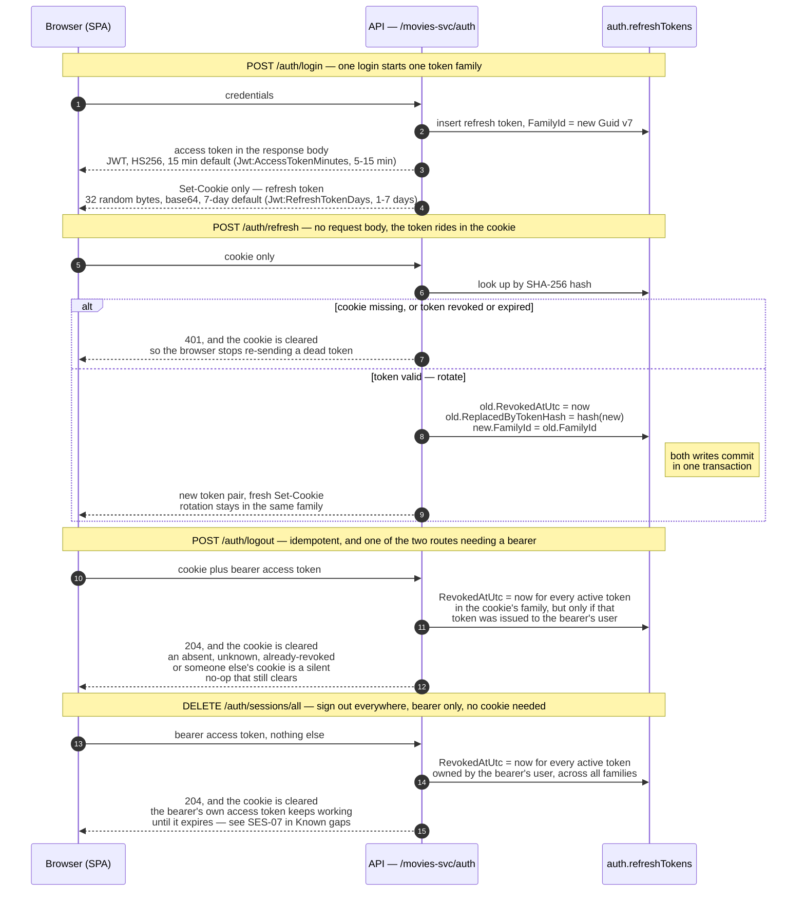
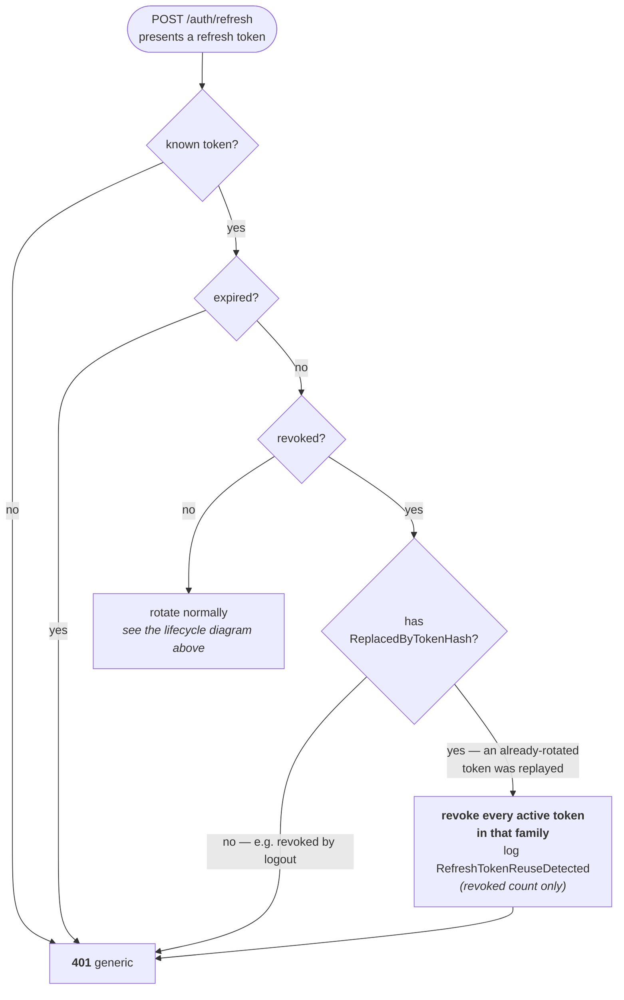

# Token Lifecycle & Sessions

The whole life of one session, from the login that opens it to the logout that closes it. Only the
access token is ever returned in a response body; the refresh token exists for the browser solely as
a cookie.



Logout ends the **family**, not the row the cookie names. A session is a family — one login opens
one — so revoking only the presented hash would leave a rotation that landed moments earlier holding
a live successor, and the session would outlive the logout that ended it. Ending the family is also
bounded in the other direction: the user's other logins are other families and are untouched.

The ownership condition is part of the same statement, not a check made before it. It matters less
as a barrier than it looks — anyone holding another user's refresh token can already exchange it at
`/auth/refresh`, which is strictly worse than ending it — and more as the fix for a browser holding
one user's cookie alongside another's bearer token, where the wrong session used to end. Because
the response is `204` either way, the outcome is not observable from outside. Inside, a token that
exists and belongs to somebody else is logged as a warning under `RefreshTokenOwnershipMismatch`; an
unknown or already-revoked one is ordinary and logged as nothing.

## The refresh token cookie

The refresh token is returned to the browser only as a cookie, never in a response body, so a
cross-site scripting defect can't read it. The access token stays in the body; it's short-lived
(15 minutes by default; configurable from 5 to 15 minutes) and the client attaches it as a bearer
header.

```http
Set-Cookie: __Secure-cinedex_refresh_token=<raw token>;
            HttpOnly; Secure; SameSite=Strict; Path=/movies-svc/auth; Expires=<token expiry>
```

| Attribute               | Purpose                                                                                                                                                                  |
| ----------------------- | ------------------------------------------------------------------------------------------------------------------------------------------------------------------------ |
| `HttpOnly`              | Unreachable from `document.cookie`.                                                                                                                                      |
| `Secure`                | Required by the `__Secure-` prefix — the browser won't store the cookie unless it was set over HTTPS.                                                                    |
| `SameSite=Strict`       | The browser never attaches the cookie to a cross-site request, which makes CSRF against `/auth/refresh` structurally impossible rather than something to defend against. |
| `Path=/movies-svc/auth` | The cookie rides only on the auth endpoints, so it never appears in logs or traces for ordinary API traffic.                                                             |
| `Expires`               | Taken from the token's own expiry, so the cookie and the database row agree on the lifetime.                                                                             |

`RefreshTokenCookie` owns the cookie name and a single `CookieOptions` factory shared by the set
and the clear, so the two can't drift apart — a cookie is only deleted when the delete call's
attributes match the ones it was set with. `Authentication:RefreshTokenCookie` configures only
`Secure`; `SameSite=Strict`, `HttpOnly=true`, and `Path=/movies-svc/auth` remain fixed, and no
`Domain` attribute is set.

### Deployment constraints

Both of these are load-bearing. Violating the first breaks authentication silently; violating the
second weakens it.

1. **The SPA and the API must be same-site.** `SameSite` is evaluated on registrable domain, not
   origin (ports are excluded, so `localhost:9000` → `localhost:8080` is already same-site). In
   production this means either one registrable domain (`app.cinedex.com` + `api.cinedex.com`) or
   the API served through the SPA's reverse proxy. A `SameSite=Strict` cookie is not sent
   cross-site, so hosting the UI on an unrelated domain breaks refresh entirely, with a bare 401.
2. **No untrusted content on sibling subdomains.** The cookie uses the `__Secure-` prefix rather
   than `__Host-`, because `__Host-` forbids a `Path` and would put the token on every API request.
   The trade-off: `__Secure-` doesn't forbid a `Domain` attribute, so a sibling subdomain could set
   a same-named cookie scoped to the parent domain and shadow this one — session fixation, for a
   refresh token. If untrusted subdomains ever become possible, switch to `__Host-` and accept
   `Path=/`.

### Direct HTTP local development

`appsettings.Development.json` sets `Authentication:RefreshTokenCookie:Secure=false` and enables
credentialed CORS only for `http://localhost:5173`; the direct WebService launch profile listens on
`http://localhost:5186`. Requests that use the refresh cookie must set `credentials: "include"`. The HTTP-only development cookie uses an unprefixed name because browsers
reject a `__Secure-` cookie without the `Secure` attribute. Production keeps `Secure=true` and the
`__Secure-` name.

## Access token claims

Issued by `JwtTokenService.CreateAccessToken`, signed HS256 with `Jwt:SigningKey`:

`sub` (user id) · `email` · `jti` (Guid v7) · `ClaimTypes.NameIdentifier` · `ClaimTypes.Name` ·
`ClaimTypes.Role` (repeatable — one entry per assigned role)

Roles are re-read from Identity on both issue and refresh, so a role change propagates on the next
refresh — the lag is bounded by the access-token lifetime (15 minutes by default; configurable
from 5 to 15 minutes). The JwtBearer default
`RoleClaimType` is `ClaimTypes.Role`, so `[Authorize(Roles = ...)]` reads these claims without
further configuration.

## Why refresh tokens are hashed

The raw refresh token is returned to the client exactly once, at issue time — as the cookie above —
and is never persisted in raw form. The database stores only `SHA256(token)` as hex, so a dump of
the `auth.refreshTokens` table doesn't yield usable tokens.

Rotation on every use means a stolen refresh token has a bounded window: the moment the legitimate
client refreshes, the stolen token is revoked, and vice versa.

## Token families

Every refresh token carries a `FamilyId`: a Guid v7 minted by `POST /auth/login` and copied
unchanged onto each replacement by `POST /auth/refresh`. One login therefore produces one family,
and the whole rotation chain that follows shares a single indexed value. Two logins by the same
account are two families, so they can be reasoned about — and revoked — independently.

The identifier is derivable by walking `ReplacedByTokenHash` hash by hash, but storing it collapses
that walk into one indexed lookup — a 15-minute default access token over a 7-day default refresh window means a
continuously-active session can accumulate several hundred rotations, so chain-walking would cost
that many sequential round-trips on the refresh path.

## Reuse response

`POST /auth/refresh` applies one state policy to the presented row. Note the branch order — expiry
is tested **before** reuse, so an expired token that was also replayed is simply an expired token,
and raises no reuse event. Every path ends at the same generic `401`; the response never tells the
caller which branch it took.



- An unknown or expired token returns the ordinary generic `401`; expiry takes precedence over
  reuse detection.
- A revoked token without a replacement link — for example one revoked by logout — returns the same
  `401` without raising a new reuse event.
- A known, unexpired token with `ReplacedByTokenHash` is evidence that an already-rotated token was
  replayed. **Every active token in that family is revoked** before the same generic `401` is
  returned.
- An unrevoked token is rotated normally.

Every known, unexpired family is serialized with a PostgreSQL transaction-scoped advisory lock
whose key is derived from `FamilyId`, so rotation and reuse detection can't race each other. Only
the compromised login family is affected — other families for the same user remain valid, and
already-issued access tokens remain valid until their normal (short) expiry.

The public contract stays indistinguishable from every other invalid refresh attempt: RFC 7807
`401 Unauthorized` with the existing generic detail. The reuse event that's logged
(`RefreshTokenReuseDetected`) carries only a revoked-token count — no raw token, hash, family id,
user id, email, or username.

See [Storage & Retention](./storage-and-retention.md#refresh-token-retention) for how long revoked
rows stick around before they're swept, and why that window matters for this detection to work at
all.

## Errors

`InvalidCredentialsException` — thrown for bad logins and for invalid, revoked, or expired refresh
tokens — is translated to `401 Unauthorized` by a dedicated exception handler in the same
chain-of-responsibility pipeline as the validation and not-found handlers. All error responses are
RFC 7807 problem details carrying the request's correlation id.
