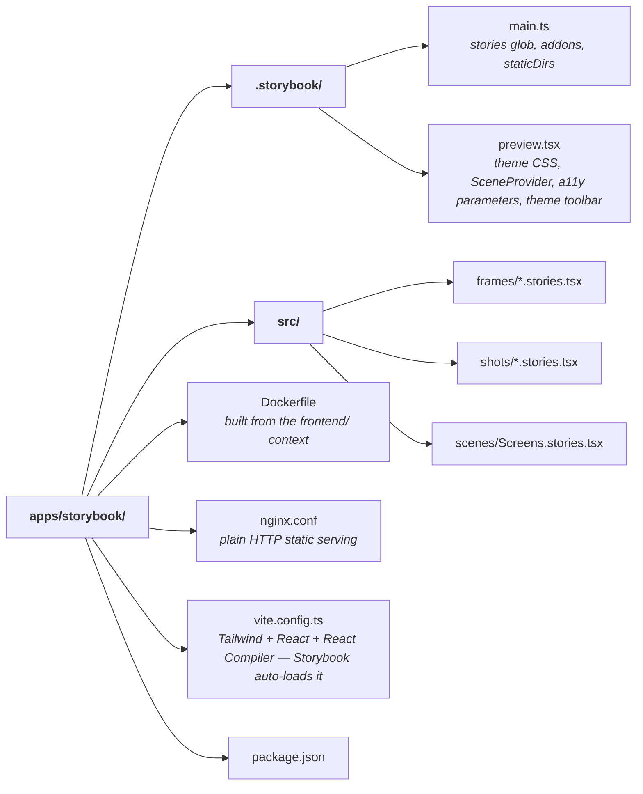

# @cinedex/storybook

The [Storybook](https://storybook.js.org/) for Cinedex's three component tiers — [`@cinedex/frames`](../../packages/frames/README.md), [`@cinedex/shots`](../../packages/shots/README.md) and [`@cinedex/scenes`](../../packages/scenes/README.md) — a workbench for building and reviewing them in isolation.

It is a real app in the [`frontend/` workspace](../../README.md) that **depends on the libraries**, exactly as the SPA does. The stories import from the packages, so they exercise the public API rather than reaching into internals; if a component isn't exported from a barrel, the Storybook build fails.

```bash
npm run storybook        # from frontend/ → http://localhost:9001
```

You do not have to start this yourself: `dotnet run --project aspire/Cinedex.AppHost` (from `backend/`) runs this same script as one of its resources, serving it on the same port 9001 and installing dependencies first when `node_modules` is missing. It references no other resource and waits on nothing — Storybook renders the libraries in isolation and calls no API — so it comes up even with the rest of the stack switched off. Turn the resource off there with `Features:EnableStorybookSvc`.

With the Compose stack running, the built Storybook is also served at **http://localhost:9001**. That is the static bundle on Nginx; the two paths above are the dev server with hot reload.

## 📁 Layout



Stories are grouped by tier, which is also how they appear in the sidebar: **Frames**, **Shots**, **Scenes**.

## 📜 Scripts

Run from `frontend/`; both delegate here with `-w @cinedex/storybook`.

| Script              | Description                                                   |
| ------------------- | ------------------------------------------------------------- |
| `npm run storybook` | Dev server with HMR on port 9001                              |
| `npm run build`     | Type-check and build the static bundle to `storybook-static/` |

## 🎨 Styling and theming

`vite.config.ts` carries **`@tailwindcss/vite`, and it is not optional** — every component in all three libraries is Tailwind-styled, so without the plugin `preview.tsx`'s theme import is inert and the stories render with correct markup and no styling at all, silently.

`preview.tsx` loads the whole design system through one export entry, exactly as the SPA's `main.tsx` does:

```ts
import '@cinedex/theme/tailwind.css'; // pulls in tokens.css and base.css itself
```

The toolbar's **Theme** control switches between System, Light and Dark. It works by setting `color-scheme` on the preview's root element — nothing more. The theme declares its colours with [`light-dark()`](https://developer.mozilla.org/en-US/docs/Web/CSS/color_value/light-dark), so the used `color-scheme` selects a side and every component repaints, native form controls included.

## 🔗 Screens without a router

`preview.tsx` wraps every story in `<SceneProvider>` with **no `linkComponent`**, so `@cinedex/scenes`'s screens fall back to plain anchors. That is why a full sign-in screen renders here with no router and no mock — the point of injecting navigation rather than importing it.

## ➕ Adding a story

1. Create `src/<tier>/<Name>.stories.tsx`.
2. Import the component from `@cinedex/frames`, `@cinedex/shots` or `@cinedex/scenes` — **never** by a relative path into `packages/`. If the import fails, the component is missing from that package's barrel; add it there.
3. Use CSF3 with `satisfies Meta<typeof X>` and `tags: ['autodocs']` so it appears in the generated docs.
4. Title it `Frames/…`, `Shots/…` or `Scenes/…` to land in the right sidebar group.

## 🐳 Docker

The image builds from the workspace root, because the lockfile is there:

```bash
docker build -f apps/storybook/Dockerfile -t cinedex-storybook .
```

It is a two-stage build — Node builds the static bundle, Nginx serves it on port 80 — published on host port 9001 by `compose.yaml`. Plain HTTP, unlike the SPA image: this container is not the stack's reverse proxy and Storybook makes no API calls, so there is nothing to terminate TLS for.
