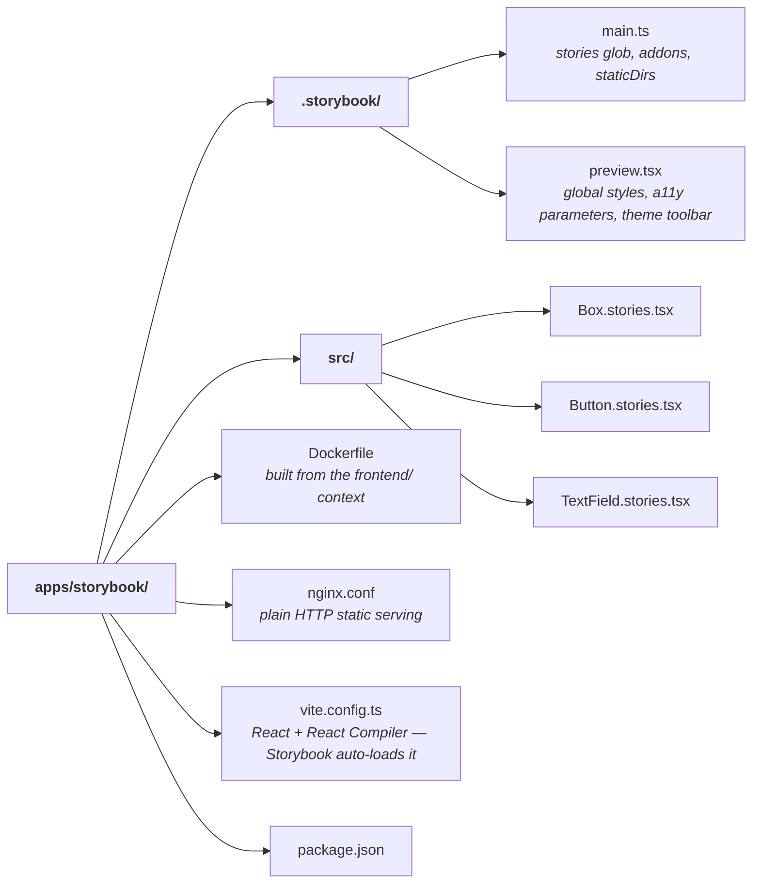

# @cinedex/storybook

The [Storybook](https://storybook.js.org/) for [`@cinedex/components`](../../packages/components/README.md) — a workbench for building and reviewing components in isolation.

It is a real app in the [`frontend/` workspace](../../README.md) that **depends on the component library**, exactly as the SPA does. The stories import from `@cinedex/components`, so they exercise the public API rather than reaching into the library's internals; if a component isn't exported from the barrel, the Storybook build fails.

```bash
npm run storybook        # from frontend/ → http://localhost:9001
```

You do not have to start this yourself: `dotnet run --project aspire/Cinedex.AppHost` (from `backend/`) runs this same script as one of its resources, serving it on the same port 9001 and installing dependencies first when `node_modules` is missing. It references no other resource and waits on nothing — Storybook renders the library in isolation and calls no API — so it comes up even with the rest of the stack switched off. Turn the resource off there with `Features:EnableStorybookSvc`.

With the Compose stack running, the built Storybook is also served at **http://localhost:9001**. That is the static bundle on Nginx; the two paths above are the dev server with hot reload.

## 📁 Layout



## 📜 Scripts

Run from `frontend/`; both delegate here with `-w @cinedex/storybook`.

| Script                    | Description                                        |
| ------------------------- | -------------------------------------------------- |
| `npm run storybook`       | Dev server with HMR on port 9001                   |
| `npm run build-storybook` | Static bundle to `storybook-static/` (git-ignored) |

## 🎨 Theming

The toolbar's **Theme** control switches between System, Light and Dark. It works by setting `color-scheme` on the preview's root element — nothing more. The library declares its colours with [`light-dark()`](https://developer.mozilla.org/en-US/docs/Web/CSS/color_value/light-dark), so the used `color-scheme` selects a side and every component repaints, native form controls included.

`preview.tsx` loads the library's styles through its export entries, in the same order the SPA's `main.tsx` does:

```ts
import '@cinedex/components/tokens.css';
import '@cinedex/components/base.css';
```

## ➕ Adding a story

1. Create `src/<Name>.stories.tsx`.
2. Import the component from `@cinedex/components` — **never** by a relative path into `packages/components`. If the import fails, the component is missing from the library's barrel; add it there.
3. Use CSF3 with `satisfies Meta<typeof X>` and `tags: ['autodocs']` so it appears in the generated docs.

## 🐳 Docker

The image builds from the workspace root, because the lockfile is there:

```bash
docker build -f apps/storybook/Dockerfile -t cinedex-storybook .
```

It is a two-stage build — Node builds the static bundle, Nginx serves it on port 80 — published on host port 9001 by `compose.yaml`. Plain HTTP, unlike the SPA image: this container is not the stack's reverse proxy and Storybook makes no API calls, so there is nothing to terminate TLS for.
