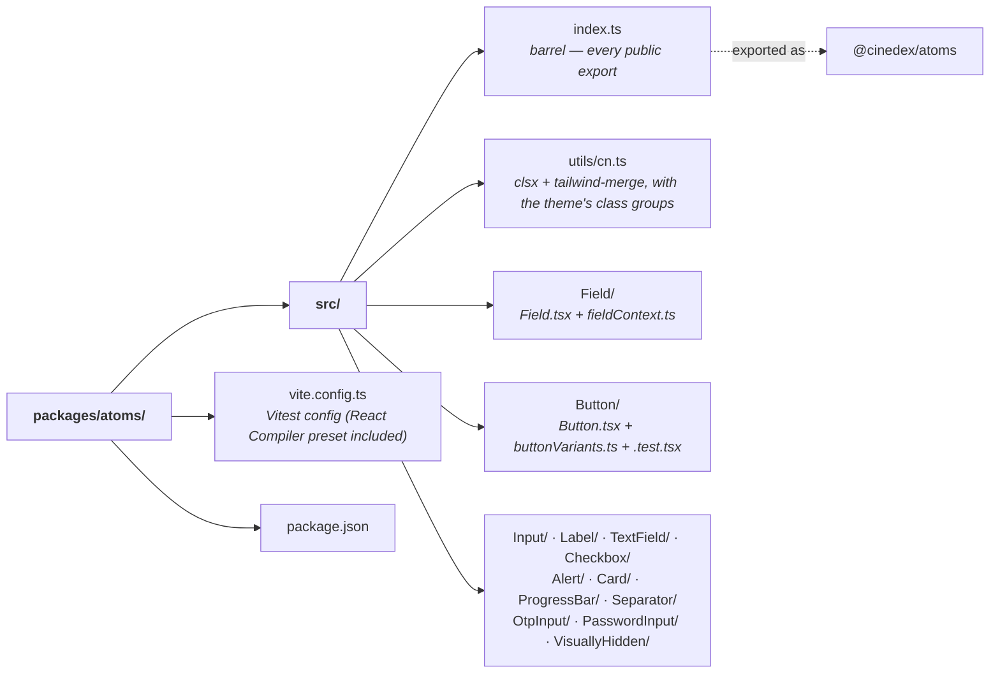

# @cinedex/atoms

The primitives: **Radix-backed, Tailwind-styled, one job each.** The bottom of Cinedex's three component tiers — [`@cinedex/compounds`](../compounds/README.md) assembles these, [`@cinedex/solution`](../solution/README.md) assembles those.

Part of the [`frontend/` workspace](../../README.md). Its stories live in [`@cinedex/storybook`](../../apps/storybook/README.md).

## Commands (from `frontend/`)

```bash
npm run test -w @cinedex/atoms       # watch mode
npm run coverage -w @cinedex/atoms
```

Lint and format run once from the workspace root and cover this package.

## 📁 Layout



One folder per component; the cva variant map sits beside the component rather than inside it, because `react-refresh/only-export-components` fires on a module exporting both.

## What's in it

| Atom                           | Built on              | Notes                                                        |
| ------------------------------ | --------------------- | ------------------------------------------------------------ |
| `Button`                       | Radix `Slot`          | 4 variants × 3 sizes; `asChild` renders the caller's element |
| `Input` / `Label` / `Field`    | Radix `Label`         | `Field` wires the id and `aria-*`; the control picks them up |
| `TextField`                    | `Field` + `Input`     | The everyday form field                                      |
| `PasswordInput`                | `Input`               | Masked, with an in-field reveal toggle                       |
| `OtpInput`                     | —                     | One box per digit, behaving like a single input              |
| `Checkbox`                     | Radix `Checkbox`      | A `<button role="checkbox">`, not an `<input>`               |
| `Alert` / `Card`               | —                     | Status surface (`role="status"`) and the raised surface      |
| `ProgressBar`                  | Radix `Progress`      | Determinate track with real `aria-value*`                    |
| `Separator` / `VisuallyHidden` | Radix                 |                                                              |
| `cn()`                         | clsx + tailwind-merge | Class composition — see below                                |

**Stable Radix primitives only.** `OtpInput` and `PasswordInput` are hand-rolled because Radix's equivalents (`unstable_OneTimePasswordField`, `unstable_PasswordToggleField`) are still preview APIs behind an `unstable_` prefix. Worth revisiting on promotion — the Radix OTP field also handles password-manager autofill and auto-submit, which this one does not.

## Conventions

- **One folder per component**, holding the component, its cva variant map and its test. Export it from `src/index.ts` — that barrel is the whole public surface, and a component missing from it fails the workspace build.
- **Tailwind only**, resolved through [`@cinedex/theme`](../theme/README.md)'s tokens. No CSS Modules, no hard-coded hex, and no raw pixel value where a named type step exists — `text-label`, not `text-[10px]`.
- **Variants are [cva](https://cva.style/), in their own file.** `react-refresh/only-export-components` fires on a module exporting both a component and a non-component, so `buttonVariants` lives in `Button/buttonVariants.ts`. Both are exported — `buttonVariants({ variant: 'outline' })` is how a caller styles something that isn't a `<button>`.
- **Compose classes with `cn()`, never string concatenation.** That is what makes a caller's `className` reliably beat the component's own: `cn('rounded-md', 'rounded-lg')` is `rounded-lg`, where `+ ' '` leaves both and lets stylesheet order decide.
- **React 19 ref-as-prop**, not `forwardRef`. `ComponentProps<'button'>` already includes `ref`.
- Tests assert behaviour and accessibility — roles, label association, `aria-*` — not class strings, except where the class _is_ the behaviour under test.

## Two things worth knowing

**`Field` hands its id to whatever control is inside it.** Through `FieldContext`, so `htmlFor`, `aria-describedby` and `aria-invalid` cannot disagree:

```tsx
<Field label="Password" error="Too short">
  <PasswordInput /> {/* picks up id + aria-* from context */}
</Field>
```

`Input` and `PasswordInput` call `useFieldControl()`; both still render standalone outside a `Field`.

**`Checkbox` is a button, and its name comes from `aria-labelledby`.** A `<label for>` _does_ associate with a button — buttons are labelable — but a button's accessible name is computed from its contents first, and this one has none. The API is Radix's: `onCheckedChange`, not `onChange`.

## Notes

- **jsdom has no `ResizeObserver`**, and Radix needs one via `useSize` whenever a control participates in a form (`Checkbox` mirrors its size onto the hidden input it submits with). `src/test/setup.ts` stubs it; every package with tests carries the same stub.
- **`cn()` registers the theme's custom type steps** with `tailwind-merge`. Without that, `text-label text-accent` would be read as two conflicting colours and one dropped. A new `--type-*` step in `@cinedex/theme` needs a matching entry here.
- Source-consumed: `exports` point at `src/`, so there is no build step and no `dist/`. `npm run build` is `tsc -b` — a typecheck.
- `vite.config.ts` here is **Vitest config only**, carrying the React Compiler Babel preset so components are tested the way they are built.
