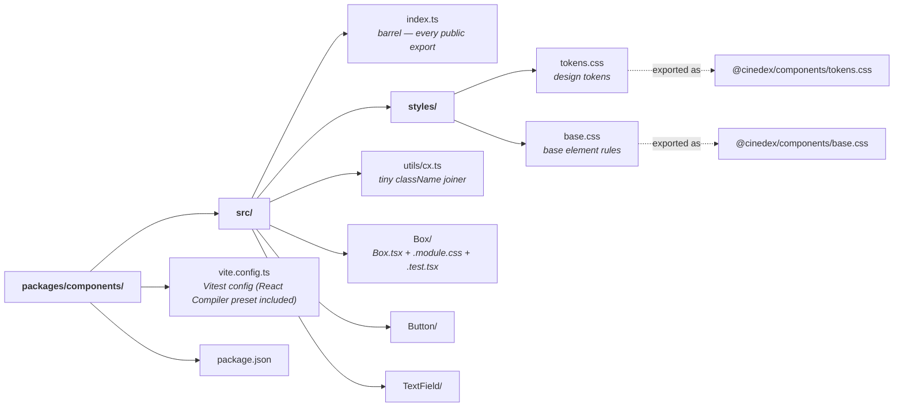

# @cinedex/components

The shared component library for Cinedex. Private to this repo — one package in the [`frontend/` workspace](../../README.md).

Its workbench is a separate app: [`@cinedex/storybook`](../../apps/storybook/README.md) depends on this package and owns the stories, so this one carries no Storybook dependency and does nothing but components.

```bash
npm run storybook        # from frontend/ → http://localhost:6006 (runs apps/storybook)
```

## 📁 Layout



## 🧩 Components

| Component   | What it does                                                                                                                                                 |
| ----------- | ------------------------------------------------------------------------------------------------------------------------------------------------------------ |
| `Box`       | Layout primitive. Flex container with `direction`, `padding`, `gap`, `align` and `justify` drawn from the spacing tokens; `as` changes the rendered element. |
| `Button`    | Action primitive. `variant` (`primary` \| `ghost`) and `size` (`sm` \| `md`). Defaults to `type="button"` so it never submits a form by accident.            |
| `TextField` | Form-input primitive. Label + input + optional error, wired together with a generated id so `htmlFor`, `aria-describedby` and `aria-invalid` always agree.   |

All three spread unknown props onto the underlying element, merge a caller's `className` with their own, and accept a `ref` as a plain prop (React 19 — no `forwardRef`).

## 🎨 Theming

Every component stylesheet resolves colour, spacing and radii through the tokens in `src/styles/tokens.css` and never a hard-coded value.

Colours are declared once with [`light-dark()`](https://developer.mozilla.org/en-US/docs/Web/CSS/color_value/light-dark) rather than duplicated under a `prefers-color-scheme` media query:

```css
:root {
  color-scheme: light dark;
  --accent: light-dark(#aa3bff, #c084fc);
}
```

The used `color-scheme` picks a side. `light dark` follows the operating system — the default, and what the app ships. Setting `color-scheme: dark` (or `light`) on the root forces a theme instead; that single line is the whole mechanism behind the Storybook app's **Theme** toolbar. It also makes native form controls render with matching chrome.

## 📦 Consuming it

The package is **source-consumed** — `exports` point at `src/`, so there is no build step and no `dist/`. `npm run build` here is `tsc -b`, a typecheck.

```tsx
import { Box, Button, TextField } from '@cinedex/components';
```

Styles are imported once at the app entry point, tokens before base:

```ts
import '@cinedex/components/tokens.css';
import '@cinedex/components/base.css';
```

## 🧪 Testing

Vitest + Testing Library in jsdom, colocated as `*.test.tsx`. Tests assert behaviour and accessibility — roles, label association, `aria-*` — rather than implementation details.

```bash
npm run test -w @cinedex/components       # watch
npm run coverage -w @cinedex/components
```

CSS Modules are compiled during tests and hashed as `_<name>_<hash>`, so the few assertions that do check a class match the readable prefix.

## ➕ Adding a component

1. Create `src/<Name>/` with `<Name>.tsx`, `<Name>.module.css` and `<Name>.test.tsx`.
2. Style it with tokens only — no literal colours or pixel spacing outside the scale.
3. Export the component and its prop types from `src/index.ts`. Until you do, nothing outside this package can see it.
4. Add its story in the [Storybook app](../../apps/storybook/README.md) — `apps/storybook/src/<Name>.stories.tsx`, importing from `@cinedex/components`.
